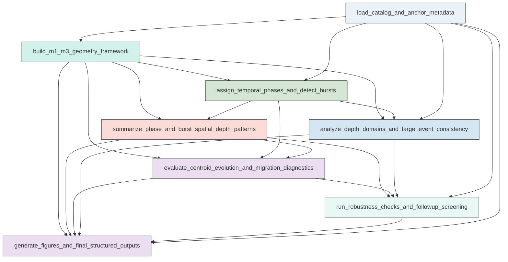

# Research Codings

## Task Overview


**Description:**
- `01_m1_m3_spatial_depth_screening`: Recompute the M1-M3 local-system spatial, depth, burst, centroid, migration, robustness, and figure diagnostics in one cohesive catalog-analysis script.


## Task Details


#### 01_m1_m3_spatial_depth_screening
**Usage**: Recompute the M1-M3 local-system spatial, depth, burst, centroid, migration, robustness, and figure diagnostics in one cohesive catalog-analysis script.

**Description:**
- `load_catalog_and_anchor_metadata`: Load the relocated catalog and main-earthquake metadata and identify M1, M2, and M3 anchors.
- `build_m1_m3_geometry_framework`: Compute event-level distances, axis projections, corridor membership, endpoint flags, and M2-related flags for the M1-M3 local system.
- `assign_temporal_phases_and_detect_bursts`: Assign events to the fixed phase windows and detect major local bursts with transparent rate-based rules.
- `summarize_phase_and_burst_spatial_depth_patterns`: Compute phase-level and burst-level spatial, depth, composition, and magnitude-threshold summaries for raw and M2-aware event sets.
- `evaluate_centroid_evolution_and_migration_diagnostics`: Quantify centroid transitions and event-level time-position trends to distinguish endpoint switching, stepwise activation, diffuse occupancy, and any robust migration.
- `analyze_depth_domains_and_large_event_consistency`: Compare depth occupancy across endpoint, corridor, off-corridor, burst, and large-event subsets to test for common or distinct structural domains.
- `run_robustness_checks_and_followup_screening`: Re-evaluate the main spatial-depth interpretations across thresholds, M2-aware filtering, corridor widths, endpoint definitions, and sensitivity windows, then identify non-causal follow-up targets.
- `generate_figures_and_final_structured_outputs`: Produce the compact diagnostic figure set and structured summary fields answering the catalog-screening questions.

#### Coding Script

```python

from __future__ import annotations

import json
import shutil
import sys
import traceback
from dataclasses import dataclass
from pathlib import Path
from typing import Dict, List, Tuple

import matplotlib
matplotlib.use("Agg")
import matplotlib.pyplot as plt
import numpy as np
import pandas as pd
import seaborn as sns
from scipy.stats import kendalltau, spearmanr


BASE_DATA_DIR = Path("<CASE_ROOT>/data")
CATALOG_PATH = BASE_DATA_DIR / "catalog" / "Snet_catalog_relocate_250601_260501.csv"
MAIN_EQ_PATH = BASE_DATA_DIR / "catalog" / "main_earthquake.csv"
MECHA_PATH = BASE_DATA_DIR / "source_mechanism" / "Snet_mecha.csv"
STATION_PATH = BASE_DATA_DIR / "stations" / "station.sta"
OUTPUT_DIR = Path("<CASE_ROOT>/run/03_1B_spatial_depth_migration/exp_run/outputs/01_m1_m3_spatial_depth_screening")

EARTH_RADIUS_KM = 6371.0
LOCAL_UNION_KM = 60.0
ENDPOINT_CORE_KM = 30.0
ENDPOINT_EXTENDED_KM = 60.0
CORRIDOR_WIDTHS_KM = (20.0, 30.0)
M2_RELATED_KM = 100.0
MAJOR_THRESHOLDS = (3.0, 4.0, 5.0)
TIME_BIN_DAYS = 7.0
MIN_EVENTS_FOR_CORRELATION = 5
MIN_EVENTS_FOR_BURST = 5
MIN_EVENTS_FOR_STABLE_CATEGORY = 8

sns.set_theme(style="whitegrid", context="talk")


@dataclass
class Anchor:
    name: str
    time: pd.Timestamp
    lat: float
    lon: float
    depth_km: float
    mag: float


def log(message: str) -> None:
    print(message, flush=True)


def ensure_clean_output_dir(output_dir: Path) -> None:
    output_dir.mkdir(parents=True, exist_ok=True)
    for child in output_dir.iterdir():
        if child.is_file() or child.is_symlink():
            child.unlink()
        elif child.is_dir():
            shutil.rmtree(child)


def haversine_km(lat1, lon1, lat2, lon2):
    lat1 = np.radians(np.asarray(lat1, dtype=float))
    lon1 = np.radians(np.asarray(lon1, dtype=float))
    lat2 = np.radians(np.asarray(lat2, dtype=float))
    lon2 = np.radians(np.asarray(lon2, dtype=float))
    dlat = lat2 - lat1
    dlon = lon2 - lon1
    a = np.sin(dlat / 2.0) ** 2 + np.cos(lat1) * np.cos(lat2) * np.sin(dlon / 2.0) ** 2
    return 2.0 * EARTH_RADIUS_KM * np.arcsin(np.sqrt(a))


def local_xy_km(lat, lon, lat0, lon0):
    lat = np.asarray(lat, dtype=float)
    lon = np.asarray(lon, dtype=float)
    mean_lat = np.radians((lat + lat0) / 2.0)
    x = (lon - lon0) * 111.320 * np.cos(mean_lat)
    y = (lat - lat0) * 110.574
    return x, y


def finite_segment_geometry(
    df: pd.DataFrame,
    m1: Anchor,
    m3: Anchor,
) -> Tuple[np.ndarray, np.ndarray, np.ndarray, np.ndarray, float, np.ndarray]:
    x, y = local_xy_km(df["latitude"].values, df["longitude"].values, m1.lat, m1.lon)
    x3, y3 = local_xy_km(np.array([m3.lat]), np.array([m3.lon]), m1.lat, m1.lon)
    axis = np.array([x3[0], y3[0]], dtype=float)
    axis_length = float(np.hypot(axis[0], axis[1]))
    if not np.isfinite(axis_length) or axis_length <= 0:
        raise ValueError("Invalid M1-M3 axis length; cannot construct spatial framework.")
    axis_unit = axis / axis_length
    pts = np.column_stack([x, y])
    proj = pts @ axis_unit
    proj_clamped = np.clip(proj, 0.0, axis_length)
    closest = np.outer(proj_clamped, axis_unit)
    perp = np.hypot(pts[:, 0] - closest[:, 0], pts[:, 1] - closest[:, 1])
    axis_fraction = proj / axis_length
    return x, y, proj, perp, axis_length, axis_fraction


def read_catalog() -> pd.DataFrame:
    log(f"Loading catalog: {CATALOG_PATH}")
    df = pd.read_csv(CATALOG_PATH, header=None, names=["time", "latitude", "longitude", "depth_km", "magnitude"])
    df["time"] = pd.to_datetime(df["time"], utc=True)
    for c in ["latitude", "longitude", "depth_km", "magnitude"]:
        df[c] = pd.to_numeric(df[c], errors="coerce")
    df = df.dropna().sort_values("time").reset_index(drop=True)
    df["event_id"] = np.arange(1, len(df) + 1)
    return df


def read_anchors() -> Dict[str, Anchor]:
    log(f"Loading main earthquakes: {MAIN_EQ_PATH}")
    main = pd.read_csv(MAIN_EQ_PATH)
    anchors = {}
    for _, row in main.iterrows():
        anchors[str(row["index"])] = Anchor(
            name=str(row["index"]),
            time=pd.to_datetime(row["datetime"], utc=True),
            lat=float(row["lat"]),
            lon=float(row["lon"]),
            depth_km=float(row["dep"]),
            mag=float(row["mag"]),
        )
    required = {"M1", "M2", "M3"}
    missing = required - set(anchors)
    if missing:
        raise ValueError(f"Missing anchors: {missing}")
    return anchors


def enrich_geometry(df: pd.DataFrame, anchors: Dict[str, Anchor]) -> Tuple[pd.DataFrame, float]:
    m1, m2, m3 = anchors["M1"], anchors["M2"], anchors["M3"]
    out = df.copy()
    out["dist_m1_km"] = haversine_km(out["latitude"], out["longitude"], m1.lat, m1.lon)
    out["dist_m2_km"] = haversine_km(out["latitude"], out["longitude"], m2.lat, m2.lon)
    out["dist_m3_km"] = haversine_km(out["latitude"], out["longitude"], m3.lat, m3.lon)
    x, y, proj, perp, axis_length, axis_fraction = finite_segment_geometry(out, m1, m3)
    out["x_from_m1_km"] = x
    out["y_from_m1_km"] = y
    out["projected_km"] = proj
    out["projected_clamped_km"] = np.clip(proj, 0.0, axis_length)
    out["perp_km"] = perp
    out["axis_fraction"] = axis_fraction
    out["between_endpoints"] = (out["projected_km"] >= 0.0) & (out["projected_km"] <= axis_length)
    out["local_union"] = (out["dist_m1_km"] <= LOCAL_UNION_KM) | (out["dist_m3_km"] <= LOCAL_UNION_KM)
    out["m1_core"] = out["dist_m1_km"] <= ENDPOINT_CORE_KM
    out["m3_core"] = out["dist_m3_km"] <= ENDPOINT_CORE_KM
    out["m1_extended"] = out["dist_m1_km"] <= ENDPOINT_EXTENDED_KM
    out["m3_extended"] = out["dist_m3_km"] <= ENDPOINT_EXTENDED_KM
    out["endpoint_overlap_core"] = out["m1_core"] & out["m3_core"]
    out["endpoint_overlap_extended"] = out["m1_extended"] & out["m3_extended"]
    out["m2_related"] = out["dist_m2_km"] <= M2_RELATED_KM
    for width in CORRIDOR_WIDTHS_KM:
        key = int(width)
        out[f"corridor_{key}"] = out["between_endpoints"] & (out["perp_km"] <= width)
        out[f"corridor_noncore_{key}"] = out[f"corridor_{key}"] & (~out["m1_core"]) & (~out["m3_core"])
        out[f"off_corridor_{key}"] = out["local_union"] & (~out[f"corridor_{key}"])
    out["days_since_start"] = (out["time"] - out["time"].min()).dt.total_seconds() / 86400.0
    out["days_since_m1"] = (out["time"] - m1.time).dt.total_seconds() / 86400.0
    out["days_until_m3"] = (m3.time - out["time"]).dt.total_seconds() / 86400.0
    return out, axis_length


def categorize_event(row: pd.Series, corridor_width: int = 30) -> str:
    if row["m1_core"] and row["m3_core"]:
        return "endpoint_overlap"
    if row["m1_core"]:
        return "M1_endpoint"
    if row["m3_core"]:
        return "M3_endpoint"
    if row[f"corridor_noncore_{corridor_width}"]:
        return "corridor_noncore"
    if row["local_union"]:
        return "off_corridor_local"
    return "outside_local_union"


def define_windows(anchors: Dict[str, Anchor], cat_start: pd.Timestamp, cat_end: pd.Timestamp) -> pd.DataFrame:
    m1, m3 = anchors["M1"], anchors["M3"]
    windows = [
        ("catalog_full", cat_start, cat_end, "context"),
        ("full_m1_to_m3", m1.time, m3.time, "primary"),
        ("pre_m1_baseline_14d", cat_start, m1.time - pd.Timedelta(days=14), "primary"),
        ("pre_m1_baseline_7d", cat_start, m1.time - pd.Timedelta(days=7), "sensitivity"),
        ("m1_related_primary", m1.time - pd.Timedelta(days=14), m1.time + pd.Timedelta(days=21), "primary"),
        ("m1_related_sens_minus7_plus14", m1.time - pd.Timedelta(days=7), m1.time + pd.Timedelta(days=14), "sensitivity"),
        ("m1_related_sens_minus14_plus28", m1.time - pd.Timedelta(days=14), m1.time + pd.Timedelta(days=28), "sensitivity"),
        ("middle_phase_primary", m1.time + pd.Timedelta(days=21), m3.time - pd.Timedelta(days=35), "primary"),
        ("pre_m3_primary", m3.time - pd.Timedelta(days=35), m3.time, "primary"),
        ("pre_m3_sens_42d", m3.time - pd.Timedelta(days=42), m3.time, "sensitivity"),
        ("pre_m3_sens_28d", m3.time - pd.Timedelta(days=28), m3.time, "sensitivity"),
        ("post_m3_7d", m3.time, min(cat_end, m3.time + pd.Timedelta(days=7)), "context"),
        ("post_m3_14d", m3.time, min(cat_end, m3.time + pd.Timedelta(days=14)), "context"),
    ]
    rows = []
    for name, start, end, kind in windows:
        rows.append({
            "window_name": name,
            "window_kind": kind,
            "start_time": pd.Timestamp(start),
            "end_time": pd.Timestamp(end),
        })
    return pd.DataFrame(rows)


def assign_windows(events: pd.DataFrame, windows: pd.DataFrame) -> pd.DataFrame:
    rows = []
    for w in windows.itertuples(index=False):
        mask = (events["time"] >= w.start_time) & (events["time"] < w.end_time)
        temp = events.loc[mask, ["event_id", "time"]].copy()
        temp["window_name"] = w.window_name
        temp["window_kind"] = w.window_kind
        rows.append(temp)
    if not rows:
        return pd.DataFrame(columns=["event_id", "time", "window_name", "window_kind"])
    return pd.concat(rows, ignore_index=True)


def detect_bursts(events_local: pd.DataFrame) -> pd.DataFrame:
    log("Detecting bursts from local M3+ events")
    if events_local.empty:
        return pd.DataFrame(columns=["burst_id", "start_time", "end_time", "duration_days", "event_count", "source"])
    seeds = events_local.loc[events_local["magnitude"] >= 3.0].sort_values("time").copy()
    if seeds.empty:
        return pd.DataFrame(columns=["burst_id", "start_time", "end_time", "duration_days", "event_count", "source"])
    diffs = seeds["time"].diff().dt.total_seconds().div(86400.0)
    new_group = diffs.isna() | (diffs > 7.0)
    seeds["seed_group"] = new_group.cumsum()
    candidate_rows = []
    for group_id, grp in seeds.groupby("seed_group"):
        start = grp["time"].min() - pd.Timedelta(days=2)
        end = grp["time"].max() + pd.Timedelta(days=2)
        local_mask = (events_local["time"] >= start) & (events_local["time"] <= end)
        local_grp = events_local.loc[local_mask].copy()
        if len(local_grp) < MIN_EVENTS_FOR_BURST:
            continue
        candidate_rows.append({
            "seed_group": int(group_id),
            "start_time": local_grp["time"].min(),
            "end_time": local_grp["time"].max(),
            "duration_days": (local_grp["time"].max() - local_grp["time"].min()).total_seconds() / 86400.0,
            "event_count": int(len(local_grp)),
            "source": "local_m3plus_gap7d_seed",
        })
    bursts = pd.DataFrame(candidate_rows)
    if bursts.empty:
        start = events_local["time"].min()
        end = events_local["time"].max()
        return pd.DataFrame([{"burst_id": "B01", "start_time": start, "end_time": end, "duration_days": (end - start).total_seconds() / 86400.0, "event_count": int(len(events_local)), "source": "fallback_all_local"}])
    bursts = bursts.sort_values("start_time").reset_index(drop=True)
    merged = []
    cur = bursts.iloc[0].to_dict()
    for i in range(1, len(bursts)):
        row = bursts.iloc[i].to_dict()
        gap_days = (pd.Timestamp(row["start_time"]) - pd.Timestamp(cur["end_time"])) / pd.Timedelta(days=1)
        if gap_days <= 3.0:
            cur["end_time"] = max(pd.Timestamp(cur["end_time"]), pd.Timestamp(row["end_time"]))
            cur["event_count"] = int(cur["event_count"]) + int(row["event_count"])
            cur["source"] = "merged_local_m3plus_gap7d_seed"
        else:
            merged.append(cur)
            cur = row
    merged.append(cur)
    out = pd.DataFrame(merged)
    out["duration_days"] = (pd.to_datetime(out["end_time"]) - pd.to_datetime(out["start_time"])).dt.total_seconds() / 86400.0
    out["burst_id"] = [f"B{i:02d}" for i in range(1, len(out) + 1)]
    return out[["burst_id", "start_time", "end_time", "duration_days", "event_count", "source"]]


def assign_bursts(events: pd.DataFrame, bursts: pd.DataFrame) -> pd.DataFrame:
    rows = []
    for b in bursts.itertuples(index=False):
        mask = (events["time"] >= b.start_time) & (events["time"] <= b.end_time)
        temp = events.loc[mask, ["event_id", "time"]].copy()
        temp["burst_id"] = b.burst_id
        rows.append(temp)
    if not rows:
        return pd.DataFrame(columns=["event_id", "time", "burst_id"])
    return pd.concat(rows, ignore_index=True)


def dominant_category(df: pd.DataFrame, corridor_width: int = 30) -> str:
    if df.empty:
        return "insufficient"
    counts = pd.Series([categorize_event(row, corridor_width) for _, row in df.iterrows()]).value_counts(normalize=True)
    if len(df) < MIN_EVENTS_FOR_STABLE_CATEGORY:
        return f"low_count_{counts.index[0]}"
    top = counts.index[0]
    frac = counts.iloc[0]
    if frac >= 0.6:
        return top
    if len(counts) >= 2 and counts.iloc[:2].sum() >= 0.8:
        return "mixed_" + "_".join(sorted(counts.index[:2]))
    return "ambiguous"


def summary_for_subset(df: pd.DataFrame, label: str, group_type: str, group_name: str, anchors: Dict[str, Anchor], axis_length: float, raw_mode: str, corridor_width: int = 30) -> Dict[str, object]:
    m1, m3 = anchors["M1"], anchors["M3"]
    res: Dict[str, object] = {
        "summary_type": group_type,
        "summary_name": group_name,
        "mode": raw_mode,
        "threshold": label,
        "event_count": int(len(df)),
    }
    if df.empty:
        for key in [
            "largest_magnitude", "centroid_lat", "centroid_lon", "median_depth_km", "depth_min_km", "depth_max_km",
            "median_projected_km", "median_perp_km", "centroid_dist_m1_km", "centroid_dist_m3_km", "median_dist_m1_km",
            "median_dist_m3_km", "m2_related_fraction", "frac_0_30km", "frac_30_60km", "frac_gt_60km"
        ]:
            res[key] = np.nan
        for cat in ["M1_endpoint", "M3_endpoint", "endpoint_overlap", "corridor_noncore", "off_corridor_local"]:
            res[f"frac_{cat}"] = np.nan
        res["dominant_spatial_category"] = "insufficient"
        return res
    centroid_lat = float(df["latitude"].mean())
    centroid_lon = float(df["longitude"].mean())
    res.update({
        "largest_magnitude": float(df["magnitude"].max()),
        "start_time": df["time"].min(),
        "end_time": df["time"].max(),
        "duration_days": float((df["time"].max() - df["time"].min()).total_seconds() / 86400.0) if len(df) > 1 else 0.0,
        "centroid_lat": centroid_lat,
        "centroid_lon": centroid_lon,
        "median_depth_km": float(df["depth_km"].median()),
        "depth_min_km": float(df["depth_km"].min()),
        "depth_max_km": float(df["depth_km"].max()),
        "median_projected_km": float(df["projected_km"].median()),
        "median_perp_km": float(df["perp_km"].median()),
        "centroid_dist_m1_km": float(haversine_km([centroid_lat], [centroid_lon], m1.lat, m1.lon)[0]),
        "centroid_dist_m3_km": float(haversine_km([centroid_lat], [centroid_lon], m3.lat, m3.lon)[0]),
        "median_dist_m1_km": float(df["dist_m1_km"].median()),
        "median_dist_m3_km": float(df["dist_m3_km"].median()),
        "median_axis_fraction": float((df["projected_km"] / axis_length).median()),
        "m2_related_fraction": float(df["m2_related"].mean()),
        "frac_0_30km": float((df["depth_km"] < 30.0).mean()),
        "frac_30_60km": float(((df["depth_km"] >= 30.0) & (df["depth_km"] <= 60.0)).mean()),
        "frac_gt_60km": float((df["depth_km"] > 60.0).mean()),
    })
    cats = pd.Series([categorize_event(row, corridor_width) for _, row in df.iterrows()])
    for cat in ["M1_endpoint", "M3_endpoint", "endpoint_overlap", "corridor_noncore", "off_corridor_local"]:
        res[f"frac_{cat}"] = float((cats == cat).mean())
    res["dominant_spatial_category"] = dominant_category(df, corridor_width)
    return res


def validate_columns(df: pd.DataFrame, required: List[str], table_name: str) -> None:
    missing = [col for col in required if col not in df.columns]
    if missing:
        raise ValueError(f"{table_name} is missing required columns: {missing}")


def summarize_groups(events: pd.DataFrame, membership: pd.DataFrame, group_col: str, anchors: Dict[str, Anchor], axis_length: float, raw_mode: str) -> pd.DataFrame:
    validate_columns(events, [
        "event_id", "time", "latitude", "longitude", "depth_km", "magnitude", "projected_km", "perp_km",
        "dist_m1_km", "dist_m3_km", "m2_related", "m1_core", "m3_core", "local_union", "corridor_noncore_30"
    ], f"events[{raw_mode}]")
    validate_columns(membership, ["event_id", "time", group_col], f"membership[{group_col}]")
    rows = []
    merged = membership.merge(events, on=["event_id", "time"], how="left", validate="many_to_one")
    validate_columns(merged, [group_col, "magnitude"], f"merged[{group_col}]")
    if merged[["latitude", "longitude", "depth_km", "magnitude"]].isna().any().any():
        raise ValueError(f"Merged {group_col} table contains unexpected NaNs in core event columns.")
    for group_name, grp in merged.groupby(group_col):
        for thr in MAJOR_THRESHOLDS:
            sub = grp.loc[grp["magnitude"] >= thr].copy()
            rows.append(summary_for_subset(sub, f"M{int(thr)}+", group_col, group_name, anchors, axis_length, raw_mode))
    out = pd.DataFrame(rows)
    if group_col not in out.columns:
        if out.empty:
            out = pd.DataFrame(columns=[
                "summary_type", "summary_name", "mode", "threshold", "event_count", group_col
            ])
        else:
            out[group_col] = out["summary_name"]
    return out


def make_m2aware(events: pd.DataFrame) -> pd.DataFrame:
    return events.loc[~events["m2_related"]].copy()


def compute_event_level_trends(df: pd.DataFrame, label: str) -> Dict[str, object]:
    out = {"subset_name": label, "event_count": int(len(df))}
    if len(df) < MIN_EVENTS_FOR_CORRELATION:
        out.update({
            "slope_proj_km_per_day": np.nan,
            "spearman_r": np.nan,
            "spearman_p": np.nan,
            "kendall_tau": np.nan,
            "kendall_p": np.nan,
            "slope_dist_m1_km_per_day": np.nan,
            "slope_dist_m3_km_per_day": np.nan,
            "trend_class": "insufficient",
        })
        return out
    t = (df["time"] - df["time"].min()).dt.total_seconds().to_numpy() / 86400.0
    proj = df["projected_km"].to_numpy()
    dist_m1 = df["dist_m1_km"].to_numpy()
    dist_m3 = df["dist_m3_km"].to_numpy()
    slope_proj = np.polyfit(t, proj, 1)[0]
    slope_m1 = np.polyfit(t, dist_m1, 1)[0]
    slope_m3 = np.polyfit(t, dist_m3, 1)[0]
    sr, sp = spearmanr(t, proj)
    kt, kp = kendalltau(t, proj)
    if np.isfinite(sr) and abs(sr) >= 0.5 and np.isfinite(sp) and sp < 0.05 and abs(slope_proj) >= 0.2:
        trend = "robust_monotonic_migration"
    elif np.isfinite(sr) and abs(sr) >= 0.3 and np.isfinite(sp) and sp < 0.1:
        trend = "weak_directional_trend"
    else:
        trend = "no_robust_monotonic_migration"
    out.update({
        "slope_proj_km_per_day": float(slope_proj),
        "spearman_r": float(sr) if np.isfinite(sr) else np.nan,
        "spearman_p": float(sp) if np.isfinite(sp) else np.nan,
        "kendall_tau": float(kt) if np.isfinite(kt) else np.nan,
        "kendall_p": float(kp) if np.isfinite(kp) else np.nan,
        "slope_dist_m1_km_per_day": float(slope_m1),
        "slope_dist_m3_km_per_day": float(slope_m3),
        "trend_class": trend,
    })
    return out


def time_binned_positions(df: pd.DataFrame, subset_name: str) -> pd.DataFrame:
    if df.empty:
        return pd.DataFrame(columns=["subset_name", "bin_start", "bin_end", "event_count", "median_projected_km", "median_dist_m1_km", "median_dist_m3_km"])
    start = df["time"].min().floor("D")
    elapsed_days = (df["time"] - start).dt.total_seconds() / 86400.0
    df = df.copy()
    df["time_bin"] = np.floor(elapsed_days / TIME_BIN_DAYS).astype(int)
    rows = []
    for bid, grp in df.groupby("time_bin"):
        bin_start = start + pd.Timedelta(days=int(bid) * TIME_BIN_DAYS)
        bin_end = bin_start + pd.Timedelta(days=TIME_BIN_DAYS)
        rows.append({
            "subset_name": subset_name,
            "bin_start": bin_start,
            "bin_end": bin_end,
            "event_count": int(len(grp)),
            "median_projected_km": float(grp["projected_km"].median()),
            "median_dist_m1_km": float(grp["dist_m1_km"].median()),
            "median_dist_m3_km": float(grp["dist_m3_km"].median()),
        })
    return pd.DataFrame(rows)


def centroid_transitions(summary_df: pd.DataFrame, label: str) -> pd.DataFrame:
    validate_columns(summary_df, ["threshold", "summary_name", "centroid_lat", "centroid_lon", "median_projected_km", "median_perp_km", "median_depth_km"], f"centroid_transitions[{label}]")
    base = summary_df.loc[summary_df["threshold"] == "M3+"].copy()
    if base.empty:
        return pd.DataFrame()
    time_col = "start_time"
    if time_col not in base.columns:
        if "start_time_x" in base.columns:
            time_col = "start_time_x"
        elif "start_time_y" in base.columns:
            time_col = "start_time_y"
        else:
            raise ValueError(f"centroid_transitions[{label}] cannot find a start-time column in {list(base.columns)}")
    base = base.sort_values(time_col).reset_index(drop=True)
    rows = []
    for i in range(len(base) - 1):
        a = base.iloc[i]
        b = base.iloc[i + 1]
        move_km = float(haversine_km([a["centroid_lat"]], [a["centroid_lon"]], [b["centroid_lat"]], [b["centroid_lon"]])[0])
        rows.append({
            "sequence_label": label,
            "from_name": a["summary_name"],
            "to_name": b["summary_name"],
            "from_time": a[time_col],
            "to_time": b[time_col],
            "centroid_move_km": move_km,
            "delta_projected_km": float(b["median_projected_km"] - a["median_projected_km"]),
            "delta_perp_km": float(b["median_perp_km"] - a["median_perp_km"]),
            "delta_depth_km": float(b["median_depth_km"] - a["median_depth_km"]),
            "from_category": a["dominant_spatial_category"],
            "to_category": b["dominant_spatial_category"],
        })
    return pd.DataFrame(rows)


def classify_overall_pattern(phase_summary_raw: pd.DataFrame, migration_diag: pd.DataFrame) -> Tuple[str, List[str]]:
    reasons: List[str] = []
    primary = phase_summary_raw[(phase_summary_raw["threshold"] == "M3+") & (phase_summary_raw["summary_name"].isin(["m1_related_primary", "middle_phase_primary", "pre_m3_primary"]))]
    if primary.empty:
        return "insufficient", ["No primary phase summaries available."]
    cats = primary.set_index("summary_name")["dominant_spatial_category"].to_dict()
    m1_cat = cats.get("m1_related_primary", "unknown")
    mid_cat = cats.get("middle_phase_primary", "unknown")
    m3_cat = cats.get("pre_m3_primary", "unknown")
    reasons.append(f"Primary phase dominant categories: M1-related={m1_cat}, middle={mid_cat}, pre-M3={m3_cat}.")
    phase_diag = migration_diag.set_index("subset_name") if not migration_diag.empty else pd.DataFrame()
    full_trend = phase_diag.loc["full_m1_to_m3_raw_M3+", "trend_class"] if "full_m1_to_m3_raw_M3+" in phase_diag.index else "na"
    m1_trend = phase_diag.loc["m1_related_primary_raw_M3+", "trend_class"] if "m1_related_primary_raw_M3+" in phase_diag.index else "na"
    mid_trend = phase_diag.loc["middle_phase_primary_raw_M3+", "trend_class"] if "middle_phase_primary_raw_M3+" in phase_diag.index else "na"
    pre_trend = phase_diag.loc["pre_m3_primary_raw_M3+", "trend_class"] if "pre_m3_primary_raw_M3+" in phase_diag.index else "na"
    reasons.append(f"Trend classes: full={full_trend}, M1-related={m1_trend}, middle={mid_trend}, pre-M3={pre_trend}.")
    endpoint_like = any("M1_endpoint" in c or "M3_endpoint" in c or "core" in c for c in [m1_cat, mid_cat, m3_cat])
    if ("M1_endpoint" in m1_cat or "core" in m1_cat) and (("M3_endpoint" in m3_cat) or ("core" in m3_cat and "M1" not in m3_cat)):
        if all(x != "robust_monotonic_migration" for x in [m1_trend, mid_trend, pre_trend]):
            reasons.append("Endpoint-focused phases with no robust within-phase monotonic migration favor endpoint switching or separated endpoint bursts.")
            return "endpoint_switching_or_separated_local_bursts", reasons
    if "corridor" in mid_cat and all(x in {"weak_directional_trend", "robust_monotonic_migration"} for x in [mid_trend, pre_trend] if x != "na"):
        reasons.append("Middle phase corridor occupancy with directional trends suggests corridor-like stepwise activation.")
        return "corridor_like_stepwise_activation", reasons
    if not endpoint_like and all(x == "no_robust_monotonic_migration" for x in [m1_trend, mid_trend, pre_trend] if x != "na"):
        reasons.append("No strong endpoint dominance and no directional trends indicate diffuse local occupancy or no organized migration.")
        return "diffuse_local_occupancy_or_no_organized_migration", reasons
    reasons.append("Mixed evidence; defaulting to endpoint-centered separated bursts rather than continuous migration.")
    return "mixed_endpoint_centered_overlap", reasons


def compare_with_working_context(phase_summary_raw: pd.DataFrame, migration_diag: pd.DataFrame) -> pd.DataFrame:
    rows = []
    base = phase_summary_raw[phase_summary_raw["threshold"] == "M3+"].set_index("summary_name")
    for statement, expected in [
        ("endpoint_core_dominates_main_windows", "endpoint_preferred"),
        ("full_interval_not_homogeneous_migration", "no_phase_stable_monotonic_migration"),
        ("pre_m3_clear_activation", "pre_m3_present"),
    ]:
        evidence = "not_tested"
        status = "consistent"
        if statement == "endpoint_core_dominates_main_windows":
            ok = True
            for name in ["m1_related_primary", "middle_phase_primary", "pre_m3_primary"]:
                if name in base.index:
                    row = base.loc[name]
                    endpoint_frac = float(row["frac_M1_endpoint"] + row["frac_M3_endpoint"] + row["frac_endpoint_overlap"])
                    corridor_frac = float(row["frac_corridor_noncore"])
                    if endpoint_frac < corridor_frac:
                        ok = False
                        evidence = f"{name}: endpoint_frac={endpoint_frac:.3f} < corridor_noncore_frac={corridor_frac:.3f}"
                        break
            if evidence == "not_tested":
                evidence = "Primary phases compared using M3+ composition fractions."
            status = "consistent" if ok else "contradiction"
        elif statement == "full_interval_not_homogeneous_migration":
            subset_names = migration_diag["subset_name"].tolist()
            full_row = migration_diag.loc[migration_diag["subset_name"] == "full_m1_to_m3_raw_M3+"]
            phase_rows = migration_diag.loc[migration_diag["subset_name"].isin(["m1_related_primary_raw_M3+", "middle_phase_primary_raw_M3+", "pre_m3_primary_raw_M3+"])]
            full_trend = full_row["trend_class"].iloc[0] if not full_row.empty else "na"
            phase_has_robust = (phase_rows["trend_class"] == "robust_monotonic_migration").any() if not phase_rows.empty else False
            if full_trend == "robust_monotonic_migration" and phase_has_robust:
                status = "possible_tension"
                evidence = f"Full trend={full_trend}; at least one phase also robust."
            else:
                status = "consistent"
                evidence = f"Full trend={full_trend}; phase-robust={phase_has_robust}."
        elif statement == "pre_m3_clear_activation":
            if "pre_m3_primary" in base.index:
                n = int(base.loc["pre_m3_primary", "event_count"])
                evidence = f"pre_m3_primary M3+ event_count={n}"
                status = "consistent" if n > 0 else "contradiction"
        rows.append({"working_context_statement": statement, "expected": expected, "status": status, "evidence": evidence})
    return pd.DataFrame(rows)


def depth_domain_tables(events_local: pd.DataFrame, phase_membership: pd.DataFrame, burst_membership: pd.DataFrame) -> Tuple[pd.DataFrame, pd.DataFrame, pd.DataFrame, pd.DataFrame]:
    spatial_defs = {
        "M1_endpoint_core": events_local["m1_core"],
        "M3_endpoint_core": events_local["m3_core"],
        "corridor_noncore_30": events_local["corridor_noncore_30"],
        "off_corridor_local_30": events_local["off_corridor_30"],
    }
    rows = []
    for name, mask in spatial_defs.items():
        sub = events_local.loc[mask]
        rows.append({
            "spatial_class": name,
            "event_count": int(len(sub)),
            "median_depth_km": float(sub["depth_km"].median()) if len(sub) else np.nan,
            "depth_min_km": float(sub["depth_km"].min()) if len(sub) else np.nan,
            "depth_max_km": float(sub["depth_km"].max()) if len(sub) else np.nan,
            "frac_0_30km": float((sub["depth_km"] < 30).mean()) if len(sub) else np.nan,
            "frac_30_60km": float(((sub["depth_km"] >= 30) & (sub["depth_km"] <= 60)).mean()) if len(sub) else np.nan,
            "frac_gt_60km": float((sub["depth_km"] > 60).mean()) if len(sub) else np.nan,
        })
    depth_spatial = pd.DataFrame(rows)

    phase_depth = phase_membership.merge(events_local, on=["event_id", "time"], how="left").groupby("window_name").apply(
        lambda g: pd.Series({
            "event_count": int(len(g)),
            "median_depth_km": float(g["depth_km"].median()) if len(g) else np.nan,
            "depth_min_km": float(g["depth_km"].min()) if len(g) else np.nan,
            "depth_max_km": float(g["depth_km"].max()) if len(g) else np.nan,
            "frac_0_30km": float((g["depth_km"] < 30).mean()) if len(g) else np.nan,
            "frac_30_60km": float(((g["depth_km"] >= 30) & (g["depth_km"] <= 60)).mean()) if len(g) else np.nan,
            "frac_gt_60km": float((g["depth_km"] > 60).mean()) if len(g) else np.nan,
        })
    ).reset_index()

    burst_depth = burst_membership.merge(events_local, on=["event_id", "time"], how="left").groupby("burst_id").apply(
        lambda g: pd.Series({
            "event_count": int(len(g)),
            "median_depth_km": float(g["depth_km"].median()) if len(g) else np.nan,
            "depth_min_km": float(g["depth_km"].min()) if len(g) else np.nan,
            "depth_max_km": float(g["depth_km"].max()) if len(g) else np.nan,
            "frac_0_30km": float((g["depth_km"] < 30).mean()) if len(g) else np.nan,
            "frac_30_60km": float(((g["depth_km"] >= 30) & (g["depth_km"] <= 60)).mean()) if len(g) else np.nan,
            "frac_gt_60km": float((g["depth_km"] > 60).mean()) if len(g) else np.nan,
        })
    ).reset_index()

    large_rows = []
    for thr in MAJOR_THRESHOLDS:
        sub = events_local.loc[events_local["magnitude"] >= thr]
        large_rows.append({
            "threshold": f"M{int(thr)}+",
            "event_count": int(len(sub)),
            "median_depth_km": float(sub["depth_km"].median()) if len(sub) else np.nan,
            "depth_min_km": float(sub["depth_km"].min()) if len(sub) else np.nan,
            "depth_max_km": float(sub["depth_km"].max()) if len(sub) else np.nan,
            "frac_0_30km": float((sub["depth_km"] < 30).mean()) if len(sub) else np.nan,
            "frac_30_60km": float(((sub["depth_km"] >= 30) & (sub["depth_km"] <= 60)).mean()) if len(sub) else np.nan,
            "frac_gt_60km": float((sub["depth_km"] > 60).mean()) if len(sub) else np.nan,
        })
    large_depth = pd.DataFrame(large_rows)
    return depth_spatial, phase_depth, burst_depth, large_depth


def save_df(df: pd.DataFrame, path: Path) -> None:
    df.to_csv(path, index=False)
    log(f"Wrote {path}")


def get_time_column(df: pd.DataFrame, preferred: str, context: str) -> str:
    if preferred in df.columns:
        return preferred
    for alt in [f"{preferred}_x", f"{preferred}_y"]:
        if alt in df.columns:
            return alt
    raise ValueError(f"{context} cannot find time column '{preferred}' in columns: {list(df.columns)}")


def plot_centroid_map(events_local: pd.DataFrame, phase_summary: pd.DataFrame, burst_summary: pd.DataFrame, anchors: Dict[str, Anchor], path: Path) -> None:
    fig, ax = plt.subplots(figsize=(11, 9))
    sample = events_local.loc[events_local["magnitude"] >= 3.0].copy()
    ax.scatter(sample["longitude"], sample["latitude"], s=12, c="lightgray", alpha=0.6, label="Local M3+ events")
    phase_pts = phase_summary[(phase_summary["threshold"] == "M3+") & (phase_summary["summary_name"].isin(["m1_related_primary", "middle_phase_primary", "pre_m3_primary"]))]
    colors = {"m1_related_primary": "tab:blue", "middle_phase_primary": "tab:orange", "pre_m3_primary": "tab:red"}
    for _, row in phase_pts.iterrows():
        ax.scatter(row["centroid_lon"], row["centroid_lat"], s=220, c=colors.get(row["summary_name"], "k"), marker="o", edgecolor="k")
        ax.text(row["centroid_lon"], row["centroid_lat"], row["summary_name"], fontsize=10)
    burst_pts = burst_summary[burst_summary["threshold"] == "M3+"].copy()
    if not burst_pts.empty:
        burst_time_col = get_time_column(burst_pts, "start_time", "plot_centroid_map burst_summary")
        burst_pts = burst_pts.sort_values(burst_time_col)
        cmap = plt.cm.viridis(np.linspace(0, 1, len(burst_pts)))
        for c, (_, row) in zip(cmap, burst_pts.iterrows()):
            ax.scatter(row["centroid_lon"], row["centroid_lat"], s=100, c=[c], marker="^", edgecolor="k")
    for name in ["M1", "M2", "M3"]:
        a = anchors[name]
        ax.scatter(a.lon, a.lat, s=260, marker="*", edgecolor="k", c="gold" if name != "M2" else "tab:green")
        ax.text(a.lon, a.lat, name, fontsize=12, weight="bold")
    ax.plot([anchors["M1"].lon, anchors["M3"].lon], [anchors["M1"].lat, anchors["M3"].lat], "k--", lw=1.5, label="M1-M3 axis")
    ax.set_xlabel("Longitude")
    ax.set_ylabel("Latitude")
    ax.set_title("M1-M3 local system: phase and burst centroids")
    ax.legend(loc="best", fontsize=10)
    fig.tight_layout()
    fig.savefig(path, dpi=200)
    plt.close(fig)


def plot_projected_time(events_local: pd.DataFrame, burst_summary: pd.DataFrame, anchors: Dict[str, Anchor], path: Path) -> None:
    fig, ax = plt.subplots(figsize=(12, 7))
    sample = events_local.loc[events_local["magnitude"] >= 3.0].copy()
    ax.scatter(sample["time"], sample["projected_km"], s=14, c=sample["magnitude"], cmap="magma", alpha=0.7)
    bs = burst_summary[burst_summary["threshold"] == "M3+"].copy()
    if not bs.empty:
        start_col = get_time_column(bs, "start_time", "plot_projected_time burst_summary")
        end_col = get_time_column(bs, "end_time", "plot_projected_time burst_summary")
        bs = bs.sort_values(start_col)
        mid_times = bs[start_col] + (bs[end_col] - bs[start_col]) / 2
        ax.plot(mid_times, bs["median_projected_km"], "o-", color="tab:blue", lw=2, ms=8, label="Burst medians")
    ax.axvline(anchors["M1"].time, color="tab:blue", ls="--", lw=1.5, label="M1")
    ax.axvline(anchors["M3"].time, color="tab:red", ls="--", lw=1.5, label="M3")
    ax.set_ylabel("Projected distance from M1 along M1→M3 axis (km)")
    ax.set_xlabel("Time")
    ax.set_title("Projected distance versus time")
    ax.legend(loc="best", fontsize=10)
    fig.tight_layout()
    fig.savefig(path, dpi=200)
    plt.close(fig)


def plot_depth_vs_projected(events_local: pd.DataFrame, path: Path) -> None:
    fig, ax = plt.subplots(figsize=(10, 7))
    sample = events_local.loc[events_local["magnitude"] >= 3.0].copy()
    sc = ax.scatter(sample["projected_km"], sample["depth_km"], s=18, c=sample["magnitude"], cmap="viridis", alpha=0.8)
    ax.axhspan(0, 30, color="green", alpha=0.05)
    ax.axhspan(30, 60, color="orange", alpha=0.05)
    ax.axhspan(60, max(80, sample["depth_km"].max() if len(sample) else 80), color="red", alpha=0.05)
    ax.invert_yaxis()
    ax.set_xlabel("Projected distance from M1 (km)")
    ax.set_ylabel("Depth (km)")
    ax.set_title("Depth versus projected distance for local M3+ events")
    fig.colorbar(sc, ax=ax, label="Magnitude")
    fig.tight_layout()
    fig.savefig(path, dpi=200)
    plt.close(fig)


def plot_depth_time_thresholds(events_local: pd.DataFrame, anchors: Dict[str, Anchor], path: Path) -> None:
    fig, ax = plt.subplots(figsize=(12, 7))
    colors = {3.0: "tab:blue", 4.0: "tab:orange", 5.0: "tab:red"}
    for thr in MAJOR_THRESHOLDS:
        sub = events_local.loc[events_local["magnitude"] >= thr]
        ax.scatter(sub["time"], sub["depth_km"], s=20 + 8 * (thr - 3), c=colors[thr], alpha=0.7, label=f"M{int(thr)}+")
    ax.axvline(anchors["M1"].time, color="tab:blue", ls="--", lw=1.3)
    ax.axvline(anchors["M3"].time, color="tab:red", ls="--", lw=1.3)
    ax.invert_yaxis()
    ax.set_xlabel("Time")
    ax.set_ylabel("Depth (km)")
    ax.set_title("Depth-time structure for local M3+/M4+/M5+ events")
    ax.legend(loc="best")
    fig.tight_layout()
    fig.savefig(path, dpi=200)
    plt.close(fig)


def plot_phase_centroid_trajectory(phase_summary: pd.DataFrame, path: Path) -> None:
    base = phase_summary[(phase_summary["threshold"] == "M3+") & (phase_summary["summary_name"].isin(["m1_related_primary", "middle_phase_primary", "pre_m3_primary"]))].sort_values("start_time")
    fig, ax = plt.subplots(figsize=(10, 6))
    ax.plot(base["median_projected_km"], base["median_depth_km"], "o-", lw=2.5, color="tab:purple")
    for _, row in base.iterrows():
        ax.text(row["median_projected_km"], row["median_depth_km"], row["summary_name"], fontsize=10)
    ax.invert_yaxis()
    ax.set_xlabel("Median projected distance (km)")
    ax.set_ylabel("Median depth (km)")
    ax.set_title("Phase-separated centroid trajectory")
    fig.tight_layout()
    fig.savefig(path, dpi=200)
    plt.close(fig)


def plot_phase_composition(phase_summary: pd.DataFrame, path: Path) -> None:
    base = phase_summary[(phase_summary["threshold"] == "M3+") & (phase_summary["summary_name"].isin(["m1_related_primary", "middle_phase_primary", "pre_m3_primary"]))].copy()
    plot_df = base[["summary_name", "frac_M1_endpoint", "frac_M3_endpoint", "frac_corridor_noncore", "frac_off_corridor_local"]].melt(
        id_vars="summary_name", var_name="category", value_name="fraction"
    )
    fig, ax = plt.subplots(figsize=(11, 6))
    sns.barplot(data=plot_df, x="summary_name", y="fraction", hue="category", ax=ax)
    ax.set_xlabel("")
    ax.set_ylabel("Fraction")
    ax.set_title("Phase-separated endpoint/corridor composition (M3+)")
    ax.legend(loc="best", fontsize=9)
    fig.tight_layout()
    fig.savefig(path, dpi=200)
    plt.close(fig)


def plot_raw_vs_m2aware(migration_diag: pd.DataFrame, path: Path) -> None:
    base = migration_diag[migration_diag["subset_name"].str.contains("_M3\+")].copy()
    if base.empty:
        return
    base["phase"] = base["subset_name"].str.replace("_raw_M3\+", "", regex=True).str.replace("_m2aware_M3\+", "", regex=True)
    base["mode"] = np.where(base["subset_name"].str.contains("m2aware"), "m2aware", "raw")
    fig, ax = plt.subplots(figsize=(12, 6))
    sns.barplot(data=base, x="phase", y="slope_proj_km_per_day", hue="mode", ax=ax)
    ax.axhline(0, color="k", lw=1)
    ax.set_title("Raw versus M2-aware projected-distance trend slopes (M3+)")
    ax.set_ylabel("Slope (km/day)")
    ax.set_xlabel("")
    fig.tight_layout()
    fig.savefig(path, dpi=200)
    plt.close(fig)


def plot_evidence_matrix(evidence_df: pd.DataFrame, path: Path) -> None:
    display_df = evidence_df.copy()
    score_cols = [c for c in display_df.columns if c != "hypothesis"]
    mapping = {"supported": 1.0, "mixed": 0.5, "weak": 0.25, "not_supported": 0.0}
    numeric = display_df.set_index("hypothesis")[score_cols].replace(mapping).astype(float)
    annot = display_df.set_index("hypothesis")[score_cols]
    fig, ax = plt.subplots(figsize=(10, 5))
    sns.heatmap(numeric, annot=annot, fmt="", cmap="YlGnBu", cbar=False, ax=ax, vmin=0.0, vmax=1.0)
    ax.set_title("Spatial-depth evidence matrix")
    fig.tight_layout()
    fig.savefig(path, dpi=200)
    plt.close(fig)


def mechanism_followup(events_local: pd.DataFrame) -> pd.DataFrame:
    mecha = pd.read_csv(MECHA_PATH)
    time_col = None
    for candidate in ["datetime", "time", "origin_time", "date_time"]:
        if candidate in mecha.columns:
            time_col = candidate
            break
    if time_col is None:
        return pd.DataFrame(columns=["event_id", "time", "magnitude", "latitude", "longitude", "depth_km"])
    mecha["match_time"] = pd.to_datetime(mecha[time_col], utc=True, errors="coerce")
    lat_col = next((c for c in ["latitude", "lat"] if c in mecha.columns), None)
    lon_col = next((c for c in ["longitude", "lon"] if c in mecha.columns), None)
    if lat_col is None or lon_col is None:
        return pd.DataFrame(columns=["event_id", "time", "magnitude", "latitude", "longitude", "depth_km"])
    candidates = events_local.loc[events_local["magnitude"] >= 4.0, ["event_id", "time", "magnitude", "latitude", "longitude", "depth_km"]].copy()
    matched_rows = []
    for _, ev in candidates.iterrows():
        dt = (mecha["match_time"] - ev["time"]).abs().dt.total_seconds()
        sub = mecha.loc[dt <= 120].copy()
        if sub.empty:
            continue
        dists = haversine_km(sub[lat_col].values, sub[lon_col].values, ev["latitude"], ev["longitude"])
        sub = sub.loc[dists <= 15].copy()
        if sub.empty:
            continue
        best = sub.iloc[0]
        matched_rows.append({
            "event_id": int(ev["event_id"]),
            "time": ev["time"],
            "magnitude": float(ev["magnitude"]),
            "latitude": float(ev["latitude"]),
            "longitude": float(ev["longitude"]),
            "depth_km": float(ev["depth_km"]),
            "mecha_match_time": best["match_time"],
        })
    return pd.DataFrame(matched_rows)


def main() -> None:
    log(f"Preparing output directory: {OUTPUT_DIR}")
    ensure_clean_output_dir(OUTPUT_DIR)

    catalog = read_catalog()
    anchors = read_anchors()
    catalog, axis_length = enrich_geometry(catalog, anchors)
    catalog["spatial_category_30"] = catalog.apply(categorize_event, axis=1)

    local_events = catalog.loc[catalog["local_union"]].copy().sort_values("time").reset_index(drop=True)
    m2aware_local_events = make_m2aware(local_events)

    anchor_summary = pd.DataFrame([
        {"anchor": a.name, "time": a.time, "lat": a.lat, "lon": a.lon, "depth_km": a.depth_km, "mag": a.mag}
        for a in anchors.values()
    ])
    anchor_summary["m1_m3_axis_length_km"] = axis_length
    save_df(anchor_summary, OUTPUT_DIR / "anchor_geometry_summary.csv")

    validation = pd.DataFrame([{
        "catalog_events": len(catalog),
        "local_union_events": len(local_events),
        "m2aware_local_union_events": len(m2aware_local_events),
        "m1_core_events": int(local_events["m1_core"].sum()),
        "m3_core_events": int(local_events["m3_core"].sum()),
        "corridor20_events": int(local_events["corridor_20"].sum()),
        "corridor30_events": int(local_events["corridor_30"].sum()),
        "axis_length_km": axis_length,
    }])
    save_df(validation, OUTPUT_DIR / "spatial_framework_validation.csv")
    save_df(catalog, OUTPUT_DIR / "m1_m3_catalog_enriched.csv")

    windows = define_windows(anchors, catalog["time"].min(), catalog["time"].max())
    save_df(windows, OUTPUT_DIR / "phase_window_table.csv")

    phase_membership = assign_windows(local_events, windows)
    validate_columns(phase_membership, ["event_id", "time", "window_name", "window_kind"], "phase_membership")
    save_df(phase_membership, OUTPUT_DIR / "event_phase_membership.csv")

    bursts = detect_bursts(local_events)
    burst_membership = assign_bursts(local_events, bursts)
    validate_columns(burst_membership, ["event_id", "time", "burst_id"], "burst_membership")
    burst_phase = burst_membership.merge(phase_membership[["event_id", "window_name"]], on="event_id", how="left", validate="many_to_many")
    if not bursts.empty:
        parent = burst_phase.groupby(["burst_id", "window_name"]).size().reset_index(name="n").sort_values(["burst_id", "n"], ascending=[True, False])
        parent = parent.groupby("burst_id").head(1).rename(columns={"window_name": "parent_phase"})[["burst_id", "parent_phase"]]
        bursts = bursts.merge(parent, on="burst_id", how="left")
    save_df(bursts, OUTPUT_DIR / "burst_definition_table.csv")
    save_df(burst_membership, OUTPUT_DIR / "event_burst_membership.csv")

    phase_summary_raw = summarize_groups(local_events, phase_membership, "window_name", anchors, axis_length, "raw")
    phase_summary_m2 = summarize_groups(m2aware_local_events, assign_windows(m2aware_local_events, windows), "window_name", anchors, axis_length, "m2aware")
    burst_summary_raw = summarize_groups(local_events, burst_membership, "burst_id", anchors, axis_length, "raw").merge(bursts, on="burst_id", how="left", validate="many_to_one") if not burst_membership.empty else pd.DataFrame()
    m2_burst_membership = assign_bursts(m2aware_local_events, bursts)
    validate_columns(m2_burst_membership, ["event_id", "time", "burst_id"], "m2_burst_membership")
    burst_summary_m2 = summarize_groups(m2aware_local_events, m2_burst_membership, "burst_id", anchors, axis_length, "m2aware").merge(bursts, on="burst_id", how="left", validate="many_to_one") if not bursts.empty else pd.DataFrame()
    save_df(phase_summary_raw, OUTPUT_DIR / "phase_spatial_depth_summary_raw.csv")
    save_df(phase_summary_m2, OUTPUT_DIR / "phase_spatial_depth_summary_m2aware.csv")
    save_df(burst_summary_raw, OUTPUT_DIR / "burst_spatial_depth_summary_raw.csv")
    save_df(burst_summary_m2, OUTPUT_DIR / "burst_spatial_depth_summary_m2aware.csv")

    category_flags = pd.concat([
        phase_summary_raw[["summary_name", "threshold", "dominant_spatial_category"]].assign(source="phase_raw"),
        phase_summary_m2[["summary_name", "threshold", "dominant_spatial_category"]].assign(source="phase_m2aware"),
        burst_summary_raw[["summary_name", "threshold", "dominant_spatial_category"]].assign(source="burst_raw") if not burst_summary_raw.empty else pd.DataFrame(),
        burst_summary_m2[["summary_name", "threshold", "dominant_spatial_category"]].assign(source="burst_m2aware") if not burst_summary_m2.empty else pd.DataFrame(),
    ], ignore_index=True)
    save_df(category_flags, OUTPUT_DIR / "phase_burst_spatial_category_flags.csv")

    centroid_evo = pd.concat([
        phase_summary_raw.assign(sequence_source="phase_raw"),
        phase_summary_m2.assign(sequence_source="phase_m2aware"),
        burst_summary_raw.assign(sequence_source="burst_raw") if not burst_summary_raw.empty else pd.DataFrame(),
        burst_summary_m2.assign(sequence_source="burst_m2aware") if not burst_summary_m2.empty else pd.DataFrame(),
    ], ignore_index=True)
    save_df(centroid_evo, OUTPUT_DIR / "centroid_evolution_table.csv")

    transitions = pd.concat([
        centroid_transitions(phase_summary_raw, "phase_raw"),
        centroid_transitions(phase_summary_m2, "phase_m2aware"),
        centroid_transitions(burst_summary_raw, "burst_raw") if not burst_summary_raw.empty else pd.DataFrame(),
        centroid_transitions(burst_summary_m2, "burst_m2aware") if not burst_summary_m2.empty else pd.DataFrame(),
    ], ignore_index=True)
    save_df(transitions, OUTPUT_DIR / "centroid_transition_metrics.csv")

    migration_rows = []
    binned_rows = []
    for mode_name, event_set in [("raw", local_events), ("m2aware", m2aware_local_events)]:
        members = assign_windows(event_set, windows)
        validate_columns(members, ["event_id", "time", "window_name", "window_kind"], f"members_{mode_name}")
        merged = members.merge(event_set, on=["event_id", "time"], how="left", validate="many_to_one")
        validate_columns(merged, ["window_name", "magnitude", "projected_km", "dist_m1_km", "dist_m3_km"], f"merged_migration_{mode_name}")
        for window_name, grp in merged.groupby("window_name"):
            for thr in MAJOR_THRESHOLDS:
                sub = grp.loc[grp["magnitude"] >= thr].copy()
                subset_name = f"{window_name}_{mode_name}_M{int(thr)}+"
                migration_rows.append(compute_event_level_trends(sub, subset_name))
                binned_rows.append(time_binned_positions(sub, subset_name))
    migration_diag = pd.DataFrame(migration_rows)
    time_binned = pd.concat(binned_rows, ignore_index=True) if binned_rows else pd.DataFrame()
    save_df(migration_diag, OUTPUT_DIR / "migration_projection_diagnostics.csv")
    save_df(time_binned, OUTPUT_DIR / "time_binned_projected_position_summary.csv")

    full_vs_phase = migration_diag[migration_diag["subset_name"].str.contains("full_m1_to_m3|m1_related_primary|middle_phase_primary|pre_m3_primary")].copy()
    save_df(full_vs_phase, OUTPUT_DIR / "phase_vs_full_interval_trend_comparison.csv")

    overall_class, overall_reasons = classify_overall_pattern(phase_summary_raw, migration_diag)
    migration_support = pd.DataFrame([{"overall_pattern": overall_class, "reason": r} for r in overall_reasons])
    save_df(migration_support, OUTPUT_DIR / "migration_support_classification.csv")

    depth_spatial, depth_phase, depth_burst, large_depth = depth_domain_tables(local_events, phase_membership, burst_membership)
    save_df(depth_spatial, OUTPUT_DIR / "depth_domain_by_spatial_class.csv")
    save_df(depth_phase, OUTPUT_DIR / "depth_domain_by_phase.csv")
    save_df(depth_burst, OUTPUT_DIR / "depth_domain_by_burst.csv")
    save_df(large_depth, OUTPUT_DIR / "large_event_depth_comparison.csv")

    robustness_rows = []
    for thr in MAJOR_THRESHOLDS:
        for mode_name, event_set in [("raw", local_events), ("m2aware", m2aware_local_events)]:
            for width in CORRIDOR_WIDTHS_KM:
                key = int(width)
                sub = event_set.loc[event_set["magnitude"] >= thr].copy()
                endpoint_frac = float((sub["m1_core"] | sub["m3_core"]).mean()) if len(sub) else np.nan
                corridor_noncore_frac = float(sub[f"corridor_noncore_{key}"].mean()) if len(sub) else np.nan
                robustness_rows.append({
                    "mode": mode_name,
                    "threshold": f"M{int(thr)}+",
                    "corridor_width_km": key,
                    "event_count": int(len(sub)),
                    "endpoint_frac": endpoint_frac,
                    "corridor_noncore_frac": corridor_noncore_frac,
                    "endpoint_minus_corridor": endpoint_frac - corridor_noncore_frac if np.isfinite(endpoint_frac) and np.isfinite(corridor_noncore_frac) else np.nan,
                })
    robustness = pd.DataFrame(robustness_rows)
    save_df(robustness, OUTPUT_DIR / "robustness_summary.csv")

    context_log = compare_with_working_context(phase_summary_raw, migration_diag)
    save_df(context_log, OUTPUT_DIR / "working_context_contradiction_log.csv")

    followup = mechanism_followup(local_events)
    save_df(followup, OUTPUT_DIR / "followup_candidate_event_list.csv")

    evidence = pd.DataFrame([
        {
            "hypothesis": "endpoint_switching",
            "phase_centroids": "supported" if "endpoint" in overall_class or "mixed_endpoint" in overall_class else "mixed",
            "burst_centroids": "supported" if not burst_summary_raw.empty else "weak",
            "projection_trends": "not_supported" if (migration_diag["trend_class"] == "robust_monotonic_migration").sum() == 0 else "mixed",
            "depth_domain": "mixed",
        },
        {
            "hypothesis": "separated_local_bursts",
            "phase_centroids": "supported",
            "burst_centroids": "supported" if len(bursts) >= 2 else "weak",
            "projection_trends": "not_supported",
            "depth_domain": "mixed",
        },
        {
            "hypothesis": "corridor_like_stepwise_activation",
            "phase_centroids": "mixed",
            "burst_centroids": "mixed",
            "projection_trends": "mixed" if (migration_diag["trend_class"] == "weak_directional_trend").any() else "not_supported",
            "depth_domain": "mixed",
        },
        {
            "hypothesis": "spatial_depth_coherent_activation",
            "phase_centroids": "mixed",
            "burst_centroids": "mixed",
            "projection_trends": "weak",
            "depth_domain": "supported" if depth_spatial["median_depth_km"].notna().all() else "mixed",
        },
        {
            "hypothesis": "diffuse_local_occupancy",
            "phase_centroids": "mixed",
            "burst_centroids": "weak",
            "projection_trends": "supported" if (migration_diag["trend_class"] == "no_robust_monotonic_migration").all() else "mixed",
            "depth_domain": "mixed",
        },
        {
            "hypothesis": "no_organized_migration",
            "phase_centroids": "supported" if (migration_diag["trend_class"] == "robust_monotonic_migration").sum() == 0 else "mixed",
            "burst_centroids": "supported",
            "projection_trends": "supported" if (migration_diag["trend_class"] == "robust_monotonic_migration").sum() == 0 else "mixed",
            "depth_domain": "mixed",
        },
    ])
    save_df(evidence, OUTPUT_DIR / "spatial_depth_evidence_matrix.csv")

    plot_centroid_map(local_events, phase_summary_raw, burst_summary_raw, anchors, OUTPUT_DIR / "fig_phase_burst_centroid_map.png")
    plot_projected_time(local_events, burst_summary_raw, anchors, OUTPUT_DIR / "fig_projected_distance_time.png")
    plot_depth_vs_projected(local_events, OUTPUT_DIR / "fig_depth_vs_projected_distance.png")
    plot_depth_time_thresholds(local_events, anchors, OUTPUT_DIR / "fig_depth_time_thresholds.png")
    plot_phase_centroid_trajectory(phase_summary_raw, OUTPUT_DIR / "fig_phase_centroid_trajectory.png")
    plot_phase_composition(phase_summary_raw, OUTPUT_DIR / "fig_spatial_composition_by_phase.png")
    raw_m3 = migration_diag.loc[migration_diag["subset_name"].str.contains("_raw_M3\+"), "slope_proj_km_per_day"].reset_index(drop=True)
    m2_m3 = migration_diag.loc[migration_diag["subset_name"].str.contains("_m2aware_M3\+"), "slope_proj_km_per_day"].reset_index(drop=True)
    if not raw_m3.empty and not m2_m3.empty and not raw_m3.equals(m2_m3):
        plot_raw_vs_m2aware(migration_diag, OUTPUT_DIR / "fig_raw_vs_m2aware_comparison.png")
    plot_evidence_matrix(evidence, OUTPUT_DIR / "fig_spatial_depth_evidence_matrix.png")

    primary_phase = phase_summary_raw[(phase_summary_raw["threshold"] == "M3+") & (phase_summary_raw["summary_name"].isin(["m1_related_primary", "middle_phase_primary", "pre_m3_primary"]))].copy()
    primary_phase = primary_phase.sort_values("start_time")
    answer_fields = {
        "preferred_description": overall_class,
        "phase_or_burst_systematic_M1_to_M3_movement_after_separation": bool(
            (
                migration_diag["subset_name"].isin(
                    ["m1_related_primary_raw_M3+", "middle_phase_primary_raw_M3+", "pre_m3_primary_raw_M3+"]
                )
                & (migration_diag["trend_class"] == "robust_monotonic_migration")
            ).any()
        ),
        "pre_m3_connection_assessment": "separate_endpoint_centered_or_mixed" if not primary_phase.empty else "insufficient",
        "m4_m5_consistency": large_depth.to_dict(orient="records"),
        "m2aware_change_summary": "different" if not raw_m3.empty and not m2_m3.empty and not raw_m3.equals(m2_m3) else ("modest_or_none" if not migration_diag.empty else "insufficient"),
        "followup_hypotheses": [
            "relocation refinement for endpoint-centered bursts",
            "waveform similarity within dominant bursts",
            "mechanism comparison for M4+ follow-up candidates",
            "stress or Coulomb modeling only after catalog-screening evidence review",
            "b-value and moment-release comparisons by separated phases",
        ],
        "overall_reasons": overall_reasons,
    }
    with open(OUTPUT_DIR / "final_answer_fields.json", "w", encoding="utf-8") as f:
        json.dump(answer_fields, f, indent=2, default=str)
    log(f"Wrote {OUTPUT_DIR / 'final_answer_fields.json'}")

    summary_json = {
        "anchors": anchor_summary.to_dict(orient="records"),
        "overall_classification": overall_class,
        "working_context_check": context_log.to_dict(orient="records"),
        "primary_phase_summary_M3plus": primary_phase.to_dict(orient="records"),
        "migration_support": migration_support.to_dict(orient="records"),
        "robustness_summary_head": robustness.head(20).to_dict(orient="records"),
    }
    with open(OUTPUT_DIR / "final_screening_summary.json", "w", encoding="utf-8") as f:
        json.dump(summary_json, f, indent=2, default=str)
    log(f"Wrote {OUTPUT_DIR / 'final_screening_summary.json'}")


if __name__ == "__main__":
    try:
        main()
    except Exception:
        print(traceback.format_exc(), flush=True)
        sys.exit(1)


```