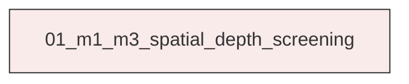
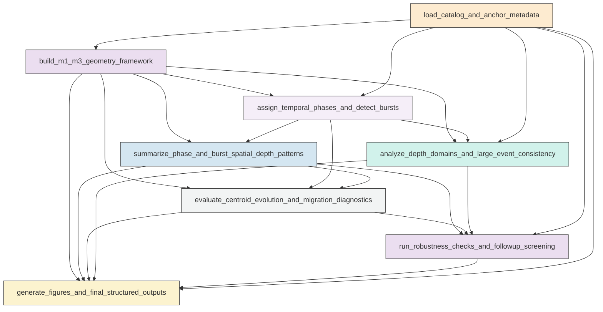

# Workflow Overview

## Top-Level Task Dependencies

**Description:**
- `01_m1_m3_spatial_depth_screening`: Recompute the M1-M3 local-system spatial, depth, burst, centroid, migration, robustness, and figure diagnostics in one cohesive catalog-analysis script.

## Subtask Dependencies

#### 01_m1_m3_spatial_depth_screening
**Usage**: Recompute the M1-M3 local-system spatial, depth, burst, centroid, migration, robustness, and figure diagnostics in one cohesive catalog-analysis script.

**Description:**
- `load_catalog_and_anchor_metadata`: Load the relocated catalog and main-earthquake metadata and identify M1, M2, and M3 anchors.
- `build_m1_m3_geometry_framework`: Compute event-level distances, axis projections, corridor membership, endpoint flags, and M2-related flags for the M1-M3 local system.
- `assign_temporal_phases_and_detect_bursts`: Assign events to the fixed phase windows and detect major local bursts with transparent rate-based rules.
- `summarize_phase_and_burst_spatial_depth_patterns`: Compute phase-level and burst-level spatial, depth, composition, and magnitude-threshold summaries for raw and M2-aware event sets.
- `evaluate_centroid_evolution_and_migration_diagnostics`: Quantify centroid transitions and event-level time-position trends to distinguish endpoint switching, stepwise activation, diffuse occupancy, and any robust migration.
- `analyze_depth_domains_and_large_event_consistency`: Compare depth occupancy across endpoint, corridor, off-corridor, burst, and large-event subsets to test for common or distinct structural domains.
- `run_robustness_checks_and_followup_screening`: Re-evaluate the main spatial-depth interpretations across thresholds, M2-aware filtering, corridor widths, endpoint definitions, and sensitivity windows, then identify non-causal follow-up targets.
- `generate_figures_and_final_structured_outputs`: Produce the compact diagnostic figure set and structured summary fields answering the catalog-screening questions.