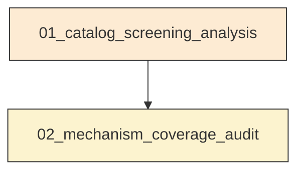
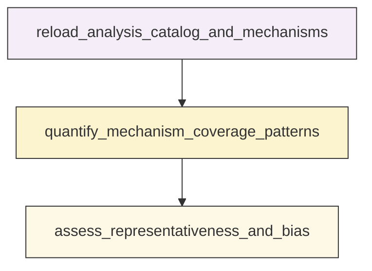

# Research Codings

## Task Overview


**Description:**
- `01_catalog_screening_analysis`: Build the validated Aomori master catalog and run the full catalog-level screening workflow for sliding-window completeness and b-value, spatial comparisons, magnitude hierarchy, moment proxy, robustness checks, figures, and machine-readable summaries.
- `02_mechanism_coverage_audit`: Perform a reusable standalone audit of focal-mechanism matching and representativeness by phase, magnitude level, and spatial class.


## Task Details


#### 01_catalog_screening_analysis
**Usage**: Build the validated Aomori master catalog and run the full catalog-level screening workflow for sliding-window completeness and b-value, spatial comparisons, magnitude hierarchy, moment proxy, robustness checks, figures, and machine-readable summaries.

```mermaid
graph TD
    ingest_and_validate_inputs
    ingest_and_validate_inputs --> define_phases_and_spatial_domains
    define_phases_and_spatial_domains --> audit_mechanism_join_and_coverage_inputs
    ingest_and_validate_inputs --> select_magnitude_discretization
    define_phases_and_spatial_domains --> compute_sliding_mc_and_bvalue
    select_magnitude_discretization --> compute_sliding_mc_and_bvalue
    compute_sliding_mc_and_bvalue --> grade_window_reliability
    compute_sliding_mc_and_bvalue --> summarize_phase_aware_bvalue_behavior
    grade_window_reliability --> summarize_phase_aware_bvalue_behavior
    define_phases_and_spatial_domains --> summarize_phase_aware_bvalue_behavior
    select_magnitude_discretization --> summarize_phase_aware_bvalue_behavior
    compute_sliding_mc_and_bvalue --> compare_spatial_bvalue_patterns
    grade_window_reliability --> compare_spatial_bvalue_patterns
    define_phases_and_spatial_domains --> compare_spatial_bvalue_patterns
    define_phases_and_spatial_domains --> compute_magnitude_hierarchy
    define_phases_and_spatial_domains --> compute_moment_release_proxy
    compute_magnitude_hierarchy --> compute_moment_release_proxy
    summarize_phase_aware_bvalue_behavior --> build_catalog_evidence_matrix
    compare_spatial_bvalue_patterns --> build_catalog_evidence_matrix
    compute_magnitude_hierarchy --> build_catalog_evidence_matrix
    compute_moment_release_proxy --> build_catalog_evidence_matrix
    audit_mechanism_join_and_coverage_inputs --> build_catalog_evidence_matrix
    define_phases_and_spatial_domains --> build_catalog_evidence_matrix
    define_phases_and_spatial_domains --> run_targeted_robustness_checks
    compute_sliding_mc_and_bvalue --> run_targeted_robustness_checks
    summarize_phase_aware_bvalue_behavior --> run_targeted_robustness_checks
    compare_spatial_bvalue_patterns --> run_targeted_robustness_checks
    compute_magnitude_hierarchy --> run_targeted_robustness_checks
    compute_moment_release_proxy --> run_targeted_robustness_checks
    build_catalog_evidence_matrix --> run_targeted_robustness_checks
    compute_sliding_mc_and_bvalue --> generate_compact_diagnostic_figures
    grade_window_reliability --> generate_compact_diagnostic_figures
    summarize_phase_aware_bvalue_behavior --> generate_compact_diagnostic_figures
    compare_spatial_bvalue_patterns --> generate_compact_diagnostic_figures
    compute_moment_release_proxy --> generate_compact_diagnostic_figures
    compute_magnitude_hierarchy --> generate_compact_diagnostic_figures
    build_catalog_evidence_matrix --> generate_compact_diagnostic_figures
    compute_sliding_mc_and_bvalue --> validate_outputs_and_record_failures
    summarize_phase_aware_bvalue_behavior --> validate_outputs_and_record_failures
    compare_spatial_bvalue_patterns --> validate_outputs_and_record_failures
    compute_magnitude_hierarchy --> validate_outputs_and_record_failures
    compute_moment_release_proxy --> validate_outputs_and_record_failures
    build_catalog_evidence_matrix --> validate_outputs_and_record_failures
    style define_phases_and_spatial_domains fill:#ebdef0,stroke:#333,stroke-width:1px
    style summarize_phase_aware_bvalue_behavior fill:#f6ddcc,stroke:#333,stroke-width:1px
    style compute_sliding_mc_and_bvalue fill:#d1f2eb,stroke:#333,stroke-width:1px
    style generate_compact_diagnostic_figures fill:#eaf2f8,stroke:#333,stroke-width:1px
    style grade_window_reliability fill:#fdebd0,stroke:#333,stroke-width:1px
    style audit_mechanism_join_and_coverage_inputs fill:#fadbd8,stroke:#333,stroke-width:1px
    style compute_magnitude_hierarchy fill:#ebdef0,stroke:#333,stroke-width:1px
    style compute_moment_release_proxy fill:#f6ddcc,stroke:#333,stroke-width:1px
    style compare_spatial_bvalue_patterns fill:#d4e6f1,stroke:#333,stroke-width:1px
    style run_targeted_robustness_checks fill:#fdebd0,stroke:#333,stroke-width:1px
    style validate_outputs_and_record_failures fill:#e8f8f5,stroke:#333,stroke-width:1px
    style build_catalog_evidence_matrix fill:#f5eef8,stroke:#333,stroke-width:1px
    style select_magnitude_discretization fill:#f9e79f,stroke:#333,stroke-width:1px
    style ingest_and_validate_inputs fill:#e8f8f5,stroke:#333,stroke-width:1px
```

**Description:**
- `ingest_and_validate_inputs`: Load the relocated catalog and reference tables, inspect schema, standardize core fields, and log validation results.
- `define_phases_and_spatial_domains`: Construct phase boundaries, distance metrics, neutral geometric subsets, and M2-related flags for downstream analysis.
- `audit_mechanism_join_and_coverage_inputs`: Match focal-mechanism records to the catalog, quantify join success, and record potential coverage bias before interpretation.
- `select_magnitude_discretization`: determine an operational magnitude bin width from metadata or observed quantization and store the choice for reproducible Mc and b-value estimation.
- `compute_sliding_mc_and_bvalue`: Estimate Mc and classical b-value in fixed-count sliding windows for the combined local zone and feasible secondary spatial subsets.
- `grade_window_reliability`: Classify each sliding-window result as robust, usable with caution, exploratory, or not interpretable using completeness and fit diagnostics.
- `summarize_phase_aware_bvalue_behavior`: Overlay phase boundaries on the sliding-window b-value curves and compare temporal evolution against secondary aggregate phase summaries.
- `compare_spatial_bvalue_patterns`: Compare b-value behavior across M1-centered, M3-centered, along-axis, and off-axis subsets only where sample size and reliability are adequate.
- `compute_magnitude_hierarchy`: Quantify largest-event structure, magnitude gaps, threshold counts, and burst-level hierarchy across phases and spatial subsets.
- `compute_moment_release_proxy`: Convert magnitudes to a consistent scalar moment proxy and summarize cumulative release, burst shares, and dominance metrics by phase and spatial class.
- `build_catalog_evidence_matrix`: Synthesize catalog-level statistical evidence and mechanism coverage limits into the requested hypothesis screening matrix.
- `run_targeted_robustness_checks`: Evaluate whether the main screening conclusions change under the user-prioritized sensitivity tests.
- `generate_compact_diagnostic_figures`: Produce the requested compact figure set and figure-ready tables tied directly to the main catalog-screening questions.
- `validate_outputs_and_record_failures`: Verify that required scientific outputs are non-empty and log failure evidence for any incomplete analysis branch.

#### Coding Script

```python

from __future__ import annotations

import math
import sys
import traceback
from dataclasses import dataclass
from pathlib import Path
from typing import Dict, List, Optional, Tuple

import matplotlib
matplotlib.use("Agg")
import matplotlib.dates as mdates
import matplotlib.pyplot as plt
import numpy as np
import pandas as pd
from seismostats import Catalog


SCRIPT_PATH = Path(__file__).resolve()
OUTPUT_DIR = Path("<CASE_ROOT>/run/03_1C_mechanism_screening/exp_run/outputs/01_catalog_screening_analysis")
DATA_DIR = Path("<CASE_ROOT>/data")
CATALOG_PATH = DATA_DIR / "catalog" / "Snet_catalog_relocate_250601_260501.csv"
MAIN_PATH = DATA_DIR / "catalog" / "main_earthquake.csv"
MECHA_PATH = DATA_DIR / "source_mechanism" / "Snet_mecha.csv"
STATION_PATH = DATA_DIR / "stations" / "station.sta"

DELTA_M = 0.1
PRIMARY_WINDOW = 500
PRIMARY_STEPS = [100, 200]
MIN_ABOVE_MC_INTERPRETABLE = 50
MIN_ABOVE_MC_CAUTION = 100
MIN_FIT_RANGE_INTERPRETABLE = 0.5
M2_TIME_DAYS = 21.0
M2_DISTANCE_KM = 60.0
EARTH_RADIUS_KM = 6371.0

RELIABILITY_ORDER = ["robust", "usable_with_caution", "exploratory", "not_interpretable"]
RELIABILITY_RANK = {name: i for i, name in enumerate(RELIABILITY_ORDER)}
RELIABILITY_COLORS = {
    "robust": "#1b9e77",
    "usable_with_caution": "#d95f02",
    "exploratory": "#7570b3",
    "not_interpretable": "#bdbdbd",
}


@dataclass
class MainEvent:
    label: str
    time: pd.Timestamp
    lat: float
    lon: float
    depth_km: float
    mag: float


def log(message: str) -> None:
    print(message, flush=True)


def ensure_output_dir() -> None:
    OUTPUT_DIR.mkdir(parents=True, exist_ok=True)
    removable_patterns = [
        "*.csv",
        "*.png",
        "*.jpg",
        "*.jpeg",
        "*.txt",
    ]
    removed = 0
    for pattern in removable_patterns:
        for path in OUTPUT_DIR.glob(pattern):
            if path.is_file():
                path.unlink()
                removed += 1
            elif path.is_dir():
                shutil.rmtree(path)
                removed += 1
    log(f"Prepared output directory and removed {removed} stale quick-regenerate files from {OUTPUT_DIR}")


def haversine_km(lat1, lon1, lat2, lon2):
    lat1 = np.radians(np.asarray(lat1, dtype=float))
    lon1 = np.radians(np.asarray(lon1, dtype=float))
    lat2 = np.radians(np.asarray(lat2, dtype=float))
    lon2 = np.radians(np.asarray(lon2, dtype=float))
    dlat = lat2 - lat1
    dlon = lon2 - lon1
    a = np.sin(dlat / 2.0) ** 2 + np.cos(lat1) * np.cos(lat2) * np.sin(dlon / 2.0) ** 2
    return 2.0 * EARTH_RADIUS_KM * np.arcsin(np.sqrt(a))


def project_local_km(lat, lon, lat0, lon0):
    lat = np.asarray(lat, dtype=float)
    lon = np.asarray(lon, dtype=float)
    x = (lon - lon0) * np.cos(np.radians((lat + lat0) / 2.0)) * 111.32
    y = (lat - lat0) * 110.57
    return x, y


def corridor_metrics(df: pd.DataFrame, m1: MainEvent, m3: MainEvent) -> pd.DataFrame:
    x1, y1 = 0.0, 0.0
    x3, y3 = project_local_km(m3.lat, m3.lon, m1.lat, m1.lon)
    xe, ye = project_local_km(df["lat"].to_numpy(), df["lon"].to_numpy(), m1.lat, m1.lon)
    vx = x3 - x1
    vy = y3 - y1
    seg2 = vx * vx + vy * vy
    if seg2 <= 0:
        proj = np.zeros(len(df))
        perp = np.hypot(xe - x1, ye - y1)
    else:
        proj = ((xe - x1) * vx + (ye - y1) * vy) / seg2
        closest_x = x1 + proj * vx
        closest_y = y1 + proj * vy
        perp = np.hypot(xe - closest_x, ye - closest_y)
    out = pd.DataFrame(index=df.index)
    out["axis_proj_fraction"] = proj
    out["axis_perp_km"] = perp
    out["axis_between_endpoints"] = (proj >= 0.0) & (proj <= 1.0)
    out["axis_distance_from_m1_km"] = np.hypot(xe - x1, ye - y1)
    return out


def choose_delta_m(magnitudes: pd.Series) -> float:
    vals = np.sort(np.unique(np.round(magnitudes.dropna().to_numpy(dtype=float), 3)))
    diffs = np.diff(vals)
    diffs = diffs[diffs > 0]
    if len(diffs) == 0:
        return 0.1
    q = np.round(diffs, 3)
    candidates = q[(q >= 0.05) & (q <= 0.2)]
    if len(candidates) == 0:
        return 0.1
    mode = pd.Series(candidates).mode()
    if len(mode) == 0:
        return 0.1
    dm = float(mode.iloc[0])
    return 0.1 if abs(dm - 0.1) <= 0.02 else dm


def require_columns(df: pd.DataFrame, required: List[str], context: str) -> None:
    missing = [col for col in required if col not in df.columns]
    if missing:
        raise ValueError(f"Missing required columns in {context}: {missing}")


def load_mainshocks() -> Dict[str, MainEvent]:
    log(f"Loading mainshock table: {MAIN_PATH}")
    df = pd.read_csv(MAIN_PATH)
    df = df.rename(columns={"index": "label", "dep": "depth_km"})
    require_columns(df, ["label", "datetime", "lat", "lon", "depth_km", "mag"], "mainshock table")
    df["time"] = pd.to_datetime(df["datetime"], utc=True)
    events = {}
    for _, row in df.iterrows():
        events[row["label"]] = MainEvent(
            label=row["label"],
            time=row["time"],
            lat=float(row["lat"]),
            lon=float(row["lon"]),
            depth_km=float(row["depth_km"]),
            mag=float(row["mag"]),
        )
    for label in ["M1", "M2", "M3"]:
        if label not in events:
            raise ValueError(f"Mainshock label {label} missing from {MAIN_PATH}")
    return events


def load_catalog() -> pd.DataFrame:
    log(f"Loading relocated catalog: {CATALOG_PATH}")
    df = pd.read_csv(CATALOG_PATH).rename(columns={"dep": "depth_km"})
    require_columns(df, ["datetime", "lat", "lon", "depth_km", "mag"], "relocated catalog")
    df["time"] = pd.to_datetime(df["datetime"], utc=True)
    df = df.sort_values("time").reset_index(drop=True)
    df["event_id"] = np.arange(1, len(df) + 1, dtype=int)
    return df


def load_mechanisms() -> pd.DataFrame:
    log(f"Loading mechanism table: {MECHA_PATH}")
    df = pd.read_csv(MECHA_PATH)
    require_columns(df, ["event_code", "origin_time", "lat_deg", "lon_deg", "depth_km"], "mechanism table")
    df["origin_time"] = pd.to_datetime(df["origin_time"], utc=True, errors="coerce")
    return df


def load_stations() -> pd.DataFrame:
    log(f"Loading station metadata: {STATION_PATH}")
    df = pd.read_csv(STATION_PATH)
    require_columns(df, ["station_code", "latitude", "longitude"], "station table")
    return df


def define_phase_boundaries(main: Dict[str, MainEvent], catalog_start: pd.Timestamp, catalog_end: pd.Timestamp) -> pd.DataFrame:
    m1 = main["M1"]
    m3 = main["M3"]
    defs = [
        ("catalog_start", catalog_start),
        ("M1_minus_14d", m1.time - pd.Timedelta(days=14)),
        ("M1_minus_7d", m1.time - pd.Timedelta(days=7)),
        ("M1_time", m1.time),
        ("M1_plus_14d", m1.time + pd.Timedelta(days=14)),
        ("M1_plus_21d", m1.time + pd.Timedelta(days=21)),
        ("M1_plus_28d", m1.time + pd.Timedelta(days=28)),
        ("M3_minus_42d", m3.time - pd.Timedelta(days=42)),
        ("M3_minus_35d", m3.time - pd.Timedelta(days=35)),
        ("M3_minus_28d", m3.time - pd.Timedelta(days=28)),
        ("M3_time", m3.time),
        ("catalog_end", catalog_end),
    ]
    return pd.DataFrame(defs, columns=["boundary_name", "time"])


def add_geometry_and_flags(df: pd.DataFrame, main: Dict[str, MainEvent]) -> pd.DataFrame:
    out = df.copy()
    for label, event in main.items():
        out[f"dist_{label.lower()}_km"] = haversine_km(out["lat"], out["lon"], event.lat, event.lon)
        out[f"dt_{label.lower()}_days"] = (out["time"] - event.time).dt.total_seconds() / 86400.0
    out["within_60km_either_m1_m3"] = (out["dist_m1_km"] <= 60.0) | (out["dist_m3_km"] <= 60.0)
    out["within_30km_m1"] = out["dist_m1_km"] <= 30.0
    out["within_60km_m1"] = out["dist_m1_km"] <= 60.0
    out["within_30km_m3"] = out["dist_m3_km"] <= 30.0
    out["within_60km_m3"] = out["dist_m3_km"] <= 60.0
    out["within_both_60km"] = out["within_60km_m1"] & out["within_60km_m3"]
    cm = corridor_metrics(out, main["M1"], main["M3"])
    out = pd.concat([out, cm], axis=1)
    out["along_axis_20km"] = out["within_60km_either_m1_m3"] & out["axis_between_endpoints"] & (out["axis_perp_km"] <= 20.0)
    out["along_axis_30km"] = out["within_60km_either_m1_m3"] & out["axis_between_endpoints"] & (out["axis_perp_km"] <= 30.0)
    out["off_axis_20km"] = out["within_60km_either_m1_m3"] & (~out["along_axis_20km"])
    out["off_axis_30km"] = out["within_60km_either_m1_m3"] & (~out["along_axis_30km"])
    out["m2_related_flag"] = (out["dist_m2_km"] <= M2_DISTANCE_KM) & (np.abs(out["dt_m2_days"]) <= M2_TIME_DAYS)
    m1 = main["M1"]
    m3 = main["M3"]
    out["phase_primary"] = "outside_key_window"
    out.loc[(out["time"] >= out["time"].min()) & (out["time"] < m1.time - pd.Timedelta(days=14)), "phase_primary"] = "baseline_to_M1_minus14d"
    out.loc[(out["time"] >= m1.time - pd.Timedelta(days=14)) & (out["time"] < m1.time + pd.Timedelta(days=21)), "phase_primary"] = "M1_related_M1minus14d_to_M1plus21d"
    out.loc[(out["time"] >= m1.time + pd.Timedelta(days=21)) & (out["time"] < m3.time - pd.Timedelta(days=35)), "phase_primary"] = "middle_M1plus21d_to_M3minus35d"
    out.loc[(out["time"] >= m3.time - pd.Timedelta(days=35)) & (out["time"] < m3.time), "phase_primary"] = "preM3_M3minus35d_to_M3"
    out.loc[out["time"] >= m3.time, "phase_primary"] = "post_M3_context"
    return out


def subset_masks(df: pd.DataFrame) -> Dict[str, pd.Series]:
    masks = {
        "combined_local": df["within_60km_either_m1_m3"],
        "combined_local_m2aware": df["within_60km_either_m1_m3"] & (~df["m2_related_flag"]),
        "M1_extended": df["within_60km_m1"],
        "M3_extended": df["within_60km_m3"],
        "M1_core": df["within_30km_m1"],
        "M3_core": df["within_30km_m3"],
        "along_axis_20km": df["along_axis_20km"],
        "along_axis_30km": df["along_axis_30km"],
        "off_axis_20km": df["off_axis_20km"],
        "off_axis_30km": df["off_axis_30km"],
        "overlap_60km": df["within_both_60km"],
    }
    return masks


def classify_window_reliability(mc_spread, n_above_mc, fit_span, b_value, b_std, mc_adopted, window_n):
    reasons = []
    if mc_adopted is None or not np.isfinite(mc_adopted):
        return "not_interpretable", "mc_missing"
    if not np.isfinite(b_value):
        return "not_interpretable", "b_missing"
    if n_above_mc < MIN_ABOVE_MC_INTERPRETABLE:
        return "not_interpretable", f"n_above_mc<{MIN_ABOVE_MC_INTERPRETABLE}"
    if fit_span < 0.3:
        return "not_interpretable", "fit_span<0.3"
    if mc_spread <= 0.2 and n_above_mc >= 200 and fit_span >= 1.0 and np.isfinite(b_std) and b_std <= 0.12:
        return "robust", "good_mc_agreement_good_span_good_n"
    if mc_spread <= 0.3 and n_above_mc >= MIN_ABOVE_MC_CAUTION and fit_span >= MIN_FIT_RANGE_INTERPRETABLE and np.isfinite(b_std) and b_std <= 0.2:
        return "usable_with_caution", "moderate_mc_agreement_moderate_span"
    if n_above_mc >= MIN_ABOVE_MC_INTERPRETABLE and fit_span >= MIN_FIT_RANGE_INTERPRETABLE:
        if mc_spread > 0.3:
            reasons.append("mc_method_disagreement")
        if not np.isfinite(b_std) or b_std > 0.2:
            reasons.append("high_b_uncertainty")
        if n_above_mc < MIN_ABOVE_MC_CAUTION:
            reasons.append("limited_above_mc_count")
        return "exploratory", ";".join(reasons) if reasons else "limited_support"
    return "not_interpretable", "inadequate_counts_or_span"


def estimate_window_bvalues(window_df: pd.DataFrame, delta_m: float) -> Dict[str, object]:
    mags = window_df["mag"].dropna().astype(float)
    result = {
        "mc_maxc": np.nan,
        "mc_ks": np.nan,
        "mc_bstab": np.nan,
        "mc_adopted": np.nan,
        "mc_method_count": 0,
        "mc_spread": np.nan,
        "b_value": np.nan,
        "b_std": np.nan,
        "n_total": int(len(window_df)),
        "n_above_mc": 0,
        "fit_mag_min": np.nan,
        "fit_mag_max": np.nan,
        "fit_mag_span": np.nan,
        "reliability": "not_interpretable",
        "reliability_reason": "too_few_events",
    }
    if len(mags) < 50:
        return result
    cat = Catalog(pd.DataFrame({"magnitude": mags.to_numpy()}))
    mc_values = []
    method_failures = []
    try:
        mc_maxc, _ = cat.estimate_mc_maxc(fmd_bin=delta_m)
        result["mc_maxc"] = mc_maxc
        if mc_maxc is not None and np.isfinite(mc_maxc):
            mc_values.append(float(mc_maxc))
    except Exception as exc:
        method_failures.append(f"mc_maxc_failed:{type(exc).__name__}")
    try:
        mc_ks, _ = cat.estimate_mc_ks(delta_m=delta_m, n=300, stop_when_passed=True)
        result["mc_ks"] = mc_ks if mc_ks is not None else np.nan
        if mc_ks is not None and np.isfinite(mc_ks):
            mc_values.append(float(mc_ks))
    except Exception as exc:
        method_failures.append(f"mc_ks_failed:{type(exc).__name__}")
    try:
        mc_bstab, _ = cat.estimate_mc_b_stability(delta_m=delta_m, stop_when_passed=True)
        result["mc_bstab"] = mc_bstab if mc_bstab is not None else np.nan
        if mc_bstab is not None and np.isfinite(mc_bstab):
            mc_values.append(float(mc_bstab))
    except Exception as exc:
        method_failures.append(f"mc_bstab_failed:{type(exc).__name__}")
    if len(mc_values) == 0:
        result["reliability_reason"] = "all_mc_methods_failed" + (";" + ";".join(method_failures) if method_failures else "")
        return result
    mc_values = np.array(mc_values, dtype=float)
    mc_adopted = float(np.nanmedian(mc_values))
    result["mc_adopted"] = mc_adopted
    result["mc_method_count"] = int(np.isfinite(mc_values).sum())
    result["mc_spread"] = float(np.nanmax(mc_values) - np.nanmin(mc_values)) if len(mc_values) else np.nan
    above = mags[mags >= mc_adopted]
    result["n_above_mc"] = int(len(above))
    if len(above) > 0:
        result["fit_mag_min"] = float(np.min(above))
        result["fit_mag_max"] = float(np.max(above))
        result["fit_mag_span"] = float(np.max(above) - np.min(above))
    if len(above) < MIN_ABOVE_MC_INTERPRETABLE:
        result["reliability_reason"] = f"n_above_mc<{MIN_ABOVE_MC_INTERPRETABLE}"
        return result
    try:
        b_est = cat.estimate_b(mc=mc_adopted, delta_m=delta_m)
        result["b_value"] = float(getattr(b_est, "b_value", np.nan))
        result["b_std"] = float(getattr(b_est, "std", np.nan))
    except Exception as exc:
        result["reliability_reason"] = f"b_estimation_failed:{type(exc).__name__}"
        return result
    reliability, reason = classify_window_reliability(
        mc_spread=float(result["mc_spread"]) if np.isfinite(result["mc_spread"]) else 999.0,
        n_above_mc=int(result["n_above_mc"]),
        fit_span=float(result["fit_mag_span"]) if np.isfinite(result["fit_mag_span"]) else -1.0,
        b_value=float(result["b_value"]) if np.isfinite(result["b_value"]) else np.nan,
        b_std=float(result["b_std"]) if np.isfinite(result["b_std"]) else np.nan,
        mc_adopted=float(result["mc_adopted"]) if np.isfinite(result["mc_adopted"]) else None,
        window_n=int(result["n_total"]),
    )
    result["reliability"] = reliability
    result["reliability_reason"] = reason
    return result


def choose_window_size(n_events: int, preferred: int = 500) -> Optional[int]:
    candidates = [preferred, 400, 300, 250, 200, 150, 120, 100]
    for c in candidates:
        if n_events >= c * 3:
            return c
    for c in candidates:
        if n_events >= c:
            return c
    return None


def run_sliding_windows(df: pd.DataFrame, subset_name: str, mask: pd.Series, window_size: int, step: int, delta_m: float) -> pd.DataFrame:
    sub = df.loc[mask].sort_values("time").reset_index(drop=True)
    rows: List[Dict[str, object]] = []
    if window_size is None or len(sub) < window_size:
        return pd.DataFrame(rows)
    for start in range(0, len(sub) - window_size + 1, step):
        end = start + window_size
        w = sub.iloc[start:end].copy()
        metrics = estimate_window_bvalues(w, delta_m=delta_m)
        row = {
            "subset": subset_name,
            "window_size": window_size,
            "step": step,
            "window_index": len(rows),
            "start_event_index_subset": start,
            "end_event_index_subset": end - 1,
            "start_time": w["time"].iloc[0],
            "end_time": w["time"].iloc[-1],
            "median_time": w["time"].iloc[len(w) // 2],
            "median_time_num": mdates.date2num(w["time"].iloc[len(w) // 2].to_pydatetime()),
            "phase_mode": w["phase_primary"].mode().iloc[0] if len(w["phase_primary"].mode()) else "unknown",
            "m2_related_fraction": float(w["m2_related_flag"].mean()),
        }
        row.update(metrics)
        rows.append(row)
    return pd.DataFrame(rows)


def phase_windows(main: Dict[str, MainEvent], catalog_start: pd.Timestamp, catalog_end: pd.Timestamp) -> List[Dict[str, object]]:
    m1 = main["M1"]
    m3 = main["M3"]
    return [
        {"phase_name": "baseline_primary", "start": catalog_start, "end": m1.time - pd.Timedelta(days=14), "phase_group": "baseline"},
        {"phase_name": "baseline_sensitivity_M1minus7d", "start": catalog_start, "end": m1.time - pd.Timedelta(days=7), "phase_group": "baseline"},
        {"phase_name": "M1_related_primary", "start": m1.time - pd.Timedelta(days=14), "end": m1.time + pd.Timedelta(days=21), "phase_group": "M1_related"},
        {"phase_name": "M1_related_sens_M1minus7d_to_M1plus14d", "start": m1.time - pd.Timedelta(days=7), "end": m1.time + pd.Timedelta(days=14), "phase_group": "M1_related"},
        {"phase_name": "M1_related_sens_M1minus14d_to_M1plus28d", "start": m1.time - pd.Timedelta(days=14), "end": m1.time + pd.Timedelta(days=28), "phase_group": "M1_related"},
        {"phase_name": "middle_primary", "start": m1.time + pd.Timedelta(days=21), "end": m3.time - pd.Timedelta(days=35), "phase_group": "middle"},
        {"phase_name": "preM3_primary", "start": m3.time - pd.Timedelta(days=35), "end": m3.time, "phase_group": "preM3"},
        {"phase_name": "preM3_sens_M3minus42d_to_M3", "start": m3.time - pd.Timedelta(days=42), "end": m3.time, "phase_group": "preM3"},
        {"phase_name": "preM3_sens_M3minus28d_to_M3", "start": m3.time - pd.Timedelta(days=28), "end": m3.time, "phase_group": "preM3"},
        {"phase_name": "full_M1_to_M3", "start": m1.time, "end": m3.time, "phase_group": "full"},
        {"phase_name": "postM3_context", "start": m3.time, "end": catalog_end, "phase_group": "postM3"},
    ]


def aggregate_phase_bvalues(df: pd.DataFrame, masks: Dict[str, pd.Series], main: Dict[str, MainEvent], delta_m: float) -> pd.DataFrame:
    rows = []
    pw = phase_windows(main, df["time"].min(), df["time"].max())
    for subset_name in ["combined_local", "combined_local_m2aware", "M1_extended", "M3_extended", "along_axis_30km", "off_axis_30km"]:
        base_mask = masks[subset_name]
        for phase in pw:
            mask = base_mask & (df["time"] >= phase["start"]) & (df["time"] < phase["end"])
            sub = df.loc[mask].copy()
            metrics = estimate_window_bvalues(sub, delta_m=delta_m)
            row = {
                "subset": subset_name,
                "phase_name": phase["phase_name"],
                "phase_group": phase["phase_group"],
                "start": phase["start"],
                "end": phase["end"],
                "duration_days": (phase["end"] - phase["start"]).total_seconds() / 86400.0,
                "event_count": int(len(sub)),
                "median_mag": float(sub["mag"].median()) if len(sub) else np.nan,
                "max_mag": float(sub["mag"].max()) if len(sub) else np.nan,
                "secondary_summary_flag": True,
            }
            row.update(metrics)
            rows.append(row)
    return pd.DataFrame(rows)


def summarize_sliding_by_phase(sliding_df: pd.DataFrame, main: Dict[str, MainEvent], catalog_start: pd.Timestamp, catalog_end: pd.Timestamp) -> pd.DataFrame:
    pw = phase_windows(main, catalog_start, catalog_end)
    rows = []
    for subset_name, sdf in sliding_df.groupby("subset"):
        for phase in pw:
            ss = sdf[(sdf["median_time"] >= phase["start"]) & (sdf["median_time"] < phase["end"])].copy()
            if len(ss) == 0:
                rows.append({
                    "subset": subset_name,
                    "phase_name": phase["phase_name"],
                    "interpretable_window_count": 0,
                    "window_count": 0,
                })
                continue
            interp = ss[ss["reliability"].isin(["robust", "usable_with_caution", "exploratory"])]
            reliability_counts = ss["reliability"].value_counts().to_dict()
            rows.append({
                "subset": subset_name,
                "phase_name": phase["phase_name"],
                "phase_group": phase["phase_group"],
                "window_count": int(len(ss)),
                "interpretable_window_count": int(len(interp)),
                "median_b_value": float(interp["b_value"].median()) if len(interp) else np.nan,
                "b_value_iqr": float(interp["b_value"].quantile(0.75) - interp["b_value"].quantile(0.25)) if len(interp) >= 2 else np.nan,
                "median_mc": float(interp["mc_adopted"].median()) if len(interp) else np.nan,
                "mc_iqr": float(interp["mc_adopted"].quantile(0.75) - interp["mc_adopted"].quantile(0.25)) if len(interp) >= 2 else np.nan,
                "robust_windows": int(reliability_counts.get("robust", 0)),
                "usable_with_caution_windows": int(reliability_counts.get("usable_with_caution", 0)),
                "exploratory_windows": int(reliability_counts.get("exploratory", 0)),
                "not_interpretable_windows": int(reliability_counts.get("not_interpretable", 0)),
            })
    return pd.DataFrame(rows)


def summarize_phase_transitions(phase_summary: pd.DataFrame) -> pd.DataFrame:
    focus = phase_summary[phase_summary["subset"] == "combined_local"].copy()
    phase_order = ["baseline_primary", "M1_related_primary", "middle_primary", "preM3_primary", "postM3_context"]
    focus["_order"] = focus["phase_name"].map({k: i for i, k in enumerate(phase_order)})
    focus = focus.dropna(subset=["_order"]).sort_values("_order")
    rows = []
    for i in range(len(focus) - 1):
        a = focus.iloc[i]
        b = focus.iloc[i + 1]
        delta = np.nan
        if np.isfinite(a.get("median_b_value", np.nan)) and np.isfinite(b.get("median_b_value", np.nan)):
            delta = float(b["median_b_value"] - a["median_b_value"])
        rows.append({
            "subset": "combined_local",
            "from_phase": a["phase_name"],
            "to_phase": b["phase_name"],
            "delta_median_b": delta,
            "from_interpretable_windows": int(a.get("interpretable_window_count", 0)),
            "to_interpretable_windows": int(b.get("interpretable_window_count", 0)),
            "transition_assessment": "unresolved" if not np.isfinite(delta) else ("increase" if delta > 0.1 else ("decrease" if delta < -0.1 else "broadly_similar")),
        })
    return pd.DataFrame(rows)


def magnitude_hierarchy_metrics(sub: pd.DataFrame) -> Dict[str, object]:
    mags = np.sort(sub["mag"].dropna().to_numpy(dtype=float))[::-1]
    if len(mags) == 0:
        return {
            "event_count": 0,
            "largest_mag": np.nan,
            "second_largest_mag": np.nan,
            "third_largest_mag": np.nan,
            "gap_1_2": np.nan,
            "gap_2_3": np.nan,
            "count_M4plus": 0,
            "count_M5plus": 0,
            "count_M6plus": 0,
            "companions_within_0p5": 0,
            "companions_within_1p0": 0,
        }
    largest = mags[0]
    second = mags[1] if len(mags) > 1 else np.nan
    third = mags[2] if len(mags) > 2 else np.nan
    return {
        "event_count": int(len(mags)),
        "largest_mag": float(largest),
        "second_largest_mag": float(second) if np.isfinite(second) else np.nan,
        "third_largest_mag": float(third) if np.isfinite(third) else np.nan,
        "gap_1_2": float(largest - second) if np.isfinite(second) else np.nan,
        "gap_2_3": float(second - third) if np.isfinite(second) and np.isfinite(third) else np.nan,
        "count_M4plus": int(np.sum(mags >= 4.0)),
        "count_M5plus": int(np.sum(mags >= 5.0)),
        "count_M6plus": int(np.sum(mags >= 6.0)),
        "companions_within_0p5": int(np.sum(mags >= largest - 0.5)) - 1,
        "companions_within_1p0": int(np.sum(mags >= largest - 1.0)) - 1,
    }


def scalar_moment_proxy(mag: pd.Series) -> pd.Series:
    return 10.0 ** (1.5 * mag.astype(float) + 9.1)


def burst_detection(df_local: pd.DataFrame) -> pd.DataFrame:
    daily = df_local.set_index("time").sort_index().resample("1D").size().rename("count").to_frame()
    daily["roll7"] = daily["count"].rolling(7, min_periods=3).mean()
    baseline = daily["count"].median()
    threshold = max(baseline * 3.0, daily["count"].quantile(0.9), 10.0)
    active = daily["count"] >= threshold
    rows = []
    if not active.any():
        return pd.DataFrame(rows)
    grp = (active != active.shift(fill_value=False)).cumsum()
    burst_id = 0
    for _, idx in active.groupby(grp):
        if not bool(idx.iloc[0]):
            continue
        start = idx.index.min()
        end = idx.index.max() + pd.Timedelta(days=1)
        sub = df_local[(df_local["time"] >= start) & (df_local["time"] < end)].copy()
        if len(sub) == 0:
            continue
        burst_id += 1
        m1_frac = float(sub["within_30km_m1"].mean())
        m3_frac = float(sub["within_30km_m3"].mean())
        axis_frac = float(sub["along_axis_30km"].mean())
        if m1_frac >= 0.6 and m3_frac < 0.4:
            category = "M1_centered"
        elif m3_frac >= 0.6 and m1_frac < 0.4:
            category = "M3_centered"
        elif axis_frac < 0.3 and (m1_frac + m3_frac) < 0.6:
            category = "off_corridor_or_mixed_local"
        else:
            category = "mixed_overlap"
        rows.append({
            "burst_id": f"burst_{burst_id:02d}",
            "start": start,
            "end": end,
            "duration_days": (end - start).total_seconds() / 86400.0,
            "event_count": int(len(sub)),
            "category": category,
            "m1_core_fraction": m1_frac,
            "m3_core_fraction": m3_frac,
            "axis30_fraction": axis_frac,
            "largest_mag": float(sub["mag"].max()),
        })
    return pd.DataFrame(rows)


def build_hierarchy_tables(df: pd.DataFrame, masks: Dict[str, pd.Series], main: Dict[str, MainEvent], bursts: pd.DataFrame) -> Tuple[pd.DataFrame, pd.DataFrame]:
    rows = []
    for subset_name in ["combined_local", "combined_local_m2aware", "M1_extended", "M3_extended", "along_axis_30km", "off_axis_30km"]:
        base = masks[subset_name]
        for phase in phase_windows(main, df["time"].min(), df["time"].max()):
            sub = df.loc[base & (df["time"] >= phase["start"]) & (df["time"] < phase["end"])].copy()
            row = {"subset": subset_name, "phase_name": phase["phase_name"], "phase_group": phase["phase_group"]}
            row.update(magnitude_hierarchy_metrics(sub))
            rows.append(row)
    phase_df = pd.DataFrame(rows)
    burst_rows = []
    for _, burst in bursts.iterrows():
        sub = df[(df["time"] >= burst["start"]) & (df["time"] < burst["end"]) & df["within_60km_either_m1_m3"]].copy()
        row = {"burst_id": burst["burst_id"], "category": burst["category"], "start": burst["start"], "end": burst["end"]}
        row.update(magnitude_hierarchy_metrics(sub))
        burst_rows.append(row)
    return phase_df, pd.DataFrame(burst_rows)


def build_moment_tables(df: pd.DataFrame, masks: Dict[str, pd.Series], main: Dict[str, MainEvent], bursts: pd.DataFrame) -> Tuple[pd.DataFrame, pd.DataFrame, pd.DataFrame, pd.DataFrame]:
    out = df.copy()
    out["moment_proxy"] = scalar_moment_proxy(out["mag"])
    event_table = out[["event_id", "time", "mag", "moment_proxy", "within_60km_either_m1_m3", "within_60km_m1", "within_60km_m3", "along_axis_30km", "off_axis_30km", "m2_related_flag", "phase_primary"]].copy()
    cumulative_rows = []
    for subset_name in ["combined_local", "M1_extended", "M3_extended", "along_axis_30km", "off_axis_30km"]:
        sub = out.loc[masks[subset_name]].sort_values("time").copy()
        if len(sub) == 0:
            continue
        sub["subset"] = subset_name
        sub["cumulative_moment_proxy"] = sub["moment_proxy"].cumsum()
        cumulative_rows.append(sub[["time", "subset", "moment_proxy", "cumulative_moment_proxy", "mag"]])
    cumulative_df = pd.concat(cumulative_rows, ignore_index=True) if cumulative_rows else pd.DataFrame()
    phase_rows = []
    for subset_name in ["combined_local", "combined_local_m2aware", "M1_extended", "M3_extended", "along_axis_30km", "off_axis_30km"]:
        base = masks[subset_name]
        for phase in phase_windows(main, out["time"].min(), out["time"].max()):
            sub = out.loc[base & (out["time"] >= phase["start"]) & (out["time"] < phase["end"])].copy()
            total = float(sub["moment_proxy"].sum()) if len(sub) else 0.0
            sorted_m = np.sort(sub["moment_proxy"].to_numpy())[::-1] if len(sub) else np.array([])
            phase_rows.append({
                "subset": subset_name,
                "phase_name": phase["phase_name"],
                "event_count": int(len(sub)),
                "total_moment_proxy": total,
                "top1_fraction": float(sorted_m[0] / total) if len(sorted_m) >= 1 and total > 0 else np.nan,
                "top3_fraction": float(sorted_m[:3].sum() / total) if len(sorted_m) >= 3 and total > 0 else np.nan,
                "top10pct_fraction": float(sorted_m[: max(1, math.ceil(0.1 * len(sorted_m)))].sum() / total) if len(sorted_m) >= 1 and total > 0 else np.nan,
                "largest_mag": float(sub["mag"].max()) if len(sub) else np.nan,
            })
    burst_rows = []
    for _, burst in bursts.iterrows():
        sub = out[(out["time"] >= burst["start"]) & (out["time"] < burst["end"]) & out["within_60km_either_m1_m3"]].copy()
        total = float(sub["moment_proxy"].sum()) if len(sub) else 0.0
        sorted_m = np.sort(sub["moment_proxy"].to_numpy())[::-1] if len(sub) else np.array([])
        burst_rows.append({
            "burst_id": burst["burst_id"],
            "category": burst["category"],
            "start": burst["start"],
            "end": burst["end"],
            "event_count": int(len(sub)),
            "total_moment_proxy": total,
            "top1_fraction": float(sorted_m[0] / total) if len(sorted_m) >= 1 and total > 0 else np.nan,
            "top3_fraction": float(sorted_m[:3].sum() / total) if len(sorted_m) >= 3 and total > 0 else np.nan,
            "largest_mag": float(sub["mag"].max()) if len(sub) else np.nan,
        })
    dominance_rows = []
    for subset_name in ["combined_local", "combined_local_m2aware", "M1_extended", "M3_extended", "along_axis_30km", "off_axis_30km"]:
        sub = out.loc[masks[subset_name]].copy()
        total = float(sub["moment_proxy"].sum()) if len(sub) else 0.0
        sorted_m = np.sort(sub["moment_proxy"].to_numpy())[::-1] if len(sub) else np.array([])
        dominance_rows.append({
            "subset": subset_name,
            "event_count": int(len(sub)),
            "total_moment_proxy": total,
            "top1_fraction": float(sorted_m[0] / total) if len(sorted_m) >= 1 and total > 0 else np.nan,
            "top3_fraction": float(sorted_m[:3].sum() / total) if len(sorted_m) >= 3 and total > 0 else np.nan,
            "dominance_class": "single_event_dominated" if len(sorted_m) and total > 0 and sorted_m[0] / total >= 0.7 else ("few_event_dominated" if len(sorted_m) >= 3 and total > 0 and sorted_m[:3].sum() / total >= 0.7 else "distributed_or_burst_distributed"),
        })
    return event_table, cumulative_df, pd.DataFrame(phase_rows), pd.DataFrame(burst_rows), pd.DataFrame(dominance_rows)


def mechanism_join_audit(df: pd.DataFrame, mecha: pd.DataFrame) -> pd.DataFrame:
    mc = mecha.copy().dropna(subset=["origin_time", "lat_deg", "lon_deg"])
    cat = df[["event_id", "time", "lat", "lon", "depth_km", "mag", "phase_primary", "within_60km_either_m1_m3", "within_60km_m1", "within_60km_m3", "along_axis_30km"]].copy()
    cat["time_round_s"] = cat["time"].dt.round("1s")
    mc["time_round_s"] = mc["origin_time"].dt.round("1s")
    merged = mc.merge(cat, on="time_round_s", how="left", suffixes=("_mecha", "_cat"))
    merged["dist_match_km"] = haversine_km(merged["lat_deg"], merged["lon_deg"], merged["lat"], merged["lon"])
    merged["depth_abs_diff_km"] = np.abs(merged["depth_km_mecha"] - merged["depth_km_cat"])
    merged["time_abs_s"] = np.abs((merged["origin_time"] - merged["time"]).dt.total_seconds())
    good = merged[(merged["time_abs_s"] <= 5.0) & (merged["dist_match_km"] <= 5.0) & (merged["depth_abs_diff_km"] <= 10.0)].copy()
    good = good.sort_values(["event_code", "time_abs_s", "dist_match_km", "depth_abs_diff_km"]).drop_duplicates("event_code")
    rows = []
    rows.append({
        "metric": "mecha_total_rows",
        "value": int(len(mecha)),
    })
    rows.append({
        "metric": "mecha_rows_with_good_catalog_match",
        "value": int(len(good)),
    })
    rows.append({
        "metric": "good_match_fraction",
        "value": float(len(good) / len(mecha)) if len(mecha) else np.nan,
    })
    for phase, g in good.groupby("phase_primary"):
        rows.append({"metric": f"matched_mecha_count__{phase}", "value": int(len(g))})
    rows.append({"metric": "matched_local_zone_fraction", "value": float(good["within_60km_either_m1_m3"].mean()) if len(good) else np.nan})
    rows.append({"metric": "matched_axis30_fraction", "value": float(good["along_axis_30km"].mean()) if len(good) else np.nan})
    rows.append({"metric": "matched_median_time_abs_s", "value": float(good["time_abs_s"].median()) if len(good) else np.nan})
    rows.append({"metric": "matched_median_dist_km", "value": float(good["dist_match_km"].median()) if len(good) else np.nan})
    rows.append({"metric": "matched_median_depth_abs_diff_km", "value": float(good["depth_abs_diff_km"].median()) if len(good) else np.nan})
    return pd.DataFrame(rows), good


def compare_phase_aggregate_vs_sliding(phase_agg: pd.DataFrame, phase_sliding: pd.DataFrame) -> pd.DataFrame:
    merged = phase_agg.merge(
        phase_sliding[["subset", "phase_name", "median_b_value", "interpretable_window_count"]],
        on=["subset", "phase_name"],
        how="left",
        suffixes=("_aggregate", "_sliding"),
    )
    merged["aggregate_minus_sliding_median_b"] = merged["b_value"] - merged["median_b_value"]
    merged["consistency_flag"] = np.where(
        merged["interpretable_window_count"].fillna(0) < 2,
        "sliding_insufficient",
        np.where(np.abs(merged["aggregate_minus_sliding_median_b"]) <= 0.15, "consistent", "potentially_misleading"),
    )
    return merged


def build_spatial_comparison(sliding_all: pd.DataFrame, window_size_selection: pd.DataFrame) -> pd.DataFrame:
    rows = []
    for subset, sdf in sliding_all.groupby("subset"):
        interp = sdf[sdf["reliability"].isin(["robust", "usable_with_caution", "exploratory"])]
        rows.append({
            "subset": subset,
            "window_size": int(sdf["window_size"].iloc[0]) if len(sdf) else np.nan,
            "step_values": ",".join(map(str, sorted(sdf["step"].unique()))) if len(sdf) else "",
            "window_count": int(len(sdf)),
            "interpretable_window_count": int(len(interp)),
            "robust_windows": int((sdf["reliability"] == "robust").sum()),
            "usable_with_caution_windows": int((sdf["reliability"] == "usable_with_caution").sum()),
            "exploratory_windows": int((sdf["reliability"] == "exploratory").sum()),
            "not_interpretable_windows": int((sdf["reliability"] == "not_interpretable").sum()),
            "median_b_value": float(interp["b_value"].median()) if len(interp) else np.nan,
            "median_mc": float(interp["mc_adopted"].median()) if len(interp) else np.nan,
            "interpretation_class": "robust" if (sdf["reliability"] == "robust").sum() >= 3 else ("usable_with_caution" if len(interp) >= 3 else ("exploratory" if len(interp) >= 1 else "not_interpretable")),
        })
    return pd.DataFrame(rows)


def build_robustness_log(primary_100: pd.DataFrame, primary_200: pd.DataFrame, phase_agg: pd.DataFrame, dominance: pd.DataFrame) -> Tuple[pd.DataFrame, pd.DataFrame]:
    rows = []
    interp100 = primary_100[primary_100["reliability"].isin(["robust", "usable_with_caution", "exploratory"])]
    interp200 = primary_200[primary_200["reliability"].isin(["robust", "usable_with_caution", "exploratory"])]
    rows.append({
        "check_name": "combined_local_step100_vs_step200_median_b",
        "base_value": float(interp100["b_value"].median()) if len(interp100) else np.nan,
        "test_value": float(interp200["b_value"].median()) if len(interp200) else np.nan,
        "change": float(interp200["b_value"].median() - interp100["b_value"].median()) if len(interp100) and len(interp200) else np.nan,
        "impact": "minor" if len(interp100) and len(interp200) and abs(interp200["b_value"].median() - interp100["b_value"].median()) <= 0.1 else "potentially_material",
    })
    raw = phase_agg[(phase_agg["subset"] == "combined_local") & (phase_agg["phase_name"] == "middle_primary")]
    m2a = phase_agg[(phase_agg["subset"] == "combined_local_m2aware") & (phase_agg["phase_name"] == "middle_primary")]
    rows.append({
        "check_name": "middle_phase_raw_vs_m2aware_aggregate_b",
        "base_value": float(raw["b_value"].iloc[0]) if len(raw) else np.nan,
        "test_value": float(m2a["b_value"].iloc[0]) if len(m2a) else np.nan,
        "change": float(m2a["b_value"].iloc[0] - raw["b_value"].iloc[0]) if len(raw) and len(m2a) else np.nan,
        "impact": "minor" if len(raw) and len(m2a) and abs(m2a["b_value"].iloc[0] - raw["b_value"].iloc[0]) <= 0.1 else "potentially_material",
    })
    d = dominance[dominance["subset"].isin(["combined_local", "combined_local_m2aware"])].copy()
    if len(d) == 2:
        base = d[d["subset"] == "combined_local"].iloc[0]
        test = d[d["subset"] == "combined_local_m2aware"].iloc[0]
        rows.append({
            "check_name": "moment_dominance_raw_vs_m2aware",
            "base_value": float(base["top1_fraction"]),
            "test_value": float(test["top1_fraction"]),
            "change": float(test["top1_fraction"] - base["top1_fraction"]),
            "impact": "minor" if abs(test["top1_fraction"] - base["top1_fraction"]) <= 0.05 else "potentially_material",
        })
    stability = pd.DataFrame([
        {
            "conclusion_topic": "sliding_bvalue_interpretability",
            "stability": "stable" if (rows[0]["impact"] == "minor") else "sensitive",
        },
        {
            "conclusion_topic": "middle_phase_M2_sensitivity",
            "stability": "stable" if (rows[1]["impact"] == "minor") else "sensitive",
        },
        {
            "conclusion_topic": "moment_dominance",
            "stability": "stable" if len(rows) < 3 or rows[2]["impact"] == "minor" else "sensitive",
        },
    ])
    return pd.DataFrame(rows), stability


def build_evidence_matrix(phase_summary: pd.DataFrame, spatial_comp: pd.DataFrame, hierarchy_phase: pd.DataFrame, phase_moment: pd.DataFrame, mecha_audit: pd.DataFrame) -> pd.DataFrame:
    def phase_med(phase_name: str) -> float:
        x = phase_summary[(phase_summary["subset"] == "combined_local") & (phase_summary["phase_name"] == phase_name)]
        return float(x["median_b_value"].iloc[0]) if len(x) and np.isfinite(x["median_b_value"].iloc[0]) else np.nan

    middle_b = phase_med("middle_primary")
    prem3_b = phase_med("preM3_primary")
    m1_b = phase_med("M1_related_primary")
    baseline_b = phase_med("baseline_primary")
    combined_dom = phase_moment[phase_moment["subset"] == "combined_local"]
    full_moment = combined_dom[combined_dom["phase_name"] == "full_M1_to_M3"]
    top1 = float(full_moment["top1_fraction"].iloc[0]) if len(full_moment) else np.nan
    local_axis = spatial_comp[spatial_comp["subset"] == "along_axis_30km"]
    local_off = spatial_comp[spatial_comp["subset"] == "off_axis_30km"]
    axis_interp = local_axis["interpretation_class"].iloc[0] if len(local_axis) else "not_interpretable"
    off_interp = local_off["interpretation_class"].iloc[0] if len(local_off) else "not_interpretable"
    mecha_frac = float(mecha_audit.loc[mecha_audit["metric"] == "good_match_fraction", "value"].iloc[0]) if (mecha_audit["metric"] == "good_match_fraction").any() else np.nan

    rows = [
        {
            "hypothesis": "independent_local_ruptures",
            "supporting_evidence": "Separated M1-related and pre-M3 phases remain identifiable; mixed M1/M3 local subsets and off-axis contributions are non-zero.",
            "contradicting_evidence": "Full interval contains elevated local activity between major phases rather than cleanly isolated single-event windows.",
            "missing_evidence": "High-resolution relocation uncertainty and waveform similarity needed to test event-family continuity.",
            "confidence_level": "moderate" if np.isfinite(top1) and top1 < 0.8 else "low_to_moderate",
            "required_physical_followup": "Double-difference uncertainty audit, repeating-event search, waveform correlation, and source-property comparison.",
        },
        {
            "hypothesis": "phase_separated_activation_between_M1_and_M3",
            "supporting_evidence": "Primary temporal partition shows strong M1-related phase, weaker but elevated middle phase, and clear final pre-M3 activation.",
            "contradicting_evidence": "Phase boundaries are statistical windows; windows may blend overlapping sub-bursts.",
            "missing_evidence": "Independent rate-change model and uncertainty-aware burst segmentation.",
            "confidence_level": "moderate",
            "required_physical_followup": "Formal change-point modeling and relocation-quality-controlled phase decomposition.",
        },
        {
            "hypothesis": "compact_swarm_like_compound_activation",
            "supporting_evidence": "If top-event dominance is limited and multiple companion events lie within 0.5-1.0 magnitude units, compound behavior becomes more plausible.",
            "contradicting_evidence": "Large-event concentration in M1-related phase and interval-scale major-event hierarchy weaken a purely compact swarm interpretation.",
            "missing_evidence": "Burst-scale relocation and waveform-family structure.",
            "confidence_level": "low_to_moderate",
            "required_physical_followup": "Cluster-by-cluster waveform similarity, repeating-event tests, and burst-level location uncertainty analysis.",
        },
        {
            "hypothesis": "M1_M3_centered_repeated_shallow_activation",
            "supporting_evidence": "Spatial bookkeeping and current context favor mixed M1-centered and M3-centered local bursts with shallow-dominated larger-event depths.",
            "contradicting_evidence": "Catalog statistics alone do not demonstrate repeated rupture on the same structure.",
            "missing_evidence": "Mechanism consistency and precise hypocentral uncertainty within each local center.",
            "confidence_level": "moderate",
            "required_physical_followup": "Center-specific waveform similarity, focal mechanisms with better coverage, and refined relative locations.",
        },
        {
            "hypothesis": "stepwise_or_along_axis_activation_candidate",
            "supporting_evidence": "Along-axis subset can be monitored geometrically as a comparison class.",
            "contradicting_evidence": f"Along-axis subset interpretation is {axis_interp}; off-axis subset is {off_interp}, so robust corridor preference is not established from this catalog screening alone.",
            "missing_evidence": "Time-overlapping robust along-axis versus off-axis b-value and moment contrasts.",
            "confidence_level": "low",
            "required_physical_followup": "Formal migration testing with uncertainty ellipses and independent structural constraints.",
        },
        {
            "hypothesis": "stress_interaction_candidate",
            "supporting_evidence": "Catalog phases and local overlap may motivate follow-up modeling.",
            "contradicting_evidence": "Catalog statistics alone are insufficient for causal stress-transfer inference.",
            "missing_evidence": "Static and dynamic stress calculations, finite-fault models, and uncertainty propagation.",
            "confidence_level": "low",
            "required_physical_followup": "Stress modeling using rupture geometry and regional structure.",
        },
        {
            "hypothesis": "fluid_diffusion_like_candidate",
            "supporting_evidence": "None at robust catalog-only level beyond generic rate variability.",
            "contradicting_evidence": "Catalog geometry, b-value, and moment trends alone cannot diagnose fluid migration.",
            "missing_evidence": "Hydrologic/geodetic constraints, migration fits, and independent structural-fluid indicators.",
            "confidence_level": "low",
            "required_physical_followup": "Joint seismic-geodetic-structural analysis and uncertainty-aware migration modeling.",
        },
        {
            "hypothesis": "slow_slip_related_candidate",
            "supporting_evidence": "None at catalog-only screening level.",
            "contradicting_evidence": "b-value and catalog geometry are not diagnostic of slow slip without independent geodesy or tremor evidence.",
            "missing_evidence": "Geodetic transients, tremor, or independent slow-earthquake observations.",
            "confidence_level": "low",
            "required_physical_followup": "Geodetic inversion and slow-earthquake data integration.",
        },
        {
            "hypothesis": "background_window_artifact",
            "supporting_evidence": "Some phase summaries can be distorted by aggregation and changing Mc/reliability across windows.",
            "contradicting_evidence": f"Activity increase above conservative baseline is strong, and phase partitioning remains visible; baseline b={baseline_b:.2f} M1-related b={m1_b:.2f} middle b={middle_b:.2f} preM3 b={prem3_b:.2f} where interpretable.",
            "missing_evidence": "Additional station-coverage and short-term incompleteness diagnostics around largest events.",
            "confidence_level": "low_to_moderate",
            "required_physical_followup": "Detection-completeness QC using station geometry, template matching, and post-mainshock incompleteness tests.",
        },
    ]
    out = pd.DataFrame(rows)
    out["mechanism_coverage_note"] = f"Focal-mechanism coverage matched fraction: {mecha_frac:.3f}; treat mechanism consistency as exploratory/unavailable when sparse or phase-biased."
    return out


def final_answer_table(phase_summary: pd.DataFrame, agg_vs_sliding: pd.DataFrame, dominance: pd.DataFrame, spatial_comp: pd.DataFrame, evidence: pd.DataFrame) -> pd.DataFrame:
    combined = phase_summary[phase_summary["subset"] == "combined_local"].copy()
    interp_count = int(combined["interpretable_window_count"].sum()) if len(combined) else 0
    reliability_answer = "yes_with_caution" if interp_count >= 5 else "limited"
    agg_issue = agg_vs_sliding[(agg_vs_sliding["subset"] == "combined_local") & (agg_vs_sliding["consistency_flag"] == "potentially_misleading")]
    dom = dominance[dominance["subset"] == "combined_local"]
    moment_class = dom["dominance_class"].iloc[0] if len(dom) else "unresolved"
    axis = spatial_comp[spatial_comp["subset"] == "along_axis_30km"]
    axis_answer = axis["interpretation_class"].iloc[0] if len(axis) else "not_interpretable"
    top_supported = evidence.loc[evidence["confidence_level"].isin(["moderate", "low_to_moderate"]), "hypothesis"].tolist()
    rows = [
        {"question": "Are sliding-window b-value estimates reliable enough to interpret?", "answer": reliability_answer, "evidence_summary": f"Combined-local interpretable window count={interp_count}."},
        {"question": "Does b-value vary meaningfully through time, and do changes align with predefined phases?", "answer": "see_phase_summary", "evidence_summary": "Use sliding-window medians and transition table; interpret only windows with reliability better than not_interpretable."},
        {"question": "Are phase-level aggregate b-values consistent with sliding-window evolution?", "answer": "partly" if len(agg_issue) else "mostly_consistent", "evidence_summary": f"Potentially misleading aggregate subset-phase combinations={len(agg_issue)}."},
        {"question": "Is moment release single-event dominated, compound/swarm-like, phase-distributed, or burst-distributed?", "answer": moment_class, "evidence_summary": "Use top1/top3 fractions and phase/burst moment tables."},
        {"question": "Do M1-centered and M3-centered local subsets differ from along-axis subsets?", "answer": axis_answer, "evidence_summary": "Spatial comparison uses reliability-graded sliding-window results; avoid strong claims when along-axis is exploratory."},
        {"question": "Which mechanism hypotheses are supported, weakened, or unresolved?", "answer": "; ".join(top_supported), "evidence_summary": "See catalog_mechanism_evidence_matrix.csv for full support/contradiction fields."},
        {"question": "Which follow-up analyses should be prioritized next?", "answer": "relocation_QC_waveform_similarity_detection_completeness_formal_change_points", "evidence_summary": "Required follow-up is listed per hypothesis; causal physical inference requires independent constraints."},
    ]
    return pd.DataFrame(rows)


def plot_mfd(phase_agg: pd.DataFrame, out_path: Path) -> None:
    sel = phase_agg[(phase_agg["subset"] == "combined_local") & (phase_agg["phase_name"].isin(["baseline_primary", "M1_related_primary", "middle_primary", "preM3_primary"]))].copy()
    fig, ax = plt.subplots(figsize=(9, 5))
    x = np.arange(len(sel))
    ax.bar(x - 0.15, sel["mc_adopted"], width=0.3, label="Mc")
    ax.bar(x + 0.15, sel["b_value"], width=0.3, label="b-value")
    ax.set_xticks(x)
    ax.set_xticklabels(sel["phase_name"], rotation=30, ha="right")
    ax.set_ylabel("Estimate")
    ax.set_title("Combined-local phase aggregate Mc and b-value (secondary summaries)")
    ax.legend()
    fig.tight_layout()
    fig.savefig(out_path, dpi=200)
    plt.close(fig)


def plot_bvalue_spatial_comparison(spatial_comp: pd.DataFrame, out_path: Path) -> None:
    sdf = spatial_comp.copy().sort_values("interpretation_class")
    fig, ax = plt.subplots(figsize=(9, 5))
    colors = [RELIABILITY_COLORS.get(x, "#999999") for x in sdf["interpretation_class"]]
    ax.barh(sdf["subset"], sdf["median_b_value"], color=colors)
    ax.set_xlabel("Median sliding-window b-value")
    ax.set_title("Spatial comparison of sliding-window b-values")
    fig.tight_layout()
    fig.savefig(out_path, dpi=200)
    plt.close(fig)


def plot_sliding_bvalue(sliding_primary: pd.DataFrame, boundaries: pd.DataFrame, out_path: Path) -> None:
    fig, ax = plt.subplots(figsize=(11, 5))
    for rel in RELIABILITY_ORDER:
        ss = sliding_primary[sliding_primary["reliability"] == rel]
        ax.scatter(ss["median_time"], ss["b_value"], s=24, color=RELIABILITY_COLORS[rel], label=rel, alpha=0.9)
    interp = sliding_primary[sliding_primary["reliability"].isin(["robust", "usable_with_caution", "exploratory"])]
    if len(interp):
        ax.plot(interp["median_time"], interp["b_value"], color="black", linewidth=1.0, alpha=0.7)
    for _, row in boundaries.iterrows():
        if row["boundary_name"] in {"M1_minus_14d", "M1_plus_21d", "M3_minus_35d", "M3_time"}:
            ax.axvline(row["time"], color="gray", linestyle="--", linewidth=1)
            ax.text(row["time"], ax.get_ylim()[1] if ax.get_ylim()[1] else 1, row["boundary_name"], rotation=90, va="top", ha="right", fontsize=8)
    ax.set_ylabel("b-value")
    ax.set_title("Combined-local sliding-window b-value evolution")
    ax.legend(ncol=4, fontsize=8)
    fig.autofmt_xdate()
    fig.tight_layout()
    fig.savefig(out_path, dpi=200)
    plt.close(fig)


def plot_mc_reliability(sliding_primary: pd.DataFrame, out_path: Path) -> None:
    fig, axes = plt.subplots(2, 1, figsize=(11, 7), sharex=True)
    axes[0].plot(sliding_primary["median_time"], sliding_primary["mc_adopted"], color="#1f78b4")
    axes[0].set_ylabel("Adopted Mc")
    axes[0].set_title("Combined-local sliding-window Mc")
    y = sliding_primary["reliability"].map(RELIABILITY_RANK)
    axes[1].scatter(sliding_primary["median_time"], y, c=sliding_primary["reliability"].map(RELIABILITY_COLORS))
    axes[1].set_yticks(range(len(RELIABILITY_ORDER)))
    axes[1].set_yticklabels(RELIABILITY_ORDER)
    axes[1].set_title("Reliability timeline")
    fig.autofmt_xdate()
    fig.tight_layout()
    fig.savefig(out_path, dpi=200)
    plt.close(fig)


def plot_cumulative_moment(cumulative_df: pd.DataFrame, out_path: Path) -> None:
    fig, ax = plt.subplots(figsize=(11, 5))
    for subset in ["combined_local", "M1_extended", "M3_extended", "along_axis_30km", "off_axis_30km"]:
        sub = cumulative_df[cumulative_df["subset"] == subset]
        if len(sub):
            ax.plot(sub["time"], sub["cumulative_moment_proxy"], label=subset)
    ax.set_ylabel("Cumulative moment proxy")
    ax.set_title("Cumulative moment proxy by subset")
    ax.legend(fontsize=8)
    fig.autofmt_xdate()
    fig.tight_layout()
    fig.savefig(out_path, dpi=200)
    plt.close(fig)


def plot_burst_summary(burst_hierarchy: pd.DataFrame, burst_moment: pd.DataFrame, out_path: Path) -> None:
    merged = burst_hierarchy.merge(burst_moment[["burst_id", "total_moment_proxy", "top1_fraction"]], on="burst_id", how="left")
    fig, axes = plt.subplots(1, 2, figsize=(12, 4.5))
    axes[0].bar(merged["burst_id"], merged["total_moment_proxy"])
    axes[0].set_title("Burst total moment proxy")
    axes[0].tick_params(axis="x", rotation=45)
    axes[1].scatter(merged["largest_mag"], merged["top1_fraction"], s=60)
    for _, row in merged.iterrows():
        axes[1].text(row["largest_mag"], row["top1_fraction"], row["burst_id"], fontsize=8)
    axes[1].set_xlabel("Largest magnitude")
    axes[1].set_ylabel("Top-1 moment fraction")
    axes[1].set_title("Burst hierarchy vs dominance")
    fig.tight_layout()
    fig.savefig(out_path, dpi=200)
    plt.close(fig)


def plot_evidence_matrix(evidence: pd.DataFrame, out_path: Path) -> None:
    score_map = {"low": 1, "low_to_moderate": 2, "moderate": 3, "high": 4}
    vals = evidence["confidence_level"].map(score_map).fillna(0)
    fig, ax = plt.subplots(figsize=(10, 5.5))
    ax.barh(evidence["hypothesis"], vals, color="#4daf4a")
    ax.set_xlabel("Confidence score (ordinal screening only)")
    ax.set_title("Catalog mechanism-evidence matrix confidence summary")
    fig.tight_layout()
    fig.savefig(out_path, dpi=200)
    plt.close(fig)


def main() -> None:
    ensure_output_dir()
    log(f"Script path: {SCRIPT_PATH}")
    log(f"Output directory: {OUTPUT_DIR}")
    log(f"Inputs: catalog={CATALOG_PATH}, main={MAIN_PATH}, mecha={MECHA_PATH}, stations={STATION_PATH}")

    main_events = load_mainshocks()
    catalog = load_catalog()
    mecha = load_mechanisms()
    stations = load_stations()
    delta_m = choose_delta_m(catalog["mag"])
    log(f"Chosen magnitude bin width delta_m={delta_m}")

    catalog = add_geometry_and_flags(catalog, main_events)
    require_columns(
        catalog,
        [
            "event_id", "time", "lat", "lon", "depth_km", "mag",
            "dist_m1_km", "dist_m2_km", "dist_m3_km",
            "within_60km_either_m1_m3", "within_60km_m1", "within_60km_m3",
            "within_30km_m1", "within_30km_m3",
            "along_axis_20km", "along_axis_30km", "off_axis_20km", "off_axis_30km",
            "m2_related_flag", "phase_primary",
        ],
        "catalog after geometry and flags",
    )
    boundaries = define_phase_boundaries(main_events, catalog["time"].min(), catalog["time"].max())
    masks = subset_masks(catalog)

    validation_summary = pd.DataFrame([
        {"metric": "catalog_event_count", "value": int(len(catalog))},
        {"metric": "catalog_time_start", "value": str(catalog["time"].min())},
        {"metric": "catalog_time_end", "value": str(catalog["time"].max())},
        {"metric": "delta_m", "value": delta_m},
        {"metric": "station_count", "value": int(len(stations))},
        {"metric": "combined_local_count", "value": int(masks["combined_local"].sum())},
        {"metric": "M1_extended_count", "value": int(masks["M1_extended"].sum())},
        {"metric": "M3_extended_count", "value": int(masks["M3_extended"].sum())},
        {"metric": "along_axis_30km_count", "value": int(masks["along_axis_30km"].sum())},
        {"metric": "off_axis_30km_count", "value": int(masks["off_axis_30km"].sum())},
        {"metric": "m2_related_count", "value": int(catalog["m2_related_flag"].sum())},
    ])

    subset_count_rows = []
    for name, mask in masks.items():
        subset_count_rows.append({
            "subset": name,
            "event_count": int(mask.sum()),
            "time_start": catalog.loc[mask, "time"].min() if mask.any() else pd.NaT,
            "time_end": catalog.loc[mask, "time"].max() if mask.any() else pd.NaT,
        })
    subset_counts = pd.DataFrame(subset_count_rows)

    window_size_rows = []
    sliding_frames = []
    for subset_name in ["combined_local", "combined_local_m2aware", "M1_extended", "M3_extended", "M1_core", "M3_core", "along_axis_20km", "along_axis_30km", "off_axis_20km", "off_axis_30km", "overlap_60km"]:
        n_events = int(masks[subset_name].sum())
        window_size = PRIMARY_WINDOW if subset_name in ["combined_local", "combined_local_m2aware"] and n_events >= PRIMARY_WINDOW else choose_window_size(n_events, preferred=PRIMARY_WINDOW)
        window_size_rows.append({"subset": subset_name, "event_count": n_events, "window_size": window_size})
        if window_size is None:
            continue
        steps = PRIMARY_STEPS if subset_name in ["combined_local", "combined_local_m2aware", "M1_extended", "M3_extended"] else [100]
        for step in steps:
            if n_events < window_size:
                continue
            log(f"Running sliding windows for {subset_name}: n={n_events}, window={window_size}, step={step}")
            sdf = run_sliding_windows(catalog, subset_name, masks[subset_name], window_size, step, delta_m)
            if len(sdf):
                sliding_frames.append(sdf)
    sliding_all = pd.concat(sliding_frames, ignore_index=True) if sliding_frames else pd.DataFrame()
    window_size_selection = pd.DataFrame(window_size_rows)
    if sliding_all.empty:
        raise RuntimeError("Sliding-window analysis produced no results for any subset.")
    require_columns(sliding_all, ["subset", "window_size", "step", "median_time", "mc_adopted", "b_value", "reliability"], "sliding-window results")

    primary_100 = sliding_all[(sliding_all["subset"] == "combined_local") & (sliding_all["step"] == 100)].copy()
    primary_200 = sliding_all[(sliding_all["subset"] == "combined_local") & (sliding_all["step"] == 200)].copy()
    m1_ext = sliding_all[(sliding_all["subset"] == "M1_extended") & (sliding_all["step"] == 100)].copy()
    m3_ext = sliding_all[(sliding_all["subset"] == "M3_extended") & (sliding_all["step"] == 100)].copy()
    exploratory = sliding_all[~sliding_all["subset"].isin(["combined_local", "M1_extended", "M3_extended"])].copy()

    phase_agg = aggregate_phase_bvalues(catalog, masks, main_events, delta_m)
    phase_sliding = summarize_sliding_by_phase(sliding_all[sliding_all["step"] == 100].copy(), main_events, catalog["time"].min(), catalog["time"].max())
    phase_transitions = summarize_phase_transitions(phase_sliding)
    agg_vs_sliding = compare_phase_aggregate_vs_sliding(phase_agg, phase_sliding)
    spatial_comp = build_spatial_comparison(sliding_all[sliding_all["step"] == 100].copy(), window_size_selection)
    spatial_phase_overlap_summary = phase_sliding[phase_sliding["subset"].isin(spatial_comp["subset"])].copy()

    local_combined = catalog.loc[masks["combined_local"]].copy()
    bursts = burst_detection(local_combined)
    hierarchy_phase, hierarchy_bursts = build_hierarchy_tables(catalog, masks, main_events, bursts)
    moment_event, cumulative_moment, phase_moment, burst_moment, dominance = build_moment_tables(catalog, masks, main_events, bursts)
    mecha_audit, mecha_matches = mechanism_join_audit(catalog, mecha)
    evidence_matrix = build_evidence_matrix(phase_sliding, spatial_comp, hierarchy_phase, phase_moment, mecha_audit)
    robustness_log, stability_matrix = build_robustness_log(primary_100, primary_200, phase_agg, dominance)
    final_answers = final_answer_table(phase_sliding, agg_vs_sliding, dominance, spatial_comp, evidence_matrix)

    catalog[[
        "event_id", "datetime", "time", "lat", "lon", "depth_km", "mag",
        "dist_m1_km", "dist_m2_km", "dist_m3_km", "dt_m1_days", "dt_m2_days", "dt_m3_days",
        "within_60km_either_m1_m3", "within_30km_m1", "within_60km_m1", "within_30km_m3", "within_60km_m3",
        "within_both_60km", "axis_proj_fraction", "axis_perp_km", "axis_between_endpoints", "along_axis_20km", "along_axis_30km",
        "off_axis_20km", "off_axis_30km", "m2_related_flag", "phase_primary"
    ]].to_csv(OUTPUT_DIR / "validated_catalog.csv", index=False)
    boundaries.to_csv(OUTPUT_DIR / "phase_boundaries.csv", index=False)
    catalog[["event_id", "within_60km_either_m1_m3", "within_30km_m1", "within_60km_m1", "within_30km_m3", "within_60km_m3", "within_both_60km", "along_axis_20km", "along_axis_30km", "off_axis_20km", "off_axis_30km", "m2_related_flag"]].to_csv(OUTPUT_DIR / "spatial_membership.csv", index=False)
    validation_summary.to_csv(OUTPUT_DIR / "catalog_validation_summary.csv", index=False)
    mecha_audit.to_csv(OUTPUT_DIR / "mechanism_join_audit.csv", index=False)
    subset_counts.to_csv(OUTPUT_DIR / "subset_count_summary.csv", index=False)

    primary_100.to_csv(OUTPUT_DIR / "sliding_bvalue_combined_local.csv", index=False)
    m1_ext.to_csv(OUTPUT_DIR / "sliding_bvalue_M1_extended.csv", index=False)
    m3_ext.to_csv(OUTPUT_DIR / "sliding_bvalue_M3_extended.csv", index=False)
    exploratory.to_csv(OUTPUT_DIR / "sliding_bvalue_exploratory_subsets.csv", index=False)
    sliding_all[["subset", "window_size", "step", "reliability", "reliability_reason"]].to_csv(OUTPUT_DIR / "window_reliability_summary.csv", index=False)
    window_size_selection.to_csv(OUTPUT_DIR / "window_size_selection.csv", index=False)

    phase_sliding.to_csv(OUTPUT_DIR / "phase_sliding_bvalue_summary.csv", index=False)
    phase_agg.to_csv(OUTPUT_DIR / "phase_aggregate_bvalue_summary.csv", index=False)
    phase_transitions.to_csv(OUTPUT_DIR / "phase_transition_assessment.csv", index=False)
    spatial_comp.to_csv(OUTPUT_DIR / "spatial_bvalue_comparison.csv", index=False)
    sliding_all.groupby(["subset", "reliability"]).size().rename("window_count").reset_index().to_csv(OUTPUT_DIR / "spatial_reliability_audit.csv", index=False)
    spatial_phase_overlap_summary.to_csv(OUTPUT_DIR / "spatial_phase_overlap_summary.csv", index=False)

    hierarchy_phase.to_csv(OUTPUT_DIR / "magnitude_hierarchy_phase_subset.csv", index=False)
    hierarchy_bursts.to_csv(OUTPUT_DIR / "magnitude_hierarchy_bursts.csv", index=False)
    bursts.to_csv(OUTPUT_DIR / "burst_classification_summary.csv", index=False)

    moment_event.to_csv(OUTPUT_DIR / "moment_proxy_event_table.csv", index=False)
    cumulative_moment.to_csv(OUTPUT_DIR / "cumulative_moment_proxy_by_subset.csv", index=False)
    phase_moment.to_csv(OUTPUT_DIR / "phase_moment_proxy_summary.csv", index=False)
    burst_moment.to_csv(OUTPUT_DIR / "burst_moment_proxy_summary.csv", index=False)
    dominance.to_csv(OUTPUT_DIR / "moment_dominance_metrics.csv", index=False)

    mecha_matches.to_csv(OUTPUT_DIR / "mechanism_coverage_audit.csv", index=False)
    evidence_matrix.to_csv(OUTPUT_DIR / "catalog_mechanism_evidence_matrix.csv", index=False)
    robustness_log.to_csv(OUTPUT_DIR / "robustness_change_log.csv", index=False)
    stability_matrix.to_csv(OUTPUT_DIR / "conclusion_stability_matrix.csv", index=False)
    final_answers.to_csv(OUTPUT_DIR / "final_answer_table.csv", index=False)
    agg_vs_sliding.to_csv(OUTPUT_DIR / "aggregate_vs_sliding_consistency.csv", index=False)

    plot_mfd(phase_agg, OUTPUT_DIR / "figure_magnitude_frequency_annotations.png")
    plot_bvalue_spatial_comparison(spatial_comp, OUTPUT_DIR / "figure_bvalue_spatial_comparison.png")
    if len(primary_100):
        plot_sliding_bvalue(primary_100, boundaries, OUTPUT_DIR / "figure_sliding_bvalue_temporal_evolution.png")
        plot_mc_reliability(primary_100, OUTPUT_DIR / "figure_sliding_mc_reliability_timeline.png")
    if len(cumulative_moment):
        plot_cumulative_moment(cumulative_moment, OUTPUT_DIR / "figure_cumulative_moment_proxy.png")
    if len(hierarchy_bursts) and len(burst_moment):
        plot_burst_summary(hierarchy_bursts, burst_moment, OUTPUT_DIR / "figure_burst_moment_hierarchy_summary.png")
    plot_evidence_matrix(evidence_matrix, OUTPUT_DIR / "figure_catalog_mechanism_evidence_matrix.png")

    required = [
        OUTPUT_DIR / "validated_catalog.csv",
        OUTPUT_DIR / "sliding_bvalue_combined_local.csv",
        OUTPUT_DIR / "phase_sliding_bvalue_summary.csv",
        OUTPUT_DIR / "catalog_mechanism_evidence_matrix.csv",
        OUTPUT_DIR / "final_answer_table.csv",
    ]
    missing = [str(p) for p in required if (not p.exists()) or p.stat().st_size == 0]
    if missing:
        raise RuntimeError(f"Required outputs missing or empty: {missing}")
    log("Completed catalog screening analysis successfully.")


if __name__ == "__main__":
    try:
        main()
    except Exception:
        print(traceback.format_exc(), file=sys.stderr, flush=True)
        sys.exit(1)


```

#### 02_mechanism_coverage_audit
**Usage**: Perform a reusable standalone audit of focal-mechanism matching and representativeness by phase, magnitude level, and spatial class.

**Description:**
- `reload_analysis_catalog_and_mechanisms`: Load the validated analysis catalog and matched mechanism information for focused coverage assessment.
- `quantify_mechanism_coverage_patterns`: Summarize mechanism availability and missingness across phases, magnitude thresholds, and spatial classes.
- `assess_representativeness_and_bias`: Flag whether available focal mechanisms are representative enough for exploratory consistency checks.

#### Coding Script

```python

from __future__ import annotations

import sys
import traceback
from dataclasses import dataclass
from pathlib import Path
from typing import Dict, List, Optional, Tuple

import matplotlib
matplotlib.use("Agg")
import matplotlib.pyplot as plt
import numpy as np
import pandas as pd
import seaborn as sns


SCRIPT_PATH = Path(__file__).resolve()
OUTPUT_DIR = Path("<CASE_ROOT>/run/03_1C_mechanism_screening/exp_run/outputs/02_mechanism_coverage_audit")
DATA_DIR = Path("<CASE_ROOT>/data")
PRIMARY_OUTPUT_DIR = Path("<CASE_ROOT>/run/03_1C_mechanism_screening/exp_run/outputs/01_catalog_screening_analysis")

CATALOG_PATH = DATA_DIR / "catalog" / "Snet_catalog_relocate_250601_260501.csv"
MAIN_PATH = DATA_DIR / "catalog" / "main_earthquake.csv"
MECHA_PATH = DATA_DIR / "source_mechanism" / "Snet_mecha.csv"
VALIDATED_CATALOG_PATH = PRIMARY_OUTPUT_DIR / "validated_catalog.csv"
PRIMARY_JOIN_AUDIT_PATH = PRIMARY_OUTPUT_DIR / "mechanism_join_audit.csv"
PHASE_BOUNDARIES_PATH = PRIMARY_OUTPUT_DIR / "phase_boundaries.csv"

EARTH_RADIUS_KM = 6371.0
TIME_TOLERANCES_SEC = [1.0, 3.0, 5.0, 10.0]
HORIZONTAL_TOLERANCES_KM = [0.5, 1.0, 2.0, 5.0]
DEPTH_TOLERANCES_KM = [1.0, 2.0, 5.0, 10.0]
REPRESENTATIVE_MAG_THRESHOLDS = [3.0, 3.5, 4.0, 4.5, 5.0]
SPATIAL_CLASSES = [
    ("combined_local", "within_60km_either_m1_m3"),
    ("M1_extended", "within_60km_m1"),
    ("M3_extended", "within_60km_m3"),
    ("M1_core", "within_30km_m1"),
    ("M3_core", "within_30km_m3"),
    ("along_axis_20km", "along_axis_20km"),
    ("along_axis_30km", "along_axis_30km"),
    ("off_axis_20km", "off_axis_20km"),
    ("off_axis_30km", "off_axis_30km"),
    ("overlap_60km", "within_both_60km"),
]
PHASE_ORDER = [
    "baseline_to_M1_minus14d",
    "M1_related_M1minus14d_to_M1plus21d",
    "middle_M1plus21d_to_M3minus35d",
    "preM3_M3minus35d_to_M3",
    "post_M3_context",
    "outside_key_window",
]


@dataclass
class MainEvent:
    label: str
    time: pd.Timestamp
    lat: float
    lon: float
    depth_km: float
    mag: float


@dataclass
class MatchConfig:
    time_tol_sec: float
    horizontal_tol_km: float
    depth_tol_km: float


def log(message: str) -> None:
    print(message, flush=True)


def ensure_output_dir() -> None:
    OUTPUT_DIR.mkdir(parents=True, exist_ok=True)
    removed = 0
    for pattern in ["*.csv", "*.png", "*.jpg", "*.jpeg", "*.txt"]:
        for path in OUTPUT_DIR.glob(pattern):
            if path.is_file():
                path.unlink()
                removed += 1
    log(f"Prepared output directory {OUTPUT_DIR}; removed {removed} stale quick-regenerate files")


def require_columns(df: pd.DataFrame, required: List[str], context: str) -> None:
    missing = [col for col in required if col not in df.columns]
    if missing:
        raise ValueError(f"Missing required columns in {context}: {missing}")


def haversine_km(lat1, lon1, lat2, lon2):
    lat1 = np.radians(np.asarray(lat1, dtype=float))
    lon1 = np.radians(np.asarray(lon1, dtype=float))
    lat2 = np.radians(np.asarray(lat2, dtype=float))
    lon2 = np.radians(np.asarray(lon2, dtype=float))
    dlat = lat2 - lat1
    dlon = lon2 - lon1
    a = np.sin(dlat / 2.0) ** 2 + np.cos(lat1) * np.cos(lat2) * np.sin(dlon / 2.0) ** 2
    return 2.0 * EARTH_RADIUS_KM * np.arcsin(np.sqrt(a))


def load_mainshocks() -> Dict[str, MainEvent]:
    df = pd.read_csv(MAIN_PATH)
    df = df.rename(columns={"index": "label", "dep": "depth_km"})
    require_columns(df, ["label", "datetime", "lat", "lon", "depth_km", "mag"], "mainshock table")
    df["time"] = pd.to_datetime(df["datetime"], utc=True)
    out: Dict[str, MainEvent] = {}
    for _, row in df.iterrows():
        out[row["label"]] = MainEvent(
            label=str(row["label"]),
            time=row["time"],
            lat=float(row["lat"]),
            lon=float(row["lon"]),
            depth_km=float(row["depth_km"]),
            mag=float(row["mag"]),
        )
    return out


def load_catalog_with_fallback() -> pd.DataFrame:
    if not VALIDATED_CATALOG_PATH.exists():
        raise FileNotFoundError(
            f"Required previous-task output not found: {VALIDATED_CATALOG_PATH}. "
            "This standalone audit depends on the validated catalog from task 01 and must not rebuild partial replacements from current-task fallback logic."
        )

    log(f"Loading validated catalog from primary analysis: {VALIDATED_CATALOG_PATH}")
    df = pd.read_csv(VALIDATED_CATALOG_PATH)
    require_columns(
        df,
        [
            "event_id",
            "datetime",
            "time",
            "lat",
            "lon",
            "depth_km",
            "mag",
            "phase_primary",
            "within_60km_either_m1_m3",
            "within_30km_m1",
            "within_60km_m1",
            "within_30km_m3",
            "within_60km_m3",
            "within_both_60km",
            "along_axis_20km",
            "along_axis_30km",
            "off_axis_20km",
            "off_axis_30km",
            "m2_related_flag",
            "dist_m1_km",
            "dist_m3_km",
        ],
        "validated catalog",
    )
    df["time"] = pd.to_datetime(df["time"], utc=True, format="mixed")
    return df.sort_values("time").reset_index(drop=True)


def load_mechanisms() -> pd.DataFrame:
    log(f"Loading mechanism metadata: {MECHA_PATH}")
    df = pd.read_csv(MECHA_PATH)
    require_columns(df, ["event_code", "origin_time", "lat_deg", "lon_deg", "depth_km", "mag_1"], "mechanism table")
    df["origin_time"] = pd.to_datetime(df["origin_time"], utc=True, errors="coerce")
    df = df.dropna(subset=["origin_time", "lat_deg", "lon_deg", "depth_km", "mag_1"]).copy()
    df["mecha_id"] = np.arange(1, len(df) + 1, dtype=int)
    df["has_focal_planes"] = df[["strike_plane1", "dip_plane1", "rake_plane1"]].notna().all(axis=1) if all(c in df.columns for c in ["strike_plane1", "dip_plane1", "rake_plane1"]) else False
    df["has_axes"] = df[["P_axis_azimuth", "P_axis_dip", "T_axis_azimuth", "T_axis_dip"]].notna().all(axis=1) if all(c in df.columns for c in ["P_axis_azimuth", "P_axis_dip", "T_axis_azimuth", "T_axis_dip"]) else False
    df["has_complete_mechanism"] = df["has_focal_planes"] & df["has_axes"]
    return df.sort_values("origin_time").reset_index(drop=True)


def build_candidate_pairs(catalog: pd.DataFrame, mecha: pd.DataFrame, config: MatchConfig) -> pd.DataFrame:
    records: List[Dict[str, object]] = []
    catalog_times = catalog["time"]
    for idx, row in mecha.iterrows():
        if idx % 25 == 0:
            log(f"Building candidate pairs: mechanism row {idx + 1}/{len(mecha)}")
        t0 = row["origin_time"]
        tmin = t0 - pd.Timedelta(seconds=config.time_tol_sec)
        tmax = t0 + pd.Timedelta(seconds=config.time_tol_sec)
        subset = catalog[(catalog_times >= tmin) & (catalog_times <= tmax)]
        if subset.empty:
            continue
        horiz = haversine_km(subset["lat"].to_numpy(), subset["lon"].to_numpy(), row["lat_deg"], row["lon_deg"])
        depth_diff = np.abs(subset["depth_km"].to_numpy(dtype=float) - float(row["depth_km"]))
        dt_sec = np.abs((subset["time"] - t0).dt.total_seconds().to_numpy(dtype=float))
        ok = (horiz <= config.horizontal_tol_km) & (depth_diff <= config.depth_tol_km)
        if not np.any(ok):
            continue
        subset_ok = subset.loc[ok].copy()
        horiz_ok = horiz[ok]
        depth_ok = depth_diff[ok]
        dt_ok = dt_sec[ok]
        for pos, (_, cat_row) in enumerate(subset_ok.iterrows()):
            score = dt_ok[pos] + 2.0 * horiz_ok[pos] + 0.25 * depth_ok[pos] + abs(float(cat_row["mag"]) - float(row["mag_1"]))
            records.append(
                {
                    "mecha_id": int(row["mecha_id"]),
                    "event_code": row["event_code"],
                    "catalog_event_id": int(cat_row["event_id"]),
                    "time_diff_sec": float(dt_ok[pos]),
                    "horizontal_diff_km": float(horiz_ok[pos]),
                    "depth_diff_km": float(depth_ok[pos]),
                    "mag_diff": float(abs(float(cat_row["mag"]) - float(row["mag_1"]))),
                    "match_score": float(score),
                }
            )
    return pd.DataFrame.from_records(records)


def select_best_unique_matches(candidates: pd.DataFrame) -> pd.DataFrame:
    if candidates.empty:
        return candidates.copy()
    remaining = candidates.sort_values([
        "match_score", "time_diff_sec", "horizontal_diff_km", "depth_diff_km", "mag_diff", "mecha_id", "catalog_event_id"
    ]).copy()
    chosen: List[pd.Series] = []
    used_mecha = set()
    used_catalog = set()
    for _, row in remaining.iterrows():
        mecha_id = int(row["mecha_id"])
        cat_id = int(row["catalog_event_id"])
        if mecha_id in used_mecha or cat_id in used_catalog:
            continue
        chosen.append(row)
        used_mecha.add(mecha_id)
        used_catalog.add(cat_id)
    if not chosen:
        return remaining.iloc[0:0].copy()
    return pd.DataFrame(chosen).reset_index(drop=True)


def run_tolerance_grid(catalog: pd.DataFrame, mecha: pd.DataFrame) -> Tuple[pd.DataFrame, pd.DataFrame, MatchConfig]:
    grid_rows: List[Dict[str, object]] = []
    best_choice: Optional[Tuple[int, int, int, pd.DataFrame, MatchConfig]] = None
    best_score: Optional[Tuple[float, float, float, float]] = None
    for tsec in TIME_TOLERANCES_SEC:
        for hkm in HORIZONTAL_TOLERANCES_KM:
            for dkm in DEPTH_TOLERANCES_KM:
                config = MatchConfig(time_tol_sec=tsec, horizontal_tol_km=hkm, depth_tol_km=dkm)
                candidates = build_candidate_pairs(catalog, mecha, config)
                matches = select_best_unique_matches(candidates)
                matched_frac = 0.0 if len(mecha) == 0 else len(matches) / len(mecha)
                ambiguous_mecha = 0
                ambiguous_catalog = 0
                if not candidates.empty:
                    mecha_counts = candidates.groupby("mecha_id").size()
                    catalog_counts = candidates.groupby("catalog_event_id").size()
                    ambiguous_mecha = int((mecha_counts > 1).sum())
                    ambiguous_catalog = int((catalog_counts > 1).sum())
                row = {
                    "time_tol_sec": tsec,
                    "horizontal_tol_km": hkm,
                    "depth_tol_km": dkm,
                    "candidate_pairs": int(len(candidates)),
                    "matched_pairs": int(len(matches)),
                    "matched_fraction": float(matched_frac),
                    "ambiguous_mecha_rows": ambiguous_mecha,
                    "ambiguous_catalog_events": ambiguous_catalog,
                    "median_time_diff_sec": float(matches["time_diff_sec"].median()) if not matches.empty else np.nan,
                    "median_horizontal_diff_km": float(matches["horizontal_diff_km"].median()) if not matches.empty else np.nan,
                    "median_depth_diff_km": float(matches["depth_diff_km"].median()) if not matches.empty else np.nan,
                }
                grid_rows.append(row)
                ranking = (
                    matched_frac,
                    -ambiguous_mecha,
                    -ambiguous_catalog,
                    -(tsec + hkm + dkm),
                )
                if best_score is None or ranking > best_score:
                    best_score = ranking
                    best_choice = (len(candidates), len(matches), ambiguous_mecha + ambiguous_catalog, matches.copy(), config)
    if best_choice is None:
        raise RuntimeError("No tolerance-grid evaluation was produced")
    tolerance_df = pd.DataFrame(grid_rows).sort_values(
        ["matched_fraction", "matched_pairs", "candidate_pairs", "time_tol_sec", "horizontal_tol_km", "depth_tol_km"],
        ascending=[False, False, False, True, True, True],
    ).reset_index(drop=True)
    matches = best_choice[3]
    config = best_choice[4]
    return tolerance_df, matches, config


def merge_match_context(catalog: pd.DataFrame, mecha: pd.DataFrame, matches: pd.DataFrame) -> pd.DataFrame:
    cat_cols = [
        "event_id", "time", "datetime", "lat", "lon", "depth_km", "mag", "phase_primary", "m2_related_flag",
        "dist_m1_km", "dist_m3_km",
    ] + [col for _, col in SPATIAL_CLASSES]
    require_columns(catalog, cat_cols, "catalog before context merge")
    cat_use = catalog[cat_cols].copy().rename(columns={
        "event_id": "catalog_event_id",
        "time": "catalog_time",
        "lat": "catalog_lat",
        "lon": "catalog_lon",
        "depth_km": "catalog_depth_km",
        "mag": "catalog_mag",
    })
    mecha_cols = [
        "mecha_id", "event_code", "origin_time", "lat_deg", "lon_deg", "depth_km", "mag_1", "mag_2",
        "focal_mech_score", "focal_mech_projection", "m_method", "m_source", "n_mech_stations",
        "has_focal_planes", "has_axes", "has_complete_mechanism",
        "P_axis_azimuth", "T_axis_azimuth", "strike_plane1", "dip_plane1", "rake_plane1",
        "strike_plane2", "dip_plane2", "rake_plane2",
    ]
    require_columns(mecha, ["mecha_id", "event_code", "origin_time", "lat_deg", "lon_deg", "depth_km", "mag_1"], "mechanism table before context merge")
    mecha_use = mecha[[col for col in mecha_cols if col in mecha.columns]].copy().rename(columns={
        "origin_time": "mecha_time",
        "lat_deg": "mecha_lat",
        "lon_deg": "mecha_lon",
        "depth_km": "mecha_depth_km",
        "mag_1": "mecha_mag_1",
        "mag_2": "mecha_mag_2",
    })
    if matches.empty:
        empty = matches.copy()
        out = empty.merge(mecha_use.iloc[0:0], on="mecha_id", how="left").merge(cat_use.iloc[0:0], on="catalog_event_id", how="left")
        out["mag_bin"] = pd.Categorical([], categories=["<3.0", "3.0-3.4", "3.5-3.9", "4.0-4.4", "4.5-4.9", ">=5.0"], ordered=True)
        out["mechanism_detail_class"] = pd.Series(dtype="object")
        out["is_local_zone_match"] = pd.Series(dtype="bool")
        return out
    out = matches.merge(mecha_use, on="mecha_id", how="left").merge(cat_use, on="catalog_event_id", how="left")
    require_columns(out, ["catalog_mag", "has_complete_mechanism", "has_focal_planes", "has_axes", "within_60km_either_m1_m3", "dist_m1_km", "dist_m3_km"], "merged mechanism-context table")
    out["mag_bin"] = pd.cut(
        out["catalog_mag"],
        bins=[-np.inf, 2.99, 3.49, 3.99, 4.49, 4.99, np.inf],
        labels=["<3.0", "3.0-3.4", "3.5-3.9", "4.0-4.4", "4.5-4.9", ">=5.0"],
        ordered=True,
    )
    out["mechanism_detail_class"] = np.select(
        [out["has_complete_mechanism"], out["has_focal_planes"] | out["has_axes"]],
        ["complete_mechanism", "partial_mechanism"],
        default="metadata_only",
    )
    out["is_local_zone_match"] = out["within_60km_either_m1_m3"].fillna(False)
    return out


def summarize_matching(catalog: pd.DataFrame, mecha: pd.DataFrame, matches: pd.DataFrame, config: MatchConfig, tolerance_df: pd.DataFrame) -> pd.DataFrame:
    matched_ids = set(matches["catalog_event_id"].astype(int).tolist()) if not matches.empty else set()
    metrics: List[Dict[str, object]] = [
        {"metric": "catalog_total_events", "value": float(len(catalog))},
        {"metric": "catalog_local_zone_events", "value": float(catalog["within_60km_either_m1_m3"].sum())},
        {"metric": "mecha_total_rows", "value": float(len(mecha))},
        {"metric": "matched_mecha_rows", "value": float(len(matches))},
        {"metric": "matched_fraction_of_mecha_rows", "value": float(0.0 if len(mecha) == 0 else len(matches) / len(mecha))},
        {"metric": "unique_catalog_events_with_mecha", "value": float(len(matched_ids))},
        {"metric": "catalog_fraction_with_mecha_all", "value": float(0.0 if len(catalog) == 0 else len(matched_ids) / len(catalog))},
        {
            "metric": "catalog_fraction_with_mecha_local_zone",
            "value": float(0.0 if catalog["within_60km_either_m1_m3"].sum() == 0 else len(set(catalog.loc[catalog["within_60km_either_m1_m3"] & catalog["event_id"].isin(matched_ids), "event_id"])) / catalog["within_60km_either_m1_m3"].sum()),
        },
        {"metric": "best_match_time_tol_sec", "value": float(config.time_tol_sec)},
        {"metric": "best_match_horizontal_tol_km", "value": float(config.horizontal_tol_km)},
        {"metric": "best_match_depth_tol_km", "value": float(config.depth_tol_km)},
    ]
    if not matches.empty:
        metrics.extend([
            {"metric": "median_match_time_diff_sec", "value": float(matches["time_diff_sec"].median())},
            {"metric": "median_match_horizontal_diff_km", "value": float(matches["horizontal_diff_km"].median())},
            {"metric": "median_match_depth_diff_km", "value": float(matches["depth_diff_km"].median())},
            {"metric": "p95_match_time_diff_sec", "value": float(matches["time_diff_sec"].quantile(0.95))},
            {"metric": "p95_match_horizontal_diff_km", "value": float(matches["horizontal_diff_km"].quantile(0.95))},
            {"metric": "p95_match_depth_diff_km", "value": float(matches["depth_diff_km"].quantile(0.95))},
        ])
    top_row = tolerance_df.iloc[0]
    metrics.extend([
        {"metric": "top_grid_matched_fraction", "value": float(top_row["matched_fraction"])},
        {"metric": "top_grid_candidate_pairs", "value": float(top_row["candidate_pairs"])},
        {"metric": "top_grid_ambiguous_mecha_rows", "value": float(top_row["ambiguous_mecha_rows"])},
        {"metric": "top_grid_ambiguous_catalog_events", "value": float(top_row["ambiguous_catalog_events"])},
    ])
    return pd.DataFrame(metrics)


def coverage_for_group(catalog_subset: pd.DataFrame, matched_subset: pd.DataFrame, label_fields: Dict[str, object]) -> Dict[str, object]:
    out = dict(label_fields)
    total_events = int(len(catalog_subset))
    matched_events = int(matched_subset["catalog_event_id"].nunique())
    out["catalog_event_count"] = total_events
    out["matched_event_count"] = matched_events
    out["coverage_fraction"] = np.nan if total_events == 0 else matched_events / total_events
    if matched_subset.empty:
        out["complete_mechanism_count"] = 0
        out["partial_mechanism_count"] = 0
        out["metadata_only_count"] = 0
        out["complete_mechanism_fraction_of_matched"] = np.nan
        out["median_match_time_diff_sec"] = np.nan
        out["median_match_horizontal_diff_km"] = np.nan
        out["median_match_depth_diff_km"] = np.nan
        out["median_catalog_mag_of_matched"] = np.nan
        return out
    detail_counts = matched_subset["mechanism_detail_class"].value_counts()
    out["complete_mechanism_count"] = int(detail_counts.get("complete_mechanism", 0))
    out["partial_mechanism_count"] = int(detail_counts.get("partial_mechanism", 0))
    out["metadata_only_count"] = int(detail_counts.get("metadata_only", 0))
    out["complete_mechanism_fraction_of_matched"] = out["complete_mechanism_count"] / matched_events if matched_events > 0 else np.nan
    out["median_match_time_diff_sec"] = float(matched_subset["time_diff_sec"].median())
    out["median_match_horizontal_diff_km"] = float(matched_subset["horizontal_diff_km"].median())
    out["median_match_depth_diff_km"] = float(matched_subset["depth_diff_km"].median())
    out["median_catalog_mag_of_matched"] = float(matched_subset["catalog_mag"].median())
    return out


def build_phase_coverage(catalog: pd.DataFrame, matched: pd.DataFrame) -> pd.DataFrame:
    rows: List[Dict[str, object]] = []
    for phase in PHASE_ORDER:
        cat_sub = catalog[catalog["phase_primary"] == phase]
        matched_sub = matched[matched["phase_primary"] == phase]
        rows.append(coverage_for_group(cat_sub, matched_sub, {"phase_primary": phase}))
    return pd.DataFrame(rows)


def build_spatial_coverage(catalog: pd.DataFrame, matched: pd.DataFrame) -> pd.DataFrame:
    rows: List[Dict[str, object]] = []
    for subset_name, col in SPATIAL_CLASSES:
        cat_sub = catalog[catalog[col].fillna(False)]
        matched_sub = matched[matched[col].fillna(False)]
        rows.append(coverage_for_group(cat_sub, matched_sub, {"spatial_class": subset_name, "spatial_flag_column": col}))
    return pd.DataFrame(rows)


def build_phase_spatial_coverage(catalog: pd.DataFrame, matched: pd.DataFrame) -> pd.DataFrame:
    rows: List[Dict[str, object]] = []
    priority_subsets = ["combined_local", "M1_extended", "M3_extended", "along_axis_30km", "off_axis_30km"]
    subset_map = {name: col for name, col in SPATIAL_CLASSES if name in priority_subsets}
    for phase in PHASE_ORDER:
        for subset_name, col in subset_map.items():
            cat_sub = catalog[(catalog["phase_primary"] == phase) & (catalog[col].fillna(False))]
            matched_sub = matched[(matched["phase_primary"] == phase) & (matched[col].fillna(False))]
            rows.append(coverage_for_group(cat_sub, matched_sub, {"phase_primary": phase, "spatial_class": subset_name}))
    return pd.DataFrame(rows)


def build_magnitude_representativeness(catalog: pd.DataFrame, matched: pd.DataFrame) -> pd.DataFrame:
    rows: List[Dict[str, object]] = []
    for thr in REPRESENTATIVE_MAG_THRESHOLDS:
        cat_sub = catalog[catalog["mag"] >= thr]
        matched_sub = matched[matched["catalog_mag"] >= thr]
        row = coverage_for_group(cat_sub, matched_sub, {"mag_threshold": thr})
        if len(cat_sub) > 0 and len(matched_sub) > 0:
            row["catalog_median_depth_km"] = float(cat_sub["depth_km"].median())
            row["matched_median_depth_km"] = float(matched_sub["catalog_depth_km"].median())
            row["catalog_median_dist_m1_km"] = float(cat_sub["dist_m1_km"].median()) if "dist_m1_km" in cat_sub.columns else np.nan
            row["matched_median_dist_m1_km"] = float(matched_sub["dist_m1_km"].median()) if "dist_m1_km" in matched_sub.columns else np.nan
        rows.append(row)
    return pd.DataFrame(rows)


def build_phase_mag_coverage(catalog: pd.DataFrame, matched: pd.DataFrame) -> pd.DataFrame:
    rows: List[Dict[str, object]] = []
    for phase in PHASE_ORDER:
        cat_phase = catalog[catalog["phase_primary"] == phase]
        matched_phase = matched[matched["phase_primary"] == phase]
        for thr in REPRESENTATIVE_MAG_THRESHOLDS:
            rows.append(
                coverage_for_group(
                    cat_phase[cat_phase["mag"] >= thr],
                    matched_phase[matched_phase["catalog_mag"] >= thr],
                    {"phase_primary": phase, "mag_threshold": thr},
                )
            )
    return pd.DataFrame(rows)


def build_representativeness_tests(catalog: pd.DataFrame, matched: pd.DataFrame) -> pd.DataFrame:
    rows: List[Dict[str, object]] = []
    matched_ids = set(matched["catalog_event_id"].astype(int).tolist()) if not matched.empty else set()
    catalog = catalog.copy()
    catalog["has_mecha_match"] = catalog["event_id"].isin(matched_ids)

    def add_test(group_name: str, mask: pd.Series, variable: str) -> None:
        sub = catalog.loc[mask, [variable, "has_mecha_match"]].dropna()
        if sub.empty:
            rows.append({"group_name": group_name, "variable": variable, "n_total": 0, "n_matched": 0, "matched_median": np.nan, "unmatched_median": np.nan, "median_difference": np.nan})
            return
        matched_vals = sub.loc[sub["has_mecha_match"], variable]
        unmatched_vals = sub.loc[~sub["has_mecha_match"], variable]
        rows.append(
            {
                "group_name": group_name,
                "variable": variable,
                "n_total": int(len(sub)),
                "n_matched": int(len(matched_vals)),
                "matched_median": float(matched_vals.median()) if len(matched_vals) > 0 else np.nan,
                "unmatched_median": float(unmatched_vals.median()) if len(unmatched_vals) > 0 else np.nan,
                "median_difference": float(matched_vals.median() - unmatched_vals.median()) if len(matched_vals) > 0 and len(unmatched_vals) > 0 else np.nan,
            }
        )

    add_test("all_catalog", pd.Series(True, index=catalog.index), "mag")
    add_test("combined_local", catalog["within_60km_either_m1_m3"].fillna(False), "mag")
    add_test("combined_local", catalog["within_60km_either_m1_m3"].fillna(False), "depth_km")
    add_test("combined_local", catalog["within_60km_either_m1_m3"].fillna(False), "dist_m1_km")
    add_test("combined_local", catalog["within_60km_either_m1_m3"].fillna(False), "dist_m3_km")
    for phase in ["baseline_to_M1_minus14d", "M1_related_M1minus14d_to_M1plus21d", "middle_M1plus21d_to_M3minus35d", "preM3_M3minus35d_to_M3", "post_M3_context"]:
        phase_mask = catalog["phase_primary"] == phase
        add_test(f"phase::{phase}", phase_mask, "mag")
        add_test(f"phase::{phase}", phase_mask, "depth_km")
    return pd.DataFrame(rows)


def build_mechanism_field_completeness(mecha: pd.DataFrame, matched: pd.DataFrame) -> pd.DataFrame:
    fields = [
        "mag_1", "mag_2", "focal_mech_score", "n_mech_stations", "P_axis_azimuth", "T_axis_azimuth",
        "strike_plane1", "dip_plane1", "rake_plane1", "strike_plane2", "dip_plane2", "rake_plane2",
        "focal_mech_projection", "m_method", "m_source",
    ]
    rows: List[Dict[str, object]] = []
    for dataset_name, df in [("all_mecha_rows", mecha), ("matched_mecha_rows", matched)]:
        n = len(df)
        for field in fields:
            if field not in df.columns:
                continue
            non_null = int(df[field].notna().sum())
            rows.append({
                "dataset_name": dataset_name,
                "field_name": field,
                "row_count": n,
                "non_null_count": non_null,
                "non_null_fraction": np.nan if n == 0 else non_null / n,
            })
    return pd.DataFrame(rows)


def build_summary_text(overall: pd.DataFrame, phase_cov: pd.DataFrame, spatial_cov: pd.DataFrame, mag_cov: pd.DataFrame, rep_tests: pd.DataFrame) -> str:
    metrics = dict(zip(overall["metric"], overall["value"]))
    local_cov = spatial_cov.loc[spatial_cov["spatial_class"] == "combined_local"].iloc[0] if not spatial_cov.empty and (spatial_cov["spatial_class"] == "combined_local").any() else None
    m1_cov = spatial_cov.loc[spatial_cov["spatial_class"] == "M1_extended"].iloc[0] if not spatial_cov.empty and (spatial_cov["spatial_class"] == "M1_extended").any() else None
    m3_cov = spatial_cov.loc[spatial_cov["spatial_class"] == "M3_extended"].iloc[0] if not spatial_cov.empty and (spatial_cov["spatial_class"] == "M3_extended").any() else None
    pre_m3 = phase_cov.loc[phase_cov["phase_primary"] == "preM3_M3minus35d_to_M3"].iloc[0] if not phase_cov.empty and (phase_cov["phase_primary"] == "preM3_M3minus35d_to_M3").any() else None
    m1_phase = phase_cov.loc[phase_cov["phase_primary"] == "M1_related_M1minus14d_to_M1plus21d"].iloc[0] if not phase_cov.empty and (phase_cov["phase_primary"] == "M1_related_M1minus14d_to_M1plus21d").any() else None
    mag45 = mag_cov.loc[np.isclose(mag_cov["mag_threshold"], 4.5)].iloc[0] if not mag_cov.empty and np.isclose(mag_cov["mag_threshold"], 4.5).any() else None
    rep_mag_local = rep_tests.loc[(rep_tests["group_name"] == "combined_local") & (rep_tests["variable"] == "mag")].iloc[0] if not rep_tests.empty and ((rep_tests["group_name"] == "combined_local") & (rep_tests["variable"] == "mag")).any() else None

    lines = [
        "Mechanism coverage audit summary",
        f"- Matched {int(metrics.get('matched_mecha_rows', 0))} mechanism rows out of {int(metrics.get('mecha_total_rows', 0))} metadata rows ({metrics.get('matched_fraction_of_mecha_rows', float('nan')):.3f}).",
        f"- Best reusable matching tolerances: time <= {metrics.get('best_match_time_tol_sec', float('nan')):.1f} s, horizontal <= {metrics.get('best_match_horizontal_tol_km', float('nan')):.1f} km, depth <= {metrics.get('best_match_depth_tol_km', float('nan')):.1f} km.",
        f"- Catalog-wide coverage is sparse: {metrics.get('catalog_fraction_with_mecha_all', float('nan')):.4f} of all relocated events and {metrics.get('catalog_fraction_with_mecha_local_zone', float('nan')):.4f} of the combined local-zone events have a matched mechanism row.",
    ]
    if local_cov is not None:
        lines.append(f"- Combined local-zone matched-event coverage = {local_cov['coverage_fraction']:.4f} ({int(local_cov['matched_event_count'])}/{int(local_cov['catalog_event_count'])}); complete-mechanism fraction among matched local events = {local_cov['complete_mechanism_fraction_of_matched']:.3f}.")
    if m1_cov is not None and m3_cov is not None:
        lines.append(f"- Extended-zone coverage comparison: M1-extended = {m1_cov['coverage_fraction']:.4f}, M3-extended = {m3_cov['coverage_fraction']:.4f}; differences should be treated as descriptive because both samples are sparse.")
    if m1_phase is not None and pre_m3 is not None:
        lines.append(f"- Phase coverage comparison: M1-related phase = {m1_phase['coverage_fraction']:.4f}, pre-M3 phase = {pre_m3['coverage_fraction']:.4f}; low fractions imply mechanism consistency by phase is exploratory unless restricted to larger events.")
    if mag45 is not None:
        lines.append(f"- Coverage rises strongly with magnitude: for M>=4.5 events the matched fraction is {mag45['coverage_fraction']:.3f} ({int(mag45['matched_event_count'])}/{int(mag45['catalog_event_count'])}).")
    if rep_mag_local is not None and pd.notna(rep_mag_local['median_difference']):
        lines.append(f"- Representativeness check in the combined local zone: matched events have median magnitude {rep_mag_local['matched_median']:.2f} versus {rep_mag_local['unmatched_median']:.2f} for unmatched events (difference {rep_mag_local['median_difference']:.2f}), indicating strong magnitude-biased mechanism availability.")
    lines.extend([
        "- Interpretation rule: focal mechanisms should be considered unavailable for general catalog-wide phase/spatial inference, and only exploratory-to-descriptive for larger-event subsets with explicitly reported coverage.",
        "- This audit addresses metadata matching and sampling bias only; it does not justify physical interpretation of rupture style or triggering.",
    ])
    return "\n".join(lines) + "\n"


def plot_phase_spatial_heatmaps(phase_cov: pd.DataFrame, spatial_cov: pd.DataFrame, mag_cov: pd.DataFrame) -> None:
    sns.set_theme(style="whitegrid")
    fig, axes = plt.subplots(1, 3, figsize=(18, 5), constrained_layout=True)

    phase_plot = phase_cov.copy()
    phase_plot["phase_primary"] = pd.Categorical(phase_plot["phase_primary"], categories=PHASE_ORDER, ordered=True)
    phase_plot = phase_plot.sort_values("phase_primary")
    sns.barplot(data=phase_plot, x="phase_primary", y="coverage_fraction", color="#4C78A8", ax=axes[0])
    axes[0].tick_params(axis="x", rotation=45)
    axes[0].set_xlabel("Phase")
    axes[0].set_ylabel("Matched fraction")
    axes[0].set_title("Mechanism coverage by phase")

    spatial_plot = spatial_cov.copy().sort_values("coverage_fraction", ascending=False)
    sns.barplot(data=spatial_plot, y="spatial_class", x="coverage_fraction", color="#F58518", ax=axes[1])
    axes[1].set_xlabel("Matched fraction")
    axes[1].set_ylabel("Spatial class")
    axes[1].set_title("Mechanism coverage by spatial class")

    mag_plot = mag_cov.copy().sort_values("mag_threshold")
    sns.lineplot(data=mag_plot, x="mag_threshold", y="coverage_fraction", marker="o", ax=axes[2], color="#54A24B")
    axes[2].set_xlabel("Catalog magnitude threshold")
    axes[2].set_ylabel("Matched fraction")
    axes[2].set_title("Coverage increases with magnitude")
    axes[2].set_ylim(bottom=0)

    fig.savefig(OUTPUT_DIR / "mechanism_coverage_overview.png", dpi=220)
    plt.close(fig)


def plot_representativeness(rep_tests: pd.DataFrame) -> None:
    plot_df = rep_tests[rep_tests["variable"].isin(["mag", "depth_km"])].copy()
    if plot_df.empty:
        return
    fig, ax = plt.subplots(figsize=(12, 6), constrained_layout=True)
    plot_df["label"] = plot_df["group_name"] + " | " + plot_df["variable"]
    sns.barplot(data=plot_df, y="label", x="median_difference", color="#B279A2", ax=ax)
    ax.axvline(0.0, color="k", linewidth=1)
    ax.set_xlabel("Matched minus unmatched median")
    ax.set_ylabel("Group | variable")
    ax.set_title("Representativeness bias diagnostics")
    fig.savefig(OUTPUT_DIR / "mechanism_representativeness_bias.png", dpi=220)
    plt.close(fig)


def plot_field_completeness(field_comp: pd.DataFrame) -> None:
    plot_df = field_comp[field_comp["dataset_name"] == "matched_mecha_rows"].copy()
    if plot_df.empty:
        return
    plot_df = plot_df.sort_values("non_null_fraction", ascending=False)
    fig, ax = plt.subplots(figsize=(10, 6), constrained_layout=True)
    sns.barplot(data=plot_df, y="field_name", x="non_null_fraction", color="#E45756", ax=ax)
    ax.set_xlabel("Non-null fraction among matched mechanism rows")
    ax.set_ylabel("Field")
    ax.set_title("Mechanism-field completeness among matched rows")
    fig.savefig(OUTPUT_DIR / "mechanism_field_completeness.png", dpi=220)
    plt.close(fig)


def main() -> None:
    ensure_output_dir()
    log(f"Script path: {SCRIPT_PATH}")
    log(f"Output directory: {OUTPUT_DIR}")

    catalog = load_catalog_with_fallback()
    mecha = load_mechanisms()
    _ = load_mainshocks()

    tolerance_df, matches_basic, config = run_tolerance_grid(catalog, mecha)
    matched = merge_match_context(catalog, mecha, matches_basic)

    overall = summarize_matching(catalog, mecha, matched, config, tolerance_df)
    phase_cov = build_phase_coverage(catalog, matched)
    spatial_cov = build_spatial_coverage(catalog, matched)
    phase_spatial_cov = build_phase_spatial_coverage(catalog, matched)
    mag_cov = build_magnitude_representativeness(catalog, matched)
    phase_mag_cov = build_phase_mag_coverage(catalog, matched)
    rep_tests = build_representativeness_tests(catalog, matched)
    field_comp = build_mechanism_field_completeness(mecha, matched)

    tolerance_df.to_csv(OUTPUT_DIR / "mechanism_matching_tolerance_grid.csv", index=False)
    matches_basic.to_csv(OUTPUT_DIR / "mechanism_match_pairs_basic.csv", index=False)
    matched.to_csv(OUTPUT_DIR / "mechanism_match_pairs_with_context.csv", index=False)
    overall.to_csv(OUTPUT_DIR / "mechanism_coverage_audit.csv", index=False)
    phase_cov.to_csv(OUTPUT_DIR / "mechanism_coverage_by_phase.csv", index=False)
    spatial_cov.to_csv(OUTPUT_DIR / "mechanism_coverage_by_spatial_class.csv", index=False)
    phase_spatial_cov.to_csv(OUTPUT_DIR / "mechanism_coverage_by_phase_and_spatial_class.csv", index=False)
    mag_cov.to_csv(OUTPUT_DIR / "mechanism_coverage_by_magnitude_threshold.csv", index=False)
    phase_mag_cov.to_csv(OUTPUT_DIR / "mechanism_coverage_by_phase_and_magnitude.csv", index=False)
    rep_tests.to_csv(OUTPUT_DIR / "mechanism_representativeness_tests.csv", index=False)
    field_comp.to_csv(OUTPUT_DIR / "mechanism_field_completeness.csv", index=False)

    summary_text = build_summary_text(overall, phase_cov, spatial_cov, mag_cov, rep_tests)
    (OUTPUT_DIR / "mechanism_coverage_summary.txt").write_text(summary_text, encoding="utf-8")

    plot_phase_spatial_heatmaps(phase_cov, spatial_cov, mag_cov)
    plot_representativeness(rep_tests)
    plot_field_completeness(field_comp)

    log("Mechanism coverage audit completed successfully")
    log(summary_text)


if __name__ == "__main__":
    try:
        main()
    except Exception:
        print(traceback.format_exc(), flush=True)
        sys.exit(1)


```
