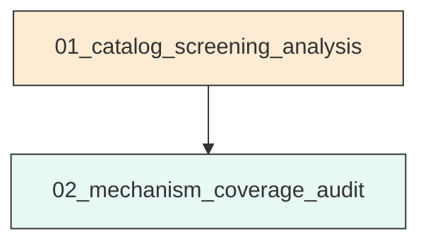
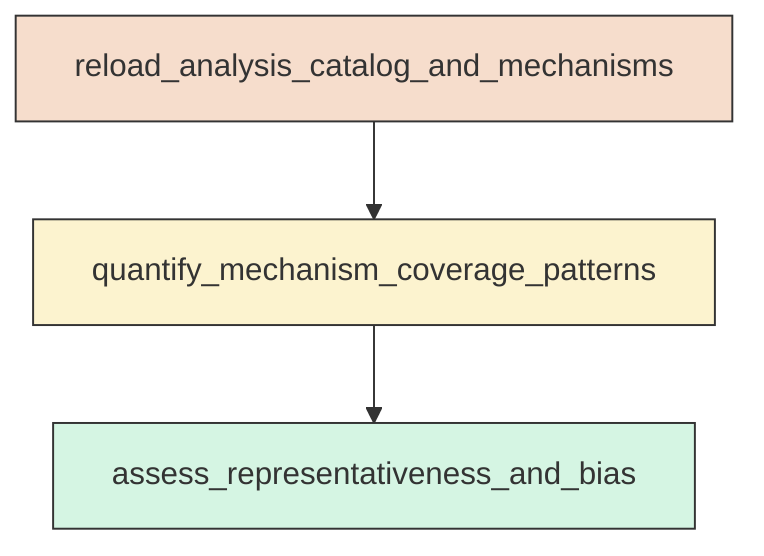

# Workflow Overview

## Top-Level Task Dependencies

**Description:**
- `01_catalog_screening_analysis`: Build the validated Aomori master catalog and run the full catalog-level screening workflow for sliding-window completeness and b-value, spatial comparisons, magnitude hierarchy, moment proxy, robustness checks, figures, and machine-readable summaries.
- `02_mechanism_coverage_audit`: Perform a reusable standalone audit of focal-mechanism matching and representativeness by phase, magnitude level, and spatial class.

## Subtask Dependencies

#### 01_catalog_screening_analysis
**Usage**: Build the validated Aomori master catalog and run the full catalog-level screening workflow for sliding-window completeness and b-value, spatial comparisons, magnitude hierarchy, moment proxy, robustness checks, figures, and machine-readable summaries.

```mermaid
graph TD
    ingest_and_validate_inputs
    ingest_and_validate_inputs --> define_phases_and_spatial_domains
    define_phases_and_spatial_domains --> audit_mechanism_join_and_coverage_inputs
    ingest_and_validate_inputs --> select_magnitude_discretization
    define_phases_and_spatial_domains --> compute_sliding_mc_and_bvalue
    select_magnitude_discretization --> compute_sliding_mc_and_bvalue
    compute_sliding_mc_and_bvalue --> grade_window_reliability
    compute_sliding_mc_and_bvalue --> summarize_phase_aware_bvalue_behavior
    grade_window_reliability --> summarize_phase_aware_bvalue_behavior
    define_phases_and_spatial_domains --> summarize_phase_aware_bvalue_behavior
    select_magnitude_discretization --> summarize_phase_aware_bvalue_behavior
    compute_sliding_mc_and_bvalue --> compare_spatial_bvalue_patterns
    grade_window_reliability --> compare_spatial_bvalue_patterns
    define_phases_and_spatial_domains --> compare_spatial_bvalue_patterns
    define_phases_and_spatial_domains --> compute_magnitude_hierarchy
    define_phases_and_spatial_domains --> compute_moment_release_proxy
    compute_magnitude_hierarchy --> compute_moment_release_proxy
    summarize_phase_aware_bvalue_behavior --> build_catalog_evidence_matrix
    compare_spatial_bvalue_patterns --> build_catalog_evidence_matrix
    compute_magnitude_hierarchy --> build_catalog_evidence_matrix
    compute_moment_release_proxy --> build_catalog_evidence_matrix
    audit_mechanism_join_and_coverage_inputs --> build_catalog_evidence_matrix
    define_phases_and_spatial_domains --> build_catalog_evidence_matrix
    define_phases_and_spatial_domains --> run_targeted_robustness_checks
    compute_sliding_mc_and_bvalue --> run_targeted_robustness_checks
    summarize_phase_aware_bvalue_behavior --> run_targeted_robustness_checks
    compare_spatial_bvalue_patterns --> run_targeted_robustness_checks
    compute_magnitude_hierarchy --> run_targeted_robustness_checks
    compute_moment_release_proxy --> run_targeted_robustness_checks
    build_catalog_evidence_matrix --> run_targeted_robustness_checks
    compute_sliding_mc_and_bvalue --> generate_compact_diagnostic_figures
    grade_window_reliability --> generate_compact_diagnostic_figures
    summarize_phase_aware_bvalue_behavior --> generate_compact_diagnostic_figures
    compare_spatial_bvalue_patterns --> generate_compact_diagnostic_figures
    compute_moment_release_proxy --> generate_compact_diagnostic_figures
    compute_magnitude_hierarchy --> generate_compact_diagnostic_figures
    build_catalog_evidence_matrix --> generate_compact_diagnostic_figures
    compute_sliding_mc_and_bvalue --> validate_outputs_and_record_failures
    summarize_phase_aware_bvalue_behavior --> validate_outputs_and_record_failures
    compare_spatial_bvalue_patterns --> validate_outputs_and_record_failures
    compute_magnitude_hierarchy --> validate_outputs_and_record_failures
    compute_moment_release_proxy --> validate_outputs_and_record_failures
    build_catalog_evidence_matrix --> validate_outputs_and_record_failures
    style define_phases_and_spatial_domains fill:#fef9e7,stroke:#333,stroke-width:1px
    style summarize_phase_aware_bvalue_behavior fill:#f6ddcc,stroke:#333,stroke-width:1px
    style compute_sliding_mc_and_bvalue fill:#fadbd8,stroke:#333,stroke-width:1px
    style generate_compact_diagnostic_figures fill:#fdebd3,stroke:#333,stroke-width:1px
    style grade_window_reliability fill:#eaf2f8,stroke:#333,stroke-width:1px
    style audit_mechanism_join_and_coverage_inputs fill:#e8daef,stroke:#333,stroke-width:1px
    style compute_magnitude_hierarchy fill:#d1f2eb,stroke:#333,stroke-width:1px
    style compute_moment_release_proxy fill:#ebdef0,stroke:#333,stroke-width:1px
    style compare_spatial_bvalue_patterns fill:#d1f2eb,stroke:#333,stroke-width:1px
    style run_targeted_robustness_checks fill:#fadbd8,stroke:#333,stroke-width:1px
    style validate_outputs_and_record_failures fill:#f9e79f,stroke:#333,stroke-width:1px
    style build_catalog_evidence_matrix fill:#fcf3cf,stroke:#333,stroke-width:1px
    style select_magnitude_discretization fill:#e8daef,stroke:#333,stroke-width:1px
    style ingest_and_validate_inputs fill:#ebdef0,stroke:#333,stroke-width:1px
```

**Description:**
- `ingest_and_validate_inputs`: Load the relocated catalog and reference tables, inspect schema, standardize core fields, and log validation results.
- `define_phases_and_spatial_domains`: Construct phase boundaries, distance metrics, neutral geometric subsets, and M2-related flags for downstream analysis.
- `audit_mechanism_join_and_coverage_inputs`: Match focal-mechanism records to the catalog, quantify join success, and record potential coverage bias before interpretation.
- `select_magnitude_discretization`: determine an operational magnitude bin width from metadata or observed quantization and store the choice for reproducible Mc and b-value estimation.
- `compute_sliding_mc_and_bvalue`: Estimate Mc and classical b-value in fixed-count sliding windows for the combined local zone and feasible secondary spatial subsets.
- `grade_window_reliability`: Classify each sliding-window result as robust, usable with caution, exploratory, or not interpretable using completeness and fit diagnostics.
- `summarize_phase_aware_bvalue_behavior`: Overlay phase boundaries on the sliding-window b-value curves and compare temporal evolution against secondary aggregate phase summaries.
- `compare_spatial_bvalue_patterns`: Compare b-value behavior across M1-centered, M3-centered, along-axis, and off-axis subsets only where sample size and reliability are adequate.
- `compute_magnitude_hierarchy`: Quantify largest-event structure, magnitude gaps, threshold counts, and burst-level hierarchy across phases and spatial subsets.
- `compute_moment_release_proxy`: Convert magnitudes to a consistent scalar moment proxy and summarize cumulative release, burst shares, and dominance metrics by phase and spatial class.
- `build_catalog_evidence_matrix`: Synthesize catalog-level statistical evidence and mechanism coverage limits into the requested hypothesis screening matrix.
- `run_targeted_robustness_checks`: Evaluate whether the main screening conclusions change under the user-prioritized sensitivity tests.
- `generate_compact_diagnostic_figures`: Produce the requested compact figure set and figure-ready tables tied directly to the main catalog-screening questions.
- `validate_outputs_and_record_failures`: Verify that required scientific outputs are non-empty and log failure evidence for any incomplete analysis branch.

#### 02_mechanism_coverage_audit
**Usage**: Perform a reusable standalone audit of focal-mechanism matching and representativeness by phase, magnitude level, and spatial class.

**Description:**
- `reload_analysis_catalog_and_mechanisms`: Load the validated analysis catalog and matched mechanism information for focused coverage assessment.
- `quantify_mechanism_coverage_patterns`: Summarize mechanism availability and missingness across phases, magnitude thresholds, and spatial classes.
- `assess_representativeness_and_bias`: Flag whether available focal mechanisms are representative enough for exploratory consistency checks.