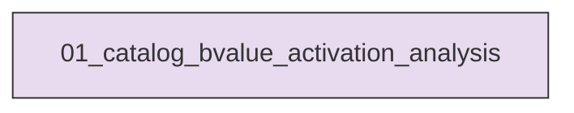
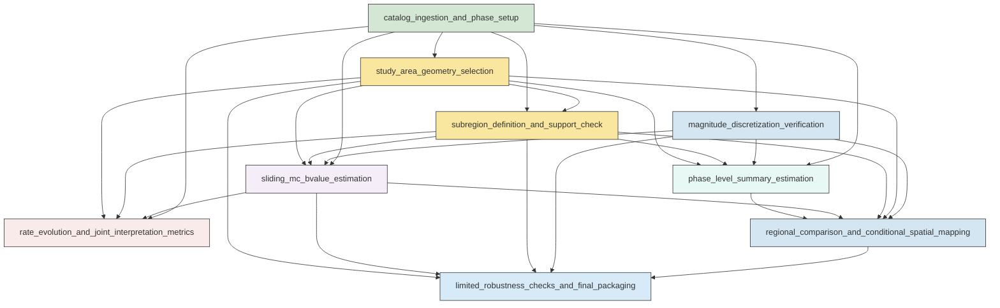

# Research Codings

## Task Overview


**Description:**
- `01_catalog_bvalue_activation_analysis`: Build the Aomori analysis catalog, define the M1-M3 study regions, estimate Mc b-value and rate evolution, run limited robustness checks, and generate the final figures and machine-readable outputs.


## Task Details


#### 01_catalog_bvalue_activation_analysis
**Usage**: Build the Aomori analysis catalog, define the M1-M3 study regions, estimate Mc b-value and rate evolution, run limited robustness checks, and generate the final figures and machine-readable outputs.

**Description:**
- `catalog_ingestion_and_phase_setup`: Load the filtered catalog and mainshock table, standardize fields, sort by origin time, and define the interpretive phase markers.
- `magnitude_discretization_verification`: Verify the catalog magnitude discretization and select a consistent delta_m for Mc and b-value estimation.
- `study_area_geometry_selection`: Construct simple M1-M3-oriented candidate regions, compare them with a broad baseline, and choose the final whole study area based on spatial coverage and exclusion of unrelated clustering.
- `subregion_definition_and_support_check`: Define M1-centered and M3-centered circular subregions and quantify whether they have enough events for the requested sliding analysis.
- `phase_level_summary_estimation`: Compute simple phase-by-region summaries of Mc b-value uncertainty completeness support and average event rate.
- `sliding_mc_bvalue_estimation`: Estimate windowed Mc and b-value series for the whole area and main subregions using fixed-count windows assigned to median event time.
- `rate_evolution_and_joint_interpretation_metrics`: Compute matched-window and simple calendar-bin event-rate measures and pair them with the sliding b-value results.
- `regional_comparison_and_conditional_spatial_mapping`: Compare whole-area M1-centered and M3-centered evolution and optionally compute spatial b-value maps only if support and Mc stability are adequate.
- `limited_robustness_checks_and_final_packaging`: Run only the targeted sensitivity tests that could change the broad interpretation and assemble the compact final deliverables.

#### Coding Script

```python

#!/usr/bin/env python
from __future__ import annotations

import math
import os
import sys
import traceback
from dataclasses import dataclass
from pathlib import Path
from typing import Iterable

import matplotlib
matplotlib.use('Agg')
import matplotlib.dates as mdates
import matplotlib.pyplot as plt
from matplotlib.patches import Ellipse, Polygon
import numpy as np
import pandas as pd
from scipy.ndimage import gaussian_filter
from scipy.spatial import cKDTree
from seismostats.analysis import estimate_b, estimate_mc_ks, estimate_mc_maxc
from statsmodels.nonparametric.smoothers_lowess import lowess


SCRIPT_PATH = Path(__file__).resolve()
OUTPUT_DIR = Path(
    '<CASE_ROOT>/run/03_1D_catalog_statistic_model_check/exp_run/outputs/01_catalog_bvalue_activation_analysis'
).resolve()
DATA_DIR = Path(
    '<CASE_ROOT>/data'
).resolve()
CATALOG_PATH = (DATA_DIR / 'catalog' / 'Snet_catalog_20200101_20260522_filter.csv').resolve()
MAINSHOCK_PATH = (DATA_DIR / 'catalog' / 'main_earthquake.csv').resolve()
STATION_PATH = (DATA_DIR / 'stations' / 'station.sta').resolve()
MECHA_PATH = (DATA_DIR / 'source_mechanism' / 'Snet_mecha.csv').resolve()

TIME_START = pd.Timestamp('2020-01-01 00:00:00')
TIME_END = pd.Timestamp('2026-05-22 23:59:59')
DELTA_M = 0.1
PRIMARY_WINDOW = 500
PRIMARY_STEP = 100
WINDOW_SENSITIVITY = [300, 500, 750]
SUBREGION_RADII_KM = [80.0, 60.0]
RATE_BIN_DAYS = 7
MIN_COMPLETE_EVENTS = 80
MIN_CELL_COMPLETE_EVENTS = 120
MIN_CELL_TOTAL_EVENTS = 180
GRID_SPACING_KM = 20.0
GRID_SEARCH_RADIUS_KM = 35.0
KS_SAMPLE_WINDOWS = 18

PHASE_COLORS = {
    'pre_M1_reference': '#4c72b0',
    'M1_related': '#dd8452',
    'middle_phase': '#55a868',
    'final_pre_M3': '#c44e52',
    'post_M3_context': '#8172b3',
}


@dataclass
class OrientedGeometry:
    shape: str
    center_lat: float
    center_lon: float
    azimuth_deg: float
    length_km: float
    width_km: float
    semi_major_km: float
    semi_minor_km: float
    start_margin_km: float
    end_margin_km: float


def log(message: str) -> None:
    print(message, flush=True)


def ensure_output_dirs() -> None:
    subdirs = [
        OUTPUT_DIR,
        OUTPUT_DIR / 'figures',
        OUTPUT_DIR / 'tables',
        OUTPUT_DIR / 'spatial',
    ]
    stale_patterns = [
        'figures/*.png',
        'figures/*.jpg',
        'tables/*.csv',
        'spatial/*.csv',
        'spatial/*.png',
    ]
    for subdir in subdirs:
        subdir.mkdir(parents=True, exist_ok=True)
    removed = 0
    for pattern in stale_patterns:
        for path in OUTPUT_DIR.glob(pattern):
            if path.is_file():
                path.unlink()
                removed += 1
    log(f'Prepared output directory and removed {removed} stale generated files from prior runs.')


def load_catalog() -> pd.DataFrame:
    log(f'Loading catalog: {CATALOG_PATH}')
    df = pd.read_csv(CATALOG_PATH, parse_dates=['datetime'])
    df = df.rename(columns={'datetime': 'time', 'lat': 'latitude', 'lon': 'longitude', 'dep': 'depth_km', 'mag': 'magnitude'})
    df = df[(df['time'] >= TIME_START) & (df['time'] <= TIME_END)].copy()
    df = df.sort_values('time').reset_index(drop=True)
    df['event_id'] = np.arange(1, len(df) + 1, dtype=np.int64)
    return df


def load_mainshocks() -> pd.DataFrame:
    main = pd.read_csv(MAINSHOCK_PATH, parse_dates=['datetime'])
    main = main.rename(columns={'index': 'name', 'datetime': 'time', 'lat': 'latitude', 'lon': 'longitude', 'dep': 'depth_km', 'mag': 'magnitude'})
    return main.sort_values('time').reset_index(drop=True)


def load_stations() -> pd.DataFrame | None:
    if not STATION_PATH.exists():
        return None
    stations = pd.read_csv(STATION_PATH)
    rename_map = {}
    if 'latitude' in stations.columns and 'lat' not in stations.columns:
        rename_map['latitude'] = 'lat'
    if 'longitude' in stations.columns and 'lon' not in stations.columns:
        rename_map['longitude'] = 'lon'
    if rename_map:
        stations = stations.rename(columns=rename_map)
    required = {'lat', 'lon'}
    missing = required.difference(stations.columns)
    if missing:
        raise ValueError(f'Station file missing required columns after normalization: {sorted(missing)}')
    return stations


def verify_delta_m(catalog: pd.DataFrame) -> pd.DataFrame:
    mags = np.sort(catalog['magnitude'].dropna().unique())
    diffs = np.diff(mags)
    diffs = diffs[diffs > 1e-8]
    summary = pd.DataFrame({
        'n_unique_magnitudes': [len(mags)],
        'min_positive_spacing': [float(diffs.min()) if len(diffs) else np.nan],
        'median_positive_spacing': [float(np.median(diffs)) if len(diffs) else np.nan],
        'adopted_delta_m': [DELTA_M],
    })
    return summary


def geodetic_xy_km(lat: Iterable[float], lon: Iterable[float], lat0: float, lon0: float) -> tuple[np.ndarray, np.ndarray]:
    lat = np.asarray(lat, dtype=float)
    lon = np.asarray(lon, dtype=float)
    lat0_rad = np.deg2rad(lat0)
    x = (lon - lon0) * 111.32 * np.cos(lat0_rad)
    y = (lat - lat0) * 110.57
    return x, y


def haversine_km(lat1, lon1, lat2, lon2):
    r = 6371.0
    lat1 = np.deg2rad(np.asarray(lat1, dtype=float))
    lon1 = np.deg2rad(np.asarray(lon1, dtype=float))
    lat2 = np.deg2rad(np.asarray(lat2, dtype=float))
    lon2 = np.deg2rad(np.asarray(lon2, dtype=float))
    dlat = lat2 - lat1
    dlon = lon2 - lon1
    a = np.sin(dlat / 2.0) ** 2 + np.cos(lat1) * np.cos(lat2) * np.sin(dlon / 2.0) ** 2
    return 2.0 * r * np.arcsin(np.sqrt(a))


def geometry_from_mainshocks(main: pd.DataFrame) -> tuple[OrientedGeometry, OrientedGeometry, dict]:
    m1 = main.loc[main['name'] == 'M1'].iloc[0]
    m3 = main.loc[main['name'] == 'M3'].iloc[0]
    center_lat = 0.5 * (m1['latitude'] + m3['latitude'])
    center_lon = 0.5 * (m1['longitude'] + m3['longitude'])
    dx, dy = geodetic_xy_km([m3['latitude']], [m3['longitude']], center_lat, center_lon)
    dx = float(dx[0])
    dy = float(dy[0])
    separation_km = math.hypot(dx, dy)
    azimuth_deg = (math.degrees(math.atan2(dx, dy)) + 360.0) % 360.0
    length_km = separation_km + 120.0
    width_km = 120.0
    start_margin_km = end_margin_km = 60.0
    rectangle = OrientedGeometry(
        shape='rotated_rectangle',
        center_lat=center_lat,
        center_lon=center_lon,
        azimuth_deg=azimuth_deg,
        length_km=length_km,
        width_km=width_km,
        semi_major_km=length_km / 2.0,
        semi_minor_km=width_km / 2.0,
        start_margin_km=start_margin_km,
        end_margin_km=end_margin_km,
    )
    ellipse = OrientedGeometry(
        shape='ellipse',
        center_lat=center_lat,
        center_lon=center_lon,
        azimuth_deg=azimuth_deg,
        length_km=length_km,
        width_km=width_km,
        semi_major_km=length_km / 2.0,
        semi_minor_km=width_km / 2.0,
        start_margin_km=start_margin_km,
        end_margin_km=end_margin_km,
    )
    broad = {
        'min_lat': float(min(m1['latitude'], m3['latitude']) - 0.9),
        'max_lat': float(max(m1['latitude'], m3['latitude']) + 0.9),
        'min_lon': float(min(m1['longitude'], m3['longitude']) - 1.2),
        'max_lon': float(max(m1['longitude'], m3['longitude']) + 1.2),
    }
    return rectangle, ellipse, broad


def project_along_cross(df: pd.DataFrame, geom: OrientedGeometry) -> tuple[np.ndarray, np.ndarray]:
    x, y = geodetic_xy_km(df['latitude'].to_numpy(), df['longitude'].to_numpy(), geom.center_lat, geom.center_lon)
    theta = np.deg2rad(90.0 - geom.azimuth_deg)
    along = x * np.cos(theta) + y * np.sin(theta)
    cross = -x * np.sin(theta) + y * np.cos(theta)
    return along, cross


def mask_geometry(df: pd.DataFrame, geom: OrientedGeometry) -> np.ndarray:
    along, cross = project_along_cross(df, geom)
    if geom.shape == 'rotated_rectangle':
        return (np.abs(along) <= geom.semi_major_km) & (np.abs(cross) <= geom.semi_minor_km)
    return (along / geom.semi_major_km) ** 2 + (cross / geom.semi_minor_km) ** 2 <= 1.0


def broad_rectangle_mask(df: pd.DataFrame, broad: dict) -> np.ndarray:
    return (
        (df['latitude'] >= broad['min_lat']) &
        (df['latitude'] <= broad['max_lat']) &
        (df['longitude'] >= broad['min_lon']) &
        (df['longitude'] <= broad['max_lon'])
    ).to_numpy()


def find_southwestern_cluster(df: pd.DataFrame) -> tuple[float, float, float]:
    qs = df[['latitude', 'longitude']].quantile([0.2, 0.35]).to_dict()
    lat_thr = float(qs['latitude'][0.2])
    lon_thr = float(qs['longitude'][0.35])
    mask = (df['latitude'] <= lat_thr) & (df['longitude'] <= lon_thr)
    frac = float(mask.mean())
    return lat_thr, lon_thr, frac


def add_phase_labels(df: pd.DataFrame, m1_time: pd.Timestamp, m3_time: pd.Timestamp) -> pd.DataFrame:
    out = df.copy()
    phase = np.full(len(out), 'outside_phase_windows', dtype=object)
    phase[(out['time'] >= TIME_START) & (out['time'] < m1_time - pd.Timedelta(days=14))] = 'pre_M1_reference'
    phase[(out['time'] >= m1_time - pd.Timedelta(days=14)) & (out['time'] < m1_time + pd.Timedelta(days=21))] = 'M1_related'
    phase[(out['time'] >= m1_time + pd.Timedelta(days=21)) & (out['time'] < m3_time - pd.Timedelta(days=35))] = 'middle_phase'
    phase[(out['time'] >= m3_time - pd.Timedelta(days=35)) & (out['time'] < m3_time)] = 'final_pre_M3'
    phase[(out['time'] >= m3_time) & (out['time'] <= TIME_END)] = 'post_M3_context'
    out['phase'] = phase
    sens = np.full(len(out), 'outside_phase_windows', dtype=object)
    sens[(out['time'] >= TIME_START) & (out['time'] < m1_time - pd.Timedelta(days=7))] = 'pre_M1_reference_7d'
    out['pre_M1_sensitivity'] = sens
    return out


def estimate_window_stats(magnitudes: np.ndarray, mc_method: str = 'maxc') -> dict:
    magnitudes = np.asarray(magnitudes, dtype=float)
    if mc_method == 'ks':
        mc, meta = estimate_mc_ks(magnitudes, delta_m=DELTA_M, n=1000, stop_when_passed=True)
        if mc is None:
            mc = np.nan
    else:
        mc, meta = estimate_mc_maxc(magnitudes, fmd_bin=DELTA_M)
    result = {
        'mc': float(mc) if mc is not None else np.nan,
        'mc_method': mc_method,
        'mc_meta': meta,
        'b_value': np.nan,
        'b_std': np.nan,
        'n_complete': 0,
        'reliability_flag': 'insufficient_complete_count',
        'reliable': False,
    }
    if not np.isfinite(result['mc']):
        result['reliability_flag'] = 'mc_not_found'
        return result
    comp_mask = magnitudes >= (result['mc'] - 1e-8)
    n_complete = int(comp_mask.sum())
    result['n_complete'] = n_complete
    if n_complete < MIN_COMPLETE_EVENTS:
        return result
    b_value, b_std, _ = estimate_b(magnitudes, mc=result['mc'], delta_m=DELTA_M, return_std=True, return_n=True)
    result['b_value'] = float(b_value)
    result['b_std'] = float(b_std)
    std_limit = max(0.35, 0.45 * max(result['b_value'], 0.5))
    if np.isfinite(result['b_value']) and np.isfinite(result['b_std']) and result['b_std'] <= std_limit:
        result['reliability_flag'] = 'reliable'
        result['reliable'] = True
    else:
        result['reliability_flag'] = 'high_uncertainty'
    return result


def sliding_window_analysis(df: pd.DataFrame, region_name: str, window_size: int, step: int, mc_method: str = 'maxc') -> pd.DataFrame:
    required_cols = {'time', 'magnitude'}
    missing = required_cols.difference(df.columns)
    if missing:
        raise ValueError(f'{region_name} missing required columns for sliding-window analysis: {sorted(missing)}')
    rows = []
    n = len(df)
    if n < window_size:
        return pd.DataFrame(rows)
    time_values = pd.to_datetime(df['time']).to_numpy()
    mags = df['magnitude'].to_numpy(dtype=float)
    total_windows = ((n - window_size) // step) + 1
    for i, start in enumerate(range(0, n - window_size + 1, step), start=1):
        if i == 1 or i == total_windows or i % 20 == 0:
            log(f'[{region_name}] sliding windows {i}/{total_windows} (window={window_size}, step={step}, mc={mc_method})')
        stop = start + window_size
        sub_mags = mags[start:stop]
        sub_times = pd.to_datetime(time_values[start:stop])
        stats = estimate_window_stats(sub_mags, mc_method=mc_method)
        duration_days = (sub_times[-1] - sub_times[0]).total_seconds() / 86400.0
        rate = np.nan if duration_days <= 0 else window_size / duration_days
        rows.append({
            'region': region_name,
            'window_size': window_size,
            'step_size': step,
            'window_start_index': int(start),
            'window_end_index': int(stop - 1),
            'window_start_time': sub_times[0],
            'window_end_time': sub_times[-1],
            'window_median_time': sub_times[len(sub_times) // 2],
            'window_duration_days': duration_days,
            'matched_rate_events_per_day': rate,
            'n_total': window_size,
            **{k: v for k, v in stats.items() if k != 'mc_meta'},
        })
    out = pd.DataFrame(rows)
    if len(out) == 0:
        return out
    out['b_rolling_median_5'] = out['b_value'].rolling(5, center=True, min_periods=2).median()
    tnum = mdates.date2num(pd.to_datetime(out['window_median_time']))
    valid = np.isfinite(out['b_value'].to_numpy())
    if valid.sum() >= 5:
        frac = min(0.5, max(0.18, 7.0 / valid.sum()))
        smooth = lowess(out.loc[valid, 'b_value'], tnum[valid], frac=frac, it=1, return_sorted=False)
        out['b_lowess'] = np.nan
        out.loc[valid, 'b_lowess'] = smooth
    else:
        out['b_lowess'] = np.nan
    return out


def summarize_phase(region_df: pd.DataFrame, region_name: str, m1_time: pd.Timestamp, m3_time: pd.Timestamp, mc_method: str = 'maxc') -> pd.DataFrame:
    phases = [
        ('pre_M1_reference', TIME_START, m1_time - pd.Timedelta(days=14)),
        ('pre_M1_reference_7d', TIME_START, m1_time - pd.Timedelta(days=7)),
        ('M1_related', m1_time - pd.Timedelta(days=14), m1_time + pd.Timedelta(days=21)),
        ('middle_phase', m1_time + pd.Timedelta(days=21), m3_time - pd.Timedelta(days=35)),
        ('final_pre_M3', m3_time - pd.Timedelta(days=35), m3_time),
        ('post_M3_context', m3_time, TIME_END),
    ]
    rows = []
    for phase_name, start, end in phases:
        phase_df = region_df[(region_df['time'] >= start) & (region_df['time'] < end)].copy()
        duration_days = max((end - start).total_seconds() / 86400.0, 0.0)
        if len(phase_df) == 0:
            rows.append({
                'region': region_name,
                'phase': phase_name,
                'start_time': start,
                'end_time': end,
                'duration_days': duration_days,
                'n_total': 0,
                'rate_events_per_day': 0.0,
                'mc': np.nan,
                'b_value': np.nan,
                'b_std': np.nan,
                'n_complete': 0,
                'reliable': False,
                'reliability_flag': 'no_events',
                'mc_method': mc_method,
            })
            continue
        stats = estimate_window_stats(phase_df['magnitude'].to_numpy(), mc_method=mc_method)
        rows.append({
            'region': region_name,
            'phase': phase_name,
            'start_time': start,
            'end_time': end,
            'duration_days': duration_days,
            'n_total': int(len(phase_df)),
            'rate_events_per_day': float(len(phase_df) / duration_days) if duration_days > 0 else np.nan,
            **{k: v for k, v in stats.items() if k != 'mc_meta'},
        })
    return pd.DataFrame(rows)


def make_polygon_vertices(geom: OrientedGeometry) -> np.ndarray:
    half_l = geom.semi_major_km
    half_w = geom.semi_minor_km
    verts = np.array([[-half_l, -half_w], [half_l, -half_w], [half_l, half_w], [-half_l, half_w]])
    theta = np.deg2rad(90.0 - geom.azimuth_deg)
    rot = np.array([[np.cos(theta), -np.sin(theta)], [np.sin(theta), np.cos(theta)]])
    xy = verts @ rot.T
    lon = geom.center_lon + xy[:, 0] / (111.32 * np.cos(np.deg2rad(geom.center_lat)))
    lat = geom.center_lat + xy[:, 1] / 110.57
    return np.column_stack([lon, lat])


def plot_study_area(catalog: pd.DataFrame, main: pd.DataFrame, stations: pd.DataFrame | None, rectangle: OrientedGeometry, ellipse: OrientedGeometry, broad: dict, region_counts: pd.DataFrame) -> None:
    fig, axes = plt.subplots(1, 2, figsize=(13, 6), constrained_layout=True)
    ax = axes[0]
    ax.scatter(catalog['longitude'], catalog['latitude'], s=1, c='0.55', alpha=0.25, linewidths=0, label='catalog events')
    rect_poly = make_polygon_vertices(rectangle)
    ax.add_patch(Polygon(rect_poly, closed=True, fill=False, edgecolor='#c44e52', linewidth=2.0, label='chosen rotated rectangle'))
    ell = Ellipse((ellipse.center_lon, ellipse.center_lat), width=ellipse.length_km / (111.32 * np.cos(np.deg2rad(ellipse.center_lat))), height=ellipse.width_km / 110.57, angle=90.0 - ellipse.azimuth_deg, fill=False, edgecolor='#4c72b0', linestyle='--', linewidth=1.6, label='ellipse sensitivity')
    ax.add_patch(ell)
    ax.plot([broad['min_lon'], broad['max_lon'], broad['max_lon'], broad['min_lon'], broad['min_lon']], [broad['min_lat'], broad['min_lat'], broad['max_lat'], broad['max_lat'], broad['min_lat']], color='0.2', linestyle=':', linewidth=1.5, label='broad rectangle baseline')
    for _, row in main.iterrows():
        ax.scatter(row['longitude'], row['latitude'], s=80, marker='*', edgecolor='k', linewidth=0.7, label=row['name'])
        ax.text(row['longitude'] + 0.03, row['latitude'] + 0.03, row['name'], fontsize=9, weight='bold')
    if stations is not None and {'lon', 'lat'}.issubset(stations.columns):
        ax.scatter(stations['lon'], stations['lat'], s=4, c='royalblue', alpha=0.18, linewidths=0, label='stations')
    ax.set_xlabel('Longitude')
    ax.set_ylabel('Latitude')
    ax.set_title('Study-area selection')
    ax.legend(loc='lower left', fontsize=8, frameon=True)
    ax.grid(alpha=0.2)

    ax = axes[1]
    count_df = region_counts.copy()
    x = np.arange(len(count_df))
    ax.bar(x - 0.18, count_df['event_count'], width=0.36, color='#4c72b0', label='events in geometry')
    ax.bar(x + 0.18, count_df['southwest_cluster_count'], width=0.36, color='#dd8452', label='SW-cluster events captured')
    ax.set_xticks(x)
    ax.set_xticklabels(count_df['region_name'], rotation=10)
    ax.set_ylabel('Count')
    ax.set_title('Geometry coverage diagnostic')
    for xi, val in zip(x, count_df['southwest_cluster_fraction']):
        ax.text(xi + 0.18, count_df.loc[count_df.index[xi], 'southwest_cluster_count'] + max(count_df['southwest_cluster_count'].max() * 0.01, 1), f'{val:.2f}', ha='center', va='bottom', fontsize=8)
    ax.legend(fontsize=8)
    ax.grid(axis='y', alpha=0.2)
    fig.savefig(OUTPUT_DIR / 'figures' / 'study_area_selection_map.png', dpi=220)
    plt.close(fig)


def plot_subregions(catalog: pd.DataFrame, main: pd.DataFrame, rectangle: OrientedGeometry) -> None:
    fig, ax = plt.subplots(figsize=(7.5, 7.0), constrained_layout=True)
    ax.scatter(catalog['longitude'], catalog['latitude'], s=1, c='0.65', alpha=0.22, linewidths=0)
    rect_poly = make_polygon_vertices(rectangle)
    ax.add_patch(Polygon(rect_poly, closed=True, fill=False, edgecolor='k', linewidth=1.8))
    colors = {'M1': '#dd8452', 'M3': '#55a868'}
    for _, row in main[main['name'].isin(['M1', 'M3'])].iterrows():
        ax.scatter(row['longitude'], row['latitude'], s=90, marker='*', c=colors[row['name']], edgecolor='k', linewidth=0.7)
        ax.text(row['longitude'] + 0.03, row['latitude'] + 0.03, row['name'], fontsize=10, weight='bold')
        for radius in [80.0, 60.0]:
            width_deg = 2 * radius / (111.32 * np.cos(np.deg2rad(row['latitude'])))
            height_deg = 2 * radius / 110.57
            ax.add_patch(Ellipse((row['longitude'], row['latitude']), width=width_deg, height=height_deg, fill=False, edgecolor=colors[row['name']], linestyle='-' if radius == 80 else '--', linewidth=1.8 if radius == 80 else 1.2, alpha=0.9))
    ax.set_xlabel('Longitude')
    ax.set_ylabel('Latitude')
    ax.set_title('Whole area and M1/M3-centered subregions')
    ax.grid(alpha=0.2)
    fig.savefig(OUTPUT_DIR / 'figures' / 'study_area_and_subregions.png', dpi=220)
    plt.close(fig)


def add_time_markers(ax, main: pd.DataFrame, label_positions: dict[str, float] | None = None, show_labels: bool = True) -> None:
    if label_positions is None:
        label_positions = {}
    for _, row in main.iterrows():
        ax.axvline(row['time'], color='k', linestyle='--', linewidth=1.0, alpha=0.75)
        if show_labels:
            ypos = label_positions.get(row['name'], 0.98)
            ax.text(row['time'], ypos, row['name'], transform=ax.get_xaxis_transform(), rotation=90, va='top', ha='right', fontsize=8, bbox=dict(facecolor='white', edgecolor='none', alpha=0.65, pad=0.5))


def add_phase_spans(ax, m1_time: pd.Timestamp, m3_time: pd.Timestamp) -> None:
    phases = [
        ('pre_M1_reference', TIME_START, m1_time - pd.Timedelta(days=14)),
        ('M1_related', m1_time - pd.Timedelta(days=14), m1_time + pd.Timedelta(days=21)),
        ('middle_phase', m1_time + pd.Timedelta(days=21), m3_time - pd.Timedelta(days=35)),
        ('final_pre_M3', m3_time - pd.Timedelta(days=35), m3_time),
        ('post_M3_context', m3_time, TIME_END),
    ]
    for name, start, end in phases:
        ax.axvspan(start, end, color=PHASE_COLORS[name], alpha=0.08)


def plot_bvalue_timeseries(series: pd.DataFrame, main: pd.DataFrame, m1_time: pd.Timestamp, m3_time: pd.Timestamp) -> None:
    if len(series) == 0:
        return
    marker_positions = {'M1': 0.98, 'M2': 0.90, 'M3': 0.82}
    fig, axes = plt.subplots(2, 1, figsize=(12.5, 8.5), sharex=True, constrained_layout=True)
    ax = axes[0]
    add_phase_spans(ax, m1_time, m3_time)
    ax.plot(series['window_median_time'], series['b_value'], color='#4c72b0', marker='o', markersize=3, linewidth=1.0, label='window b-value')
    ax.fill_between(series['window_median_time'], series['b_value'] - series['b_std'], series['b_value'] + series['b_std'], color='#4c72b0', alpha=0.15, linewidth=0)
    ax.plot(series['window_median_time'], series['b_rolling_median_5'], color='#dd8452', linewidth=2.0, label='rolling median')
    ax.plot(series['window_median_time'], series['b_lowess'], color='#c44e52', linewidth=2.3, label='LOWESS trend')
    bad = series[~series['reliable']]
    if len(bad):
        ax.scatter(bad['window_median_time'], bad['b_value'], marker='x', s=26, color='k', label='lower-reliability windows')
    add_time_markers(ax, main, marker_positions)
    ax.set_ylabel('b-value')
    ax.set_title('Whole-area sliding b-value evolution')
    ax.legend(loc='upper left', fontsize=8)
    ax.grid(alpha=0.2)

    ax = axes[1]
    add_phase_spans(ax, m1_time, m3_time)
    ax.plot(series['window_median_time'], series['mc'], color='#55a868', linewidth=1.6, label='Mc')
    ax.scatter(series.loc[series['reliable'], 'window_median_time'], np.ones(series['reliable'].sum()), s=12, color='#4c72b0', label='reliable')
    ax.scatter(series.loc[~series['reliable'], 'window_median_time'], np.zeros((~series['reliable']).sum()), s=12, color='#c44e52', label='not reliable')
    add_time_markers(ax, main, marker_positions)
    ax.set_ylabel('Mc / reliability')
    ax.set_yticks([0, 1])
    ax.set_yticklabels(['not reliable', 'reliable'])
    ax2 = ax.twinx()
    ax2.plot(series['window_median_time'], series['mc'], color='#55a868', linewidth=1.6)
    ax2.set_ylabel('Mc')
    ax.grid(alpha=0.2)
    axes[-1].xaxis.set_major_locator(mdates.MonthLocator(interval=4))
    axes[-1].xaxis.set_major_formatter(mdates.DateFormatter('%Y-%m'))
    fig.autofmt_xdate()
    fig.savefig(OUTPUT_DIR / 'figures' / 'whole_area_bvalue_mc_timeline.png', dpi=220)
    plt.close(fig)


def plot_rate_comparison(series: pd.DataFrame, region_df: pd.DataFrame, main: pd.DataFrame, m1_time: pd.Timestamp, m3_time: pd.Timestamp) -> None:
    if len(series) == 0:
        return
    marker_positions = {'M1': 0.96, 'M2': 0.80, 'M3': 0.64}
    fig, axes = plt.subplots(3, 1, figsize=(12.5, 10.2), sharex=True, constrained_layout=True, height_ratios=[1.0, 0.9, 1.0])
    cal = region_df.set_index('time').resample(f'{RATE_BIN_DAYS}D').size().rename('count').reset_index()
    cal['rate_per_day'] = cal['count'] / RATE_BIN_DAYS
    matched_rate = pd.to_numeric(series['matched_rate_events_per_day'], errors='coerce').to_numpy(dtype=float)
    cal_rate = pd.to_numeric(cal['rate_per_day'], errors='coerce').to_numpy(dtype=float)
    matched_positive = matched_rate[np.isfinite(matched_rate) & (matched_rate > 0)]
    cal_positive = cal_rate[np.isfinite(cal_rate) & (cal_rate > 0)]
    positive_list = [arr for arr in [matched_positive, cal_positive] if len(arr) > 0]
    positive_rates = np.concatenate(positive_list) if positive_list else np.array([1.0])
    ymax_log = float(np.nanmax(positive_rates) * 2.0)
    ymin_log = max(float(np.nanmin(positive_rates) * 0.7), 1e-3)
    zoom_upper = float(np.nanpercentile(positive_rates, 95)) if len(positive_rates) else 1.0
    zoom_upper = max(zoom_upper * 1.15, 1.0)

    ax = axes[0]
    add_phase_spans(ax, m1_time, m3_time)
    ax.plot(series['window_median_time'], np.clip(matched_rate, ymin_log, None), color='#dd8452', linewidth=1.5, label='matched-window rate')
    ax.plot(cal['time'], np.clip(cal_rate, ymin_log, None), color='0.25', linewidth=1.2, alpha=0.8, label='7-day rate')
    add_time_markers(ax, main, marker_positions, show_labels=False)
    ax.set_ylabel('Rate (events/day, log)')
    ax.set_yscale('log')
    ax.set_ylim(ymin_log, ymax_log)
    ax.set_title('Event-rate evolution (full dynamic range)')
    ax.legend(loc='upper left', fontsize=8)
    ax.grid(alpha=0.2, which='both')

    ax = axes[1]
    add_phase_spans(ax, m1_time, m3_time)
    ax.plot(series['window_median_time'], matched_rate, color='#dd8452', linewidth=1.4, label='matched-window rate')
    ax.plot(cal['time'], cal_rate, color='0.25', linewidth=1.1, alpha=0.8, label='7-day rate')
    add_time_markers(ax, main, marker_positions, show_labels=False)
    ax.set_ylabel('Rate (events/day)')
    ax.set_ylim(0, zoom_upper)
    ax.set_title('Event-rate evolution (zoomed central range)')
    ax.grid(alpha=0.2)

    ax = axes[2]
    add_phase_spans(ax, m1_time, m3_time)
    ax.plot(series['window_median_time'], series['b_value'], color='#4c72b0', linewidth=1.3, label='b-value')
    ax.plot(series['window_median_time'], series['b_lowess'], color='#c44e52', linewidth=2.1, label='LOWESS trend')
    add_time_markers(ax, main, marker_positions, show_labels=True)
    ax.set_ylabel('b-value')
    ax.set_title('b-value compared with event-rate evolution')
    ax.legend(loc='upper left', fontsize=8)
    ax.grid(alpha=0.2)
    axes[-1].xaxis.set_major_locator(mdates.MonthLocator(interval=4))
    axes[-1].xaxis.set_major_formatter(mdates.DateFormatter('%Y-%m'))
    fig.autofmt_xdate()
    fig.savefig(OUTPUT_DIR / 'figures' / 'event_rate_vs_bvalue.png', dpi=220)
    plt.close(fig)


def plot_region_comparison(region_series: dict[str, pd.DataFrame], main: pd.DataFrame, m1_time: pd.Timestamp, m3_time: pd.Timestamp) -> None:
    non_empty = {k: v for k, v in region_series.items() if len(v) > 0}
    if not non_empty:
        return
    marker_positions = {'M1': 0.95, 'M2': 0.76, 'M3': 0.57}
    fig, axes = plt.subplots(3, 1, figsize=(12.8, 10.5), sharex=True, constrained_layout=True, height_ratios=[1.0, 1.0, 1.0])
    colors = {'whole_oriented_area': '#4c72b0', 'M1_80km': '#dd8452', 'M3_80km': '#55a868'}
    ax = axes[0]
    add_phase_spans(ax, m1_time, m3_time)
    for name, df in non_empty.items():
        ax.plot(df['window_median_time'], df['b_lowess'].fillna(df['b_rolling_median_5']), linewidth=2.0, label=name, color=colors.get(name, None))
    add_time_markers(ax, main, marker_positions, show_labels=True)
    ax.set_ylabel('Smoothed b-value')
    ax.set_title('Whole area vs M1/M3 expanded subregions')
    ax.legend(fontsize=8)
    ax.grid(alpha=0.2)

    rate_values = []
    for df in non_empty.values():
        vals = pd.to_numeric(df['matched_rate_events_per_day'], errors='coerce').to_numpy()
        vals = vals[np.isfinite(vals) & (vals > 0)]
        if len(vals):
            rate_values.append(vals)
    if rate_values:
        all_rates = np.concatenate(rate_values)
        zoom_upper = float(np.nanpercentile(all_rates, 95))
        zoom_upper = max(zoom_upper * 1.15, float(np.nanpercentile(all_rates, 80)) * 1.15, 1.0)
    else:
        all_rates = np.array([1.0])
        zoom_upper = 1.0

    ax = axes[1]
    add_phase_spans(ax, m1_time, m3_time)
    clip_cap = float(np.nanpercentile(all_rates, 85)) if len(all_rates) else zoom_upper
    clip_cap = max(clip_cap * 1.10, 1.0)
    clipped_any = False
    for name, df in non_empty.items():
        rate = pd.to_numeric(df['matched_rate_events_per_day'], errors='coerce').to_numpy(dtype=float)
        time = pd.to_datetime(df['window_median_time'])
        capped_rate = np.minimum(rate, clip_cap)
        clipped_mask = np.isfinite(rate) & (rate > clip_cap)
        if clipped_mask.any():
            clipped_any = True
        ax.plot(time, capped_rate, linewidth=1.6, label=name, color=colors.get(name, None))
        if clipped_mask.any():
            ax.scatter(time[clipped_mask], np.full(clipped_mask.sum(), clip_cap * 0.985), marker='^', s=22, color=colors.get(name, None), edgecolor='white', linewidth=0.3, zorder=5)
    add_time_markers(ax, main, marker_positions, show_labels=False)
    ax.set_ylabel('Rate (events/day)')
    ax.set_ylim(0, clip_cap * 1.06)
    title = 'Matched-window rate comparison (capped linear view)'
    if clipped_any:
        title += ' — triangles mark rates above cap'
    ax.set_title(title)
    ax.grid(alpha=0.2)

    ax = axes[2]
    add_phase_spans(ax, m1_time, m3_time)
    for name, df in non_empty.items():
        rate = pd.to_numeric(df['matched_rate_events_per_day'], errors='coerce').to_numpy(dtype=float)
        time = pd.to_datetime(df['window_median_time'])
        ax.plot(time, np.clip(rate, 1e-3, None), linewidth=1.6, label=name, color=colors.get(name, None))
    all_positive = []
    for df in non_empty.values():
        vals = pd.to_numeric(df['matched_rate_events_per_day'], errors='coerce').to_numpy(dtype=float)
        vals = vals[np.isfinite(vals) & (vals > 0)]
        if len(vals):
            all_positive.append(vals)
    rate_min = max(min(float(v.min()) for v in all_positive), 1e-3) if all_positive else 1e-3
    rate_max = max(float(v.max()) for v in all_positive) if all_positive else 1.0
    add_time_markers(ax, main, marker_positions, show_labels=False)
    ax.set_ylabel('Rate (events/day, log)')
    ax.set_yscale('log')
    ax.set_ylim(rate_min * 0.8, rate_max * 2.0)
    ax.set_title('Matched-window rate comparison (full dynamic range)')
    ax.grid(alpha=0.2, which='both')
    axes[-1].xaxis.set_major_locator(mdates.MonthLocator(interval=4))
    axes[-1].xaxis.set_major_formatter(mdates.DateFormatter('%Y-%m'))
    fig.autofmt_xdate()
    fig.savefig(OUTPUT_DIR / 'figures' / 'whole_vs_subregion_comparison.png', dpi=220)
    plt.close(fig)


def summarize_windows_by_phase(windows: pd.DataFrame, region_name: str, m1_time: pd.Timestamp, m3_time: pd.Timestamp) -> pd.DataFrame:
    if len(windows) == 0:
        return pd.DataFrame()
    required_cols = {'window_median_time', 'reliable', 'b_value', 'mc', 'matched_rate_events_per_day'}
    missing = required_cols.difference(windows.columns)
    if missing:
        raise ValueError(f'{region_name} windows missing required summary columns: {sorted(missing)}')
    phase_windows = add_phase_labels(windows.rename(columns={'window_median_time': 'time'}), m1_time, m3_time).rename(columns={'time': 'window_median_time'})
    rows = []
    for phase_name, sub in phase_windows.groupby('phase'):
        if phase_name == 'outside_phase_windows':
            continue
        reliable = sub[sub['reliable']]
        rows.append({
            'region': region_name,
            'phase': phase_name,
            'n_windows': int(len(sub)),
            'fraction_reliable': float(sub['reliable'].mean()),
            'median_b_value_reliable': float(reliable['b_value'].median()) if len(reliable) else np.nan,
            'iqr_b_value_reliable': float(reliable['b_value'].quantile(0.75) - reliable['b_value'].quantile(0.25)) if len(reliable) else np.nan,
            'median_mc': float(sub['mc'].median()),
            'median_rate_events_per_day': float(sub['matched_rate_events_per_day'].median()),
        })
    return pd.DataFrame(rows)


def region_subset(circle_center: pd.Series, radius_km: float, catalog: pd.DataFrame) -> pd.DataFrame:
    dist = haversine_km(catalog['latitude'].to_numpy(), catalog['longitude'].to_numpy(), circle_center['latitude'], circle_center['longitude'])
    return catalog.loc[dist <= radius_km].copy()


def create_spatial_grid_map(region_df: pd.DataFrame, rectangle: OrientedGeometry, period_name: str = 'full_period') -> tuple[pd.DataFrame, bool]:
    log(f'Building optional spatial grid map for {period_name}')
    along, cross = project_along_cross(region_df, rectangle)
    work = region_df.copy()
    work['along_km'] = along
    work['cross_km'] = cross
    x_centers = np.arange(-rectangle.semi_major_km + GRID_SPACING_KM / 2.0, rectangle.semi_major_km, GRID_SPACING_KM)
    y_centers = np.arange(-rectangle.semi_minor_km + GRID_SPACING_KM / 2.0, rectangle.semi_minor_km, GRID_SPACING_KM)
    coords = work[['along_km', 'cross_km']].to_numpy()
    tree = cKDTree(coords)
    rows = []
    total_cells = len(x_centers) * len(y_centers)
    cell_counter = 0
    for xc in x_centers:
        for yc in y_centers:
            cell_counter += 1
            if cell_counter == 1 or cell_counter == total_cells or cell_counter % 30 == 0:
                log(f'[spatial-grid] evaluated {cell_counter}/{total_cells} candidate cells')
            idx = tree.query_ball_point([xc, yc], r=GRID_SEARCH_RADIUS_KM)
            if len(idx) < MIN_CELL_TOTAL_EVENTS:
                continue
            mags = work.iloc[idx]['magnitude'].to_numpy()
            stats = estimate_window_stats(mags, mc_method='maxc')
            rows.append({
                'x_center_km': xc,
                'y_center_km': yc,
                'n_total': int(len(idx)),
                **{k: v for k, v in stats.items() if k != 'mc_meta'},
            })
    grid = pd.DataFrame(rows)
    if len(grid) == 0:
        return grid, False
    interpretable = int((grid['reliable'] & (grid['n_complete'] >= MIN_CELL_COMPLETE_EVENTS)).sum()) >= 8
    if not interpretable:
        return grid, False

    fig, axes = plt.subplots(1, 3, figsize=(14, 4.6), constrained_layout=True)
    reliable_grid = grid[grid['reliable'] & (grid['n_complete'] >= MIN_CELL_COMPLETE_EVENTS)].copy()
    if len(reliable_grid) == 0:
        plt.close(fig)
        return grid, False

    cmap_b = plt.get_cmap('viridis').copy()
    cmap_mc = plt.get_cmap('magma').copy()
    cmap_n = plt.get_cmap('plasma').copy()
    for ax in axes:
        ax.set_facecolor('white')

    b_vmin = float(reliable_grid['b_value'].min())
    b_vmax = float(reliable_grid['b_value'].max())
    mc_vmin = float(reliable_grid['mc'].min())
    mc_vmax = float(reliable_grid['mc'].max())
    n_vmin = float(reliable_grid['n_complete'].min())
    n_vmax = float(reliable_grid['n_complete'].max())

    sc0 = axes[0].scatter(reliable_grid['x_center_km'], reliable_grid['y_center_km'], c=reliable_grid['b_value'], s=360, marker='s', cmap=cmap_b, vmin=b_vmin, vmax=b_vmax, linewidths=0)
    axes[0].set_title('Spatial b-value')
    fig.colorbar(sc0, ax=axes[0], shrink=0.9)

    safe_mc = reliable_grid['mc'].to_numpy(dtype=float).copy()
    if len(safe_mc):
        mc_floor = max(mc_vmin, float(np.nanpercentile(safe_mc, 2)))
        safe_mc = np.maximum(safe_mc, mc_floor)
    sc1 = axes[1].scatter(reliable_grid['x_center_km'], reliable_grid['y_center_km'], c=safe_mc, s=360, marker='s', cmap=cmap_mc, vmin=mc_vmin, vmax=mc_vmax, linewidths=0, edgecolors='none')
    axes[1].set_title('Spatial Mc')
    fig.colorbar(sc1, ax=axes[1], shrink=0.9)

    sc2 = axes[2].scatter(reliable_grid['x_center_km'], reliable_grid['y_center_km'], c=reliable_grid['n_complete'], s=360, marker='s', cmap=cmap_n, vmin=n_vmin, vmax=n_vmax, linewidths=0)
    axes[2].set_title('Complete-event support')
    fig.colorbar(sc2, ax=axes[2], shrink=0.9)

    for ax in axes:
        ax.set_xlim(x_centers.min() - GRID_SPACING_KM / 2.0, x_centers.max() + GRID_SPACING_KM / 2.0)
        ax.set_ylim(y_centers.min() - GRID_SPACING_KM / 2.0, y_centers.max() + GRID_SPACING_KM / 2.0)
        ax.set_xlabel('Along-axis km')
        ax.set_ylabel('Cross-axis km')
        ax.set_aspect('equal', adjustable='box')
    fig.savefig(OUTPUT_DIR / 'figures' / f'spatial_bvalue_maps_{period_name}.png', dpi=220)
    plt.close(fig)
    return grid, True


def run_robustness_checks(region_dict: dict[str, pd.DataFrame], rectangle: OrientedGeometry, ellipse: OrientedGeometry, catalog: pd.DataFrame, main: pd.DataFrame) -> pd.DataFrame:
    m1_time = main.loc[main['name'] == 'M1', 'time'].iloc[0]
    m3_time = main.loc[main['name'] == 'M3', 'time'].iloc[0]
    rows = []

    for win in WINDOW_SENSITIVITY:
        series = sliding_window_analysis(region_dict['whole_oriented_area'], 'whole_oriented_area', win, max(50, win // 5), mc_method='maxc')
        if len(series) == 0:
            continue
        summary = summarize_windows_by_phase(series, 'whole_oriented_area', m1_time, m3_time)
        pre = summary.loc[summary['phase'] == 'pre_M1_reference', 'median_b_value_reliable']
        mid = summary.loc[summary['phase'] == 'middle_phase', 'median_b_value_reliable']
        final = summary.loc[summary['phase'] == 'final_pre_M3', 'median_b_value_reliable']
        rows.append({
            'test_type': 'window_size',
            'setting': f'{win}_events',
            'pre_minus_middle_b': float(pre.iloc[0] - mid.iloc[0]) if len(pre) and len(mid) else np.nan,
            'final_minus_middle_b': float(final.iloc[0] - mid.iloc[0]) if len(final) and len(mid) else np.nan,
            'note': 'whole oriented area',
        })

    ellipse_mask = mask_geometry(catalog, ellipse)
    ellipse_df = catalog.loc[ellipse_mask].copy().sort_values('time').reset_index(drop=True)
    rect_series = sliding_window_analysis(region_dict['whole_oriented_area'], 'whole_oriented_area', PRIMARY_WINDOW, PRIMARY_STEP, mc_method='maxc')
    ell_series = sliding_window_analysis(ellipse_df, 'ellipse_area', PRIMARY_WINDOW, PRIMARY_STEP, mc_method='maxc')
    rect_summary = summarize_windows_by_phase(rect_series, 'whole_oriented_area', m1_time, m3_time)
    ell_summary = summarize_windows_by_phase(ell_series, 'ellipse_area', m1_time, m3_time)
    for phase_name in ['pre_M1_reference', 'middle_phase', 'final_pre_M3']:
        rv = rect_summary.loc[rect_summary['phase'] == phase_name, 'median_b_value_reliable']
        ev = ell_summary.loc[ell_summary['phase'] == phase_name, 'median_b_value_reliable']
        rows.append({
            'test_type': 'geometry',
            'setting': phase_name,
            'pre_minus_middle_b': float(rv.iloc[0] - ev.iloc[0]) if len(rv) and len(ev) else np.nan,
            'final_minus_middle_b': np.nan,
            'note': 'rectangle_minus_ellipse median reliable b for phase',
        })

    for region_name in ['M1_60km', 'M1_80km', 'M3_60km', 'M3_80km']:
        series = sliding_window_analysis(region_dict[region_name], region_name, PRIMARY_WINDOW, PRIMARY_STEP, mc_method='maxc')
        if len(series) == 0:
            rows.append({'test_type': 'radius', 'setting': region_name, 'pre_minus_middle_b': np.nan, 'final_minus_middle_b': np.nan, 'note': 'insufficient events for 500-event windows'})
            continue
        summary = summarize_windows_by_phase(series, region_name, m1_time, m3_time)
        pre = summary.loc[summary['phase'] == 'pre_M1_reference', 'median_b_value_reliable']
        mid = summary.loc[summary['phase'] == 'middle_phase', 'median_b_value_reliable']
        final = summary.loc[summary['phase'] == 'final_pre_M3', 'median_b_value_reliable']
        rows.append({
            'test_type': 'radius',
            'setting': region_name,
            'pre_minus_middle_b': float(pre.iloc[0] - mid.iloc[0]) if len(pre) and len(mid) else np.nan,
            'final_minus_middle_b': float(final.iloc[0] - mid.iloc[0]) if len(final) and len(mid) else np.nan,
            'note': 'subregion radius sensitivity',
        })

    base = region_dict['whole_oriented_area']
    if len(base) >= PRIMARY_WINDOW:
        idxs = np.linspace(0, len(base) - PRIMARY_WINDOW, min(KS_SAMPLE_WINDOWS, max(1, len(base) - PRIMARY_WINDOW + 1)), dtype=int)
        compare = []
        for start in idxs:
            mags = base.iloc[start:start + PRIMARY_WINDOW]['magnitude'].to_numpy()
            maxc = estimate_window_stats(mags, mc_method='maxc')
            ks = estimate_window_stats(mags, mc_method='ks')
            compare.append({'window_start_index': int(start), 'mc_maxc': maxc['mc'], 'mc_ks': ks['mc'], 'b_maxc': maxc['b_value'], 'b_ks': ks['b_value']})
        pd.DataFrame(compare).to_csv(OUTPUT_DIR / 'tables' / 'mc_method_checkpoint_comparison.csv', index=False)
        compare_df = pd.DataFrame(compare)
        rows.append({
            'test_type': 'mc_method',
            'setting': 'maxc_vs_ks_checkpoints',
            'pre_minus_middle_b': float((compare_df['mc_maxc'] - compare_df['mc_ks']).median()),
            'final_minus_middle_b': float((compare_df['b_maxc'] - compare_df['b_ks']).median()),
            'note': 'median maxc-minus-ks difference across sampled whole-area windows',
        })

    return pd.DataFrame(rows)


def build_final_summary(area_table: pd.DataFrame, phase_table: pd.DataFrame, window_summary: pd.DataFrame, robustness: pd.DataFrame, spatial_note: str, main: pd.DataFrame) -> pd.DataFrame:
    def pick(region: str, phase: str, column: str):
        subset = window_summary[(window_summary['region'] == region) & (window_summary['phase'] == phase)]
        return subset[column].iloc[0] if len(subset) else np.nan

    area_row = area_table.loc[area_table['region_name'] == 'whole_oriented_area'].iloc[0]
    pre_b = pick('whole_oriented_area', 'pre_M1_reference', 'median_b_value_reliable')
    mid_b = pick('whole_oriented_area', 'middle_phase', 'median_b_value_reliable')
    final_b = pick('whole_oriented_area', 'final_pre_M3', 'median_b_value_reliable')
    post_b = pick('whole_oriented_area', 'post_M3_context', 'median_b_value_reliable')
    pre_rate = pick('whole_oriented_area', 'pre_M1_reference', 'median_rate_events_per_day')
    mid_rate = pick('whole_oriented_area', 'middle_phase', 'median_rate_events_per_day')
    final_rate = pick('whole_oriented_area', 'final_pre_M3', 'median_rate_events_per_day')
    m1_mid = pick('M1_80km', 'middle_phase', 'median_b_value_reliable')
    m3_mid = pick('M3_80km', 'middle_phase', 'median_b_value_reliable')
    robust_window = robustness[robustness['test_type'] == 'window_size']
    robust_radius = robustness[robustness['test_type'] == 'radius']
    lines = [
        ('coverage_area_used', f"Rotated rectangle centered at ({area_row['center_lat']:.3f}, {area_row['center_lon']:.3f}), azimuth {area_row['azimuth_deg']:.1f}°, length {area_row['length_km']:.1f} km, width {area_row['width_km']:.1f} km; {int(area_row['event_count'])} events inside."),
        ('why_this_area', 'Chosen to follow the M1-M3 corridor with about 60 km end margins while limiting unrelated dense activity outside the main corridor.'),
        ('oriented_region_vs_broad_rectangle', f"Yes. The rotated region captured {int(area_row['southwest_cluster_count'])} southwestern-cluster events (fraction {area_row['southwest_cluster_fraction']:.2f}) versus {int(area_table.loc[area_table['region_name']=='broad_rectangle_baseline','southwest_cluster_count'].iloc[0])} in the broad baseline."),
        ('main_temporal_pattern', f"Whole-area reliable-window median b-value changed from {pre_b:.3f} before M1 to {mid_b:.3f} during the earlier M1-to-M3 interval, with final pre-M3 at {final_b:.3f} and post-M3 context at {post_b:.3f}."),
        ('before_after_M1', f"Relative to the pre-M1 reference, the M1-to-M3 state shows {'lower' if pd.notna(pre_b) and pd.notna(mid_b) and mid_b < pre_b else 'higher or similar'} b-values, while rate changed from {pre_rate:.2f} to {mid_rate:.2f} events/day in matched windows."),
        ('overall_M1_to_M3_vs_pre_M1', f"The broad M1-to-M3 interval is {'lower-b / more activated' if pd.notna(pre_b) and pd.notna(mid_b) and mid_b < pre_b else 'similar-or-higher-b / not clearly more activated'} than the pre-M1 background at catalog level."),
        ('final_pre_M3_vs_earlier_interval', f"Final pre-M3 median b-value ({final_b:.3f}) is {'lower' if pd.notna(final_b) and pd.notna(mid_b) and final_b < mid_b else 'similar or higher'} than the earlier middle-phase median ({mid_b:.3f}), with matched-window rate {final_rate:.2f} vs {mid_rate:.2f} events/day."),
        ('catalog_level_activation_state_change', 'If the b-value decrease coincides with sustained or renewed rate elevation under stable Mc, the simplest interpretation is a catalog-level shift toward relatively stronger activation or lower apparent background-like state. This is descriptive only, not mechanistic proof.'),
        ('mc_and_rate_evolution', 'Mc is tracked for every window and should be checked alongside b-value; interpret only the windows flagged reliable. Event rate is reported from matched fixed-count windows and 7-day counts.'),
        ('m1_vs_m3_subregions', f"In the 80 km subregions, middle-phase median b-values are M1-centered={m1_mid:.3f} and M3-centered={m3_mid:.3f}; use these only where reliability fractions are adequate."),
        ('grid_cell_meaningfulness', spatial_note),
        ('most_justified_follow_up', 'The best follow-up is a targeted completeness-aware spatial-temporal comparison with waveform/focal-mechanism or geodetic context, rather than claiming stress transfer, fluids, slow slip, or triggering from catalog statistics alone.'),
        ('robustness_overview', f"Window-size tests ({len(robust_window)} cases) and radius tests ({len(robust_radius)} cases) were kept limited to whether the sign of the main pre-M1 versus M1-to-M3 contrast changes."),
    ]
    return pd.DataFrame(lines, columns=['question', 'answer'])


def main() -> None:
    ensure_output_dirs()
    log(f'Output directory: {OUTPUT_DIR}')

    catalog = load_catalog()
    required_catalog_cols = {'time', 'latitude', 'longitude', 'depth_km', 'magnitude', 'event_id'}
    missing_catalog = required_catalog_cols.difference(catalog.columns)
    if missing_catalog:
        raise ValueError(f'Catalog missing required columns after load/rename: {sorted(missing_catalog)}')
    mainshocks = load_mainshocks()
    required_main_cols = {'name', 'time', 'latitude', 'longitude', 'depth_km', 'magnitude'}
    missing_main = required_main_cols.difference(mainshocks.columns)
    if missing_main:
        raise ValueError(f'Mainshock table missing required columns after load/rename: {sorted(missing_main)}')
    stations = load_stations()
    delta_summary = verify_delta_m(catalog)
    delta_summary.to_csv(OUTPUT_DIR / 'tables' / 'magnitude_discretization_summary.csv', index=False)

    m1_time = mainshocks.loc[mainshocks['name'] == 'M1', 'time'].iloc[0]
    m3_time = mainshocks.loc[mainshocks['name'] == 'M3', 'time'].iloc[0]
    catalog = add_phase_labels(catalog, m1_time, m3_time)
    catalog.to_csv(OUTPUT_DIR / 'tables' / 'analysis_catalog.csv', index=False)
    mainshocks.to_csv(OUTPUT_DIR / 'tables' / 'mainshock_reference_table.csv', index=False)

    rectangle, ellipse, broad = geometry_from_mainshocks(mainshocks)
    sw_lat_thr, sw_lon_thr, sw_frac = find_southwestern_cluster(catalog)
    sw_mask = (catalog['latitude'] <= sw_lat_thr) & (catalog['longitude'] <= sw_lon_thr)

    rect_mask = mask_geometry(catalog, rectangle)
    ellipse_mask = mask_geometry(catalog, ellipse)
    broad_mask = broad_rectangle_mask(catalog, broad)

    area_rows = []
    for region_name, geom, mask in [
        ('whole_oriented_area', rectangle, rect_mask),
        ('ellipse_sensitivity', ellipse, ellipse_mask),
    ]:
        area_rows.append({
            'region_name': region_name,
            'shape': geom.shape,
            'center_lat': geom.center_lat,
            'center_lon': geom.center_lon,
            'azimuth_deg': geom.azimuth_deg,
            'length_km': geom.length_km,
            'width_km': geom.width_km,
            'event_count': int(mask.sum()),
            'southwest_cluster_count': int((mask & sw_mask.to_numpy()).sum()),
            'southwest_cluster_fraction': float(((mask & sw_mask.to_numpy()).sum()) / max(mask.sum(), 1)),
            'sw_cluster_threshold_lat': sw_lat_thr,
            'sw_cluster_threshold_lon': sw_lon_thr,
        })
    area_rows.append({
        'region_name': 'broad_rectangle_baseline',
        'shape': 'axis_aligned_rectangle',
        'center_lat': np.nan,
        'center_lon': np.nan,
        'azimuth_deg': 0.0,
        'length_km': np.nan,
        'width_km': np.nan,
        'event_count': int(broad_mask.sum()),
        'southwest_cluster_count': int((broad_mask & sw_mask.to_numpy()).sum()),
        'southwest_cluster_fraction': float(((broad_mask & sw_mask.to_numpy()).sum()) / max(broad_mask.sum(), 1)),
        'sw_cluster_threshold_lat': sw_lat_thr,
        'sw_cluster_threshold_lon': sw_lon_thr,
    })
    area_table = pd.DataFrame(area_rows)
    area_table.to_csv(OUTPUT_DIR / 'tables' / 'study_area_summary.csv', index=False)

    plot_study_area(catalog, mainshocks, stations, rectangle, ellipse, broad, area_table)
    plot_subregions(catalog, mainshocks, rectangle)

    whole_region = catalog.loc[rect_mask].copy().sort_values('time').reset_index(drop=True)
    region_dict = {'whole_oriented_area': whole_region}

    region_defs = []
    phase_count_rows = []
    for _, row in mainshocks[mainshocks['name'].isin(['M1', 'M3'])].iterrows():
        for radius in SUBREGION_RADII_KM:
            name = f"{row['name']}_{int(radius)}km"
            subset = region_subset(row, radius, catalog).sort_values('time').reset_index(drop=True)
            region_dict[name] = subset
            region_defs.append({
                'region': name,
                'center_name': row['name'],
                'center_lat': row['latitude'],
                'center_lon': row['longitude'],
                'radius_km': radius,
                'event_count': int(len(subset)),
            })
            for phase_name, g in subset.groupby('phase'):
                phase_count_rows.append({'region': name, 'phase': phase_name, 'event_count': int(len(g))})
    region_defs.insert(0, {
        'region': 'whole_oriented_area',
        'center_name': 'M1-M3 corridor',
        'center_lat': rectangle.center_lat,
        'center_lon': rectangle.center_lon,
        'radius_km': np.nan,
        'event_count': int(len(whole_region)),
    })
    region_def_table = pd.DataFrame(region_defs)
    region_def_table.to_csv(OUTPUT_DIR / 'tables' / 'region_definition_table.csv', index=False)
    pd.DataFrame(phase_count_rows).to_csv(OUTPUT_DIR / 'tables' / 'region_phase_event_counts.csv', index=False)

    phase_tables = []
    for region_name in ['whole_oriented_area', 'M1_80km', 'M1_60km', 'M3_80km', 'M3_60km']:
        phase_tables.append(summarize_phase(region_dict[region_name], region_name, m1_time, m3_time, mc_method='maxc'))
    phase_summary = pd.concat(phase_tables, ignore_index=True)
    phase_summary.to_csv(OUTPUT_DIR / 'tables' / 'phase_summary_table.csv', index=False)

    sliding_outputs = {}
    for region_name in ['whole_oriented_area', 'M1_80km', 'M3_80km']:
        log(f'Running sliding-window analysis for {region_name}')
        series = sliding_window_analysis(region_dict[region_name], region_name, PRIMARY_WINDOW, PRIMARY_STEP, mc_method='maxc')
        sliding_outputs[region_name] = series
        series.to_csv(OUTPUT_DIR / 'tables' / f'sliding_windows_{region_name}.csv', index=False)

    for region_name in ['M1_60km', 'M3_60km']:
        log(f'Running 60-km sensitivity sliding-window analysis for {region_name}')
        series = sliding_window_analysis(region_dict[region_name], region_name, PRIMARY_WINDOW, PRIMARY_STEP, mc_method='maxc')
        sliding_outputs[region_name] = series
        series.to_csv(OUTPUT_DIR / 'tables' / f'sliding_windows_{region_name}_sensitivity.csv', index=False)

    plot_bvalue_timeseries(sliding_outputs['whole_oriented_area'], mainshocks, m1_time, m3_time)
    plot_rate_comparison(sliding_outputs['whole_oriented_area'], whole_region, mainshocks, m1_time, m3_time)
    plot_region_comparison({k: sliding_outputs[k] for k in ['whole_oriented_area', 'M1_80km', 'M3_80km']}, mainshocks, m1_time, m3_time)

    window_summaries = []
    for region_name in ['whole_oriented_area', 'M1_80km', 'M3_80km', 'M1_60km', 'M3_60km']:
        if region_name not in sliding_outputs:
            continue
        window_summaries.append(summarize_windows_by_phase(sliding_outputs[region_name], region_name, m1_time, m3_time))
    window_summary = pd.concat(window_summaries, ignore_index=True) if window_summaries else pd.DataFrame()
    window_summary.to_csv(OUTPUT_DIR / 'tables' / 'region_phase_window_summary.csv', index=False)

    log('Evaluating optional spatial grid mapping')
    spatial_grid, spatial_ok = create_spatial_grid_map(whole_region, rectangle, period_name='whole_oriented_area')
    spatial_grid.to_csv(OUTPUT_DIR / 'spatial' / 'spatial_grid_support_table.csv', index=False)
    spatial_note = 'Grid-cell results are interpretable enough for secondary context only.' if spatial_ok else 'Grid-cell results are not interpretable enough for main evidence.'

    log('Running limited robustness checks')
    robustness = run_robustness_checks(region_dict, rectangle, ellipse, catalog, mainshocks)
    robustness.to_csv(OUTPUT_DIR / 'tables' / 'robustness_summary.csv', index=False)

    final_summary = build_final_summary(area_table, phase_summary, window_summary, robustness, spatial_note, mainshocks)
    final_summary.to_csv(OUTPUT_DIR / 'tables' / 'final_concise_report_answers.csv', index=False)

    catalog_basic = pd.DataFrame([{
        'catalog_start': catalog['time'].min(),
        'catalog_end': catalog['time'].max(),
        'n_events': int(len(catalog)),
        'latitude_min': float(catalog['latitude'].min()),
        'latitude_max': float(catalog['latitude'].max()),
        'longitude_min': float(catalog['longitude'].min()),
        'longitude_max': float(catalog['longitude'].max()),
        'magnitude_min': float(catalog['magnitude'].min()),
        'magnitude_max': float(catalog['magnitude'].max()),
        'delta_m': DELTA_M,
    }])
    catalog_basic.to_csv(OUTPUT_DIR / 'tables' / 'catalog_basic_summary.csv', index=False)

    log('Analysis completed successfully.')


if __name__ == '__main__':
    try:
        main()
    except Exception:
        print(traceback.format_exc(), flush=True)
        sys.exit(1)


```