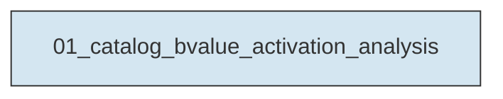
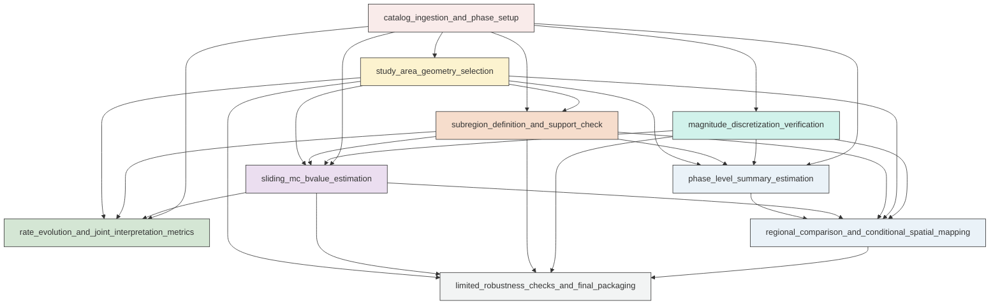

# Workflow Overview

## Top-Level Task Dependencies

**Description:**
- `01_catalog_bvalue_activation_analysis`: Build the Aomori analysis catalog, define the M1-M3 study regions, estimate Mc b-value and rate evolution, run limited robustness checks, and generate the final figures and machine-readable outputs.

## Subtask Dependencies

#### 01_catalog_bvalue_activation_analysis
**Usage**: Build the Aomori analysis catalog, define the M1-M3 study regions, estimate Mc b-value and rate evolution, run limited robustness checks, and generate the final figures and machine-readable outputs.

**Description:**
- `catalog_ingestion_and_phase_setup`: Load the filtered catalog and mainshock table, standardize fields, sort by origin time, and define the interpretive phase markers.
- `magnitude_discretization_verification`: Verify the catalog magnitude discretization and select a consistent delta_m for Mc and b-value estimation.
- `study_area_geometry_selection`: Construct simple M1-M3-oriented candidate regions, compare them with a broad baseline, and choose the final whole study area based on spatial coverage and exclusion of unrelated clustering.
- `subregion_definition_and_support_check`: Define M1-centered and M3-centered circular subregions and quantify whether they have enough events for the requested sliding analysis.
- `phase_level_summary_estimation`: Compute simple phase-by-region summaries of Mc b-value uncertainty completeness support and average event rate.
- `sliding_mc_bvalue_estimation`: Estimate windowed Mc and b-value series for the whole area and main subregions using fixed-count windows assigned to median event time.
- `rate_evolution_and_joint_interpretation_metrics`: Compute matched-window and simple calendar-bin event-rate measures and pair them with the sliding b-value results.
- `regional_comparison_and_conditional_spatial_mapping`: Compare whole-area M1-centered and M3-centered evolution and optionally compute spatial b-value maps only if support and Mc stability are adequate.
- `limited_robustness_checks_and_final_packaging`: Run only the targeted sensitivity tests that could change the broad interpretation and assemble the compact final deliverables.