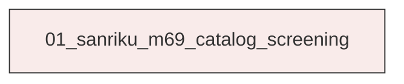
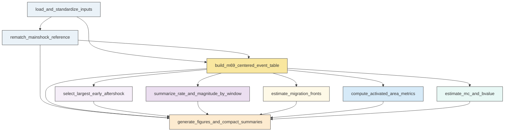

# Research Codings

## Task Overview


**Description:**
- `01_sanriku_m69_catalog_screening`: Build the M6.9-centered catalog, compute screening metrics, generate diagnostic figures, and validate machine-readable outputs for the Sanriku-Oki sequence.


## Task Details


#### 01_sanriku_m69_catalog_screening
**Usage**: Build the M6.9-centered catalog, compute screening metrics, generate diagnostic figures, and validate machine-readable outputs for the Sanriku-Oki sequence.

**Description:**
- `load_and_standardize_inputs`: Load the relocated catalog and mainshock table and standardize event fields and times.
- `rematch_mainshock_reference`: Re-match M1 to the relocated catalog with a documented near-time and near-space search and save the selection decision.
- `build_m69_centered_event_table`: Construct the master event table relative to the adopted M6.9 reference with distance, local coordinates, and phase labels.
- `select_largest_early_aftershock`: Identify the largest distinct event in the first 0.5 days after M6.9 within the local sequence while excluding the mainshock itself.
- `summarize_rate_and_magnitude_by_window`: Compute event-rate and magnitude-occurrence summaries for the foreshock and early-aftershock windows across radii.
- `estimate_migration_fronts`: Compute 90th-percentile distance fronts in time bins and fit simple linear apparent speeds before and after the mainshock.
- `compute_activated_area_metrics`: Estimate window-specific activated-area geometry with distance trimming, PCA rotation, and convex-hull metrics.
- `estimate_mc_and_bvalue`: Estimate completeness magnitude and b-value for the final foreshock stage and optionally for the early aftershock window as exploratory screening.
- `generate_figures_and_compact_summaries`: Produce the requested diagnostic figures, export compact summary files, and verify required outputs are present and non-empty.

#### Coding Script

```python

#!/usr/bin/env python
from __future__ import annotations

import json
import math
import shutil
import sys
import traceback
from dataclasses import dataclass
from pathlib import Path

import matplotlib
matplotlib.use('Agg')
import matplotlib.pyplot as plt
import numpy as np
import pandas as pd
from matplotlib.lines import Line2D
from scipy.spatial import ConvexHull, QhullError
from sklearn.decomposition import PCA

try:
    from seismostats.analysis import ClassicBValueEstimator, estimate_mc_b_stability, estimate_mc_ks, estimate_mc_maxc
    HAVE_SEISMOSTATS = True
except Exception:
    HAVE_SEISMOSTATS = False


SCRIPT_PATH = Path(__file__).resolve()
OUTPUT_DIR = Path('<CASE_ROOT>/run/04_1A_M1_migration/exp_run/outputs/01_sanriku_m69_catalog_screening').resolve()
DATA_DIR = Path('<CASE_ROOT>/data').resolve()
CATALOG_PATH = (DATA_DIR / 'catalog' / 'Snet_catalog_relocate_250601_260501.csv').resolve()
MAIN_PATH = (DATA_DIR / 'catalog' / 'main_earthquake.csv').resolve()

REFERENCE_MAIN = {
    'index': 'M1',
    'datetime': '2025-11-09 08:03:39.240',
    'lat': 39.402,
    'lon': 143.507,
    'dep': 15.9,
    'mag': 6.9,
}

PRIMARY_RADIUS_KM = 80.0
RADIUS_LIST = [60.0, 80.0, 100.0, 150.0]
CONTEXT_START_DAYS = -10.0
FORESHOCK_START_DAYS = -2.0
MAIN_T0_DAYS = 0.0
AFTERSHOCK_END_DAYS = 0.5
FRONT_PERCENTILE = 90.0
FRONT_MIN_COUNT = 5
FORESHOCK_BIN_DAYS = 0.2
AFTERSHOCK_BIN_DAYS = 0.025
AREA_TRIM_QUANTILE = 0.9
MC_BIN_WIDTH = 0.1
EARTH_RADIUS_KM = 6371.0


@dataclass
class LinearFitResult:
    status: str
    slope_km_per_day: float | None
    slope_km_per_hour: float | None
    intercept_km: float | None
    r_squared: float | None
    total_bins: int
    retained_bins: int
    excluded_bins: int
    time_min_days: float | None
    time_max_days: float | None


def log(message: str) -> None:
    print(message, flush=True)


def reset_output_dir(path: Path) -> None:
    if path.exists():
        for child in path.iterdir():
            if child.is_file() or child.is_symlink():
                child.unlink()
            else:
                shutil.rmtree(child)
    path.mkdir(parents=True, exist_ok=True)


def haversine_km(lat1, lon1, lat2, lon2):
    lat1 = np.radians(lat1)
    lon1 = np.radians(lon1)
    lat2 = np.radians(lat2)
    lon2 = np.radians(lon2)
    dlat = lat2 - lat1
    dlon = lon2 - lon1
    a = np.sin(dlat / 2.0) ** 2 + np.cos(lat1) * np.cos(lat2) * np.sin(dlon / 2.0) ** 2
    return 2.0 * EARTH_RADIUS_KM * np.arcsin(np.sqrt(a))


def local_xy_km(lat, lon, lat0, lon0):
    lat = np.asarray(lat, dtype=float)
    lon = np.asarray(lon, dtype=float)
    dlat = np.radians(lat - lat0)
    dlon = np.radians(lon - lon0)
    mean_lat = np.radians((lat + lat0) / 2.0)
    north = EARTH_RADIUS_KM * dlat
    east = EARTH_RADIUS_KM * np.cos(mean_lat) * dlon
    return east, north


def normalize_columns(df: pd.DataFrame) -> pd.DataFrame:
    df = df.copy()
    rename = {}
    for col in df.columns:
        lc = col.strip().lower()
        if lc in {'datetime', 'time', 'origin_time'}:
            rename[col] = 'datetime'
        elif lc in {'lat', 'latitude'}:
            rename[col] = 'lat'
        elif lc in {'lon', 'longitude'}:
            rename[col] = 'lon'
        elif lc in {'dep', 'depth'}:
            rename[col] = 'dep'
        elif lc in {'mag', 'magnitude'}:
            rename[col] = 'mag'
    return df.rename(columns=rename)


def load_inputs():
    log(f'Loading catalog: {CATALOG_PATH}')
    catalog = normalize_columns(pd.read_csv(CATALOG_PATH))
    required = ['datetime', 'lat', 'lon', 'dep', 'mag']
    missing = [c for c in required if c not in catalog.columns]
    if missing:
        raise ValueError(f'Catalog missing required columns: {missing}')
    catalog = catalog.copy()
    catalog['datetime'] = pd.to_datetime(catalog['datetime'], utc=True)
    for col in ['lat', 'lon', 'dep', 'mag']:
        catalog[col] = pd.to_numeric(catalog[col], errors='coerce')
    catalog = catalog.dropna(subset=required).reset_index(drop=True)
    catalog['event_id'] = [f'cat_{i:06d}' for i in range(len(catalog))]

    log(f'Loading main table: {MAIN_PATH}')
    main = normalize_columns(pd.read_csv(MAIN_PATH))
    main['datetime'] = pd.to_datetime(main['datetime'], utc=True)
    main_row = main.loc[main['index'] == REFERENCE_MAIN['index']]
    if main_row.empty:
        raise ValueError('M1 not found in main_earthquake.csv')
    main_row = main_row.iloc[0].to_dict()
    return catalog, main, main_row


def select_reference_event(catalog: pd.DataFrame, main_row: dict):
    main_time = pd.Timestamp(main_row['datetime'])
    main_lat = float(main_row['lat'])
    main_lon = float(main_row['lon'])
    dt_sec = (catalog['datetime'] - main_time).abs().dt.total_seconds()
    dist_km = haversine_km(catalog['lat'].values, catalog['lon'].values, main_lat, main_lon)
    candidates = catalog.loc[(dt_sec <= 30.0) & (dist_km <= 15.0)].copy()
    rematch = {
        'reference_source': 'main_earthquake.csv',
        'candidate_count_within_30s_15km': int(len(candidates)),
        'fallback_used': True,
        'selected_catalog_event_id': None,
        'selected_catalog_time': None,
        'time_diff_seconds': None,
        'distance_km': None,
        'reference_lat': main_lat,
        'reference_lon': main_lon,
        'reference_dep_km': float(main_row['dep']),
        'reference_mag': float(main_row['mag']),
        'reference_time': main_time.isoformat(),
    }
    if len(candidates) > 0:
        candidates['time_diff_seconds'] = (candidates['datetime'] - main_time).abs().dt.total_seconds()
        candidates['distance_km'] = haversine_km(candidates['lat'].values, candidates['lon'].values, main_lat, main_lon)
        candidates = candidates.sort_values(['time_diff_seconds', 'distance_km', 'mag'], ascending=[True, True, False])
        chosen = candidates.iloc[0]
        rematch.update({
            'fallback_used': False,
            'selected_catalog_event_id': chosen['event_id'],
            'selected_catalog_time': chosen['datetime'].isoformat(),
            'time_diff_seconds': float(chosen['time_diff_seconds']),
            'distance_km': float(chosen['distance_km']),
            'reference_source': 'relocated_catalog_rematch',
            'reference_lat': float(chosen['lat']),
            'reference_lon': float(chosen['lon']),
            'reference_dep_km': float(chosen['dep']),
            'reference_mag': float(chosen['mag']),
            'reference_time': chosen['datetime'].isoformat(),
        })
    return rematch


def build_master_table(catalog: pd.DataFrame, rematch: dict) -> pd.DataFrame:
    ref_time = pd.Timestamp(rematch['reference_time'])
    ref_lat = float(rematch['reference_lat'])
    ref_lon = float(rematch['reference_lon'])
    df = catalog.copy()
    df['relative_days'] = (df['datetime'] - ref_time).dt.total_seconds() / 86400.0
    df['relative_hours'] = df['relative_days'] * 24.0
    df['epicentral_distance_km'] = haversine_km(df['lat'].values, df['lon'].values, ref_lat, ref_lon)
    east, north = local_xy_km(df['lat'].values, df['lon'].values, ref_lat, ref_lon)
    df['east_km'] = east
    df['north_km'] = north
    for radius in RADIUS_LIST:
        df[f'within_{int(radius)}km'] = df['epicentral_distance_km'] <= radius
    is_ref_match = np.zeros(len(df), dtype=bool)
    if rematch['selected_catalog_event_id'] is not None:
        is_ref_match = df['event_id'].eq(rematch['selected_catalog_event_id']).values
    else:
        is_ref_match = np.isclose(df['relative_days'].values, 0.0, atol=1e-9) & (df['epicentral_distance_km'].values < 1e-6)
    df['is_reference_mainshock'] = is_ref_match

    phase = np.full(len(df), 'outside_main_windows', dtype=object)
    phase[(df['relative_days'] >= CONTEXT_START_DAYS) & (df['relative_days'] < FORESHOCK_START_DAYS)] = 'context_pre10d_2d'
    phase[(df['relative_days'] >= FORESHOCK_START_DAYS) & (df['relative_days'] < 0.0)] = 'foreshock_final2d'
    phase[(df['relative_days'] > 0.0) & (df['relative_days'] <= AFTERSHOCK_END_DAYS)] = 'aftershock_0_0p5d'
    phase[df['is_reference_mainshock'].values] = 'mainshock_reference'
    df['phase_label'] = phase
    return df


def write_json(path: Path, obj) -> None:
    with path.open('w', encoding='utf-8') as f:
        json.dump(obj, f, indent=2, ensure_ascii=False)


def compute_window_stats(df: pd.DataFrame, radius_km: float, label: str, start_day: float, end_day: float, exclude_mainshock: bool) -> dict:
    mask = (df['epicentral_distance_km'] <= radius_km) & (df['relative_days'] >= start_day) & (df['relative_days'] < end_day if end_day <= 0 else df['relative_days'] <= end_day)
    sub = df.loc[mask].copy()
    if exclude_mainshock:
        sub = sub.loc[~sub['is_reference_mainshock']].copy()
    duration_days = end_day - start_day
    duration_hours = duration_days * 24.0
    return {
        'window': label,
        'radius_km': radius_km,
        'start_day': start_day,
        'end_day': end_day,
        'duration_days': duration_days,
        'duration_hours': duration_hours,
        'event_count': int(len(sub)),
        'rate_per_day': float(len(sub) / duration_days) if duration_days > 0 else np.nan,
        'rate_per_hour': float(len(sub) / duration_hours) if duration_hours > 0 else np.nan,
        'max_mag': float(sub['mag'].max()) if len(sub) else np.nan,
        'median_mag': float(sub['mag'].median()) if len(sub) else np.nan,
        'count_M3plus': int((sub['mag'] >= 3.0).sum()),
        'count_M4plus': int((sub['mag'] >= 4.0).sum()),
        'count_M5plus': int((sub['mag'] >= 5.0).sum()),
    }


def compute_front_bins(df: pd.DataFrame, start_day: float, end_day: float, bin_width: float, phase_name: str) -> pd.DataFrame:
    if end_day <= 0:
        sub = df.loc[(df['epicentral_distance_km'] <= PRIMARY_RADIUS_KM) & (df['relative_days'] >= start_day) & (df['relative_days'] < end_day) & (~df['is_reference_mainshock'])].copy()
    else:
        sub = df.loc[(df['epicentral_distance_km'] <= PRIMARY_RADIUS_KM) & (df['relative_days'] > start_day) & (df['relative_days'] <= end_day) & (~df['is_reference_mainshock'])].copy()
    edges = np.arange(start_day, end_day + bin_width * 0.5, bin_width)
    records = []
    for i in range(len(edges) - 1):
        left, right = edges[i], edges[i + 1]
        if end_day <= 0:
            b = sub.loc[(sub['relative_days'] >= left) & (sub['relative_days'] < right)]
        else:
            if i == 0:
                b = sub.loc[(sub['relative_days'] > left) & (sub['relative_days'] <= right)]
            else:
                b = sub.loc[(sub['relative_days'] > left) & (sub['relative_days'] <= right)]
        count = len(b)
        p90 = float(np.percentile(b['epicentral_distance_km'], FRONT_PERCENTILE)) if count else np.nan
        records.append({
            'phase': phase_name,
            'bin_index': i,
            'bin_left_day': left,
            'bin_right_day': right,
            'bin_center_day': 0.5 * (left + right),
            'event_count': int(count),
            'distance_p90_km': p90,
            'distance_median_km': float(b['epicentral_distance_km'].median()) if count else np.nan,
            'distance_max_km': float(b['epicentral_distance_km'].max()) if count else np.nan,
            'used_for_fit': bool(count >= FRONT_MIN_COUNT),
        })
    return pd.DataFrame.from_records(records)


def linear_front_fit(front_df: pd.DataFrame) -> LinearFitResult:
    total_bins = int(len(front_df))
    fit_df = front_df.loc[front_df['used_for_fit'] & front_df['distance_p90_km'].notna()].copy()
    retained = int(len(fit_df))
    excluded = total_bins - retained
    if retained < 2:
        return LinearFitResult('insufficient_valid_bins', None, None, None, None, total_bins, retained, excluded, None, None)
    x = fit_df['bin_center_day'].to_numpy(dtype=float)
    y = fit_df['distance_p90_km'].to_numpy(dtype=float)
    slope, intercept = np.polyfit(x, y, 1)
    yhat = slope * x + intercept
    ss_res = float(np.sum((y - yhat) ** 2))
    ss_tot = float(np.sum((y - y.mean()) ** 2))
    r2 = float(1.0 - ss_res / ss_tot) if ss_tot > 0 else np.nan
    return LinearFitResult('ok', float(slope), float(slope / 24.0), float(intercept), r2, total_bins, retained, excluded, float(x.min()), float(x.max()))


def polygon_metrics(points_xy: np.ndarray) -> dict:
    if len(points_xy) < 3:
        return {'status': 'insufficient_points', 'hull_area_km2': np.nan, 'equivalent_radius_km': np.nan}
    try:
        hull = ConvexHull(points_xy)
        area = float(hull.volume)
        return {'status': 'ok', 'hull_area_km2': area, 'equivalent_radius_km': float(math.sqrt(area / math.pi))}
    except QhullError:
        return {'status': 'qhull_error', 'hull_area_km2': np.nan, 'equivalent_radius_km': np.nan}


def compute_activated_area(df: pd.DataFrame, start_day: float, end_day: float, window_name: str, radius_km: float) -> tuple[dict, pd.DataFrame]:
    if end_day <= 0:
        sub = df.loc[(df['epicentral_distance_km'] <= radius_km) & (df['relative_days'] >= start_day) & (df['relative_days'] < end_day) & (~df['is_reference_mainshock'])].copy()
    else:
        sub = df.loc[(df['epicentral_distance_km'] <= radius_km) & (df['relative_days'] > start_day) & (df['relative_days'] <= end_day) & (~df['is_reference_mainshock'])].copy()
    total_n = len(sub)
    if total_n < 3:
        return ({
            'window': window_name, 'radius_km': radius_km, 'status': 'insufficient_points', 'total_points': total_n,
            'retained_points': total_n, 'trim_distance_km': np.nan, 'pca_angle_deg': np.nan,
            'pca_var_ratio_1': np.nan, 'along_span_km': np.nan, 'across_span_km': np.nan,
            'hull_area_km2': np.nan, 'equivalent_radius_km': np.nan,
        }, sub)
    trim_distance = float(sub['epicentral_distance_km'].quantile(AREA_TRIM_QUANTILE))
    trimmed = sub.loc[sub['epicentral_distance_km'] <= trim_distance].copy()
    if len(trimmed) < 3:
        trimmed = sub.nsmallest(max(3, int(math.ceil(total_n * AREA_TRIM_QUANTILE))), 'epicentral_distance_km').copy()
    coords = trimmed[['east_km', 'north_km']].to_numpy(dtype=float)
    pca = PCA(n_components=2)
    rot = pca.fit_transform(coords)
    metrics = polygon_metrics(rot[:, :2])
    comp = pca.components_[0]
    angle_deg = float(np.degrees(np.arctan2(comp[1], comp[0])))
    along_span = float(rot[:, 0].max() - rot[:, 0].min())
    across_span = float(rot[:, 1].max() - rot[:, 1].min())
    trimmed = trimmed.copy()
    trimmed['window'] = window_name
    trimmed['radius_km'] = radius_km
    trimmed['along_km'] = rot[:, 0]
    trimmed['across_km'] = rot[:, 1]
    return ({
        'window': window_name,
        'radius_km': radius_km,
        'status': metrics['status'],
        'total_points': int(total_n),
        'retained_points': int(len(trimmed)),
        'trim_distance_km': trim_distance,
        'pca_angle_deg': angle_deg,
        'pca_var_ratio_1': float(pca.explained_variance_ratio_[0]),
        'along_span_km': along_span,
        'across_span_km': across_span,
        'hull_area_km2': metrics['hull_area_km2'],
        'equivalent_radius_km': metrics['equivalent_radius_km'],
    }, trimmed)


def estimate_mc_b(sub: pd.DataFrame, label: str) -> tuple[dict, pd.DataFrame]:
    mags = np.sort(sub['mag'].to_numpy(dtype=float))
    fmd = pd.DataFrame({'magnitude': mags})
    result = {
        'window': label,
        'radius_km': PRIMARY_RADIUS_KM,
        'status': 'not_computed',
        'method_mc_primary': 'estimate_mc_maxc' if HAVE_SEISMOSTATS else 'fallback_maxc_histogram',
        'method_mc_secondary': 'estimate_mc_ks' if HAVE_SEISMOSTATS else None,
        'method_mc_tertiary': 'estimate_mc_b_stability' if HAVE_SEISMOSTATS else None,
        'method_b': 'ClassicBValueEstimator' if HAVE_SEISMOSTATS else 'aki_utsu_manual',
        'bin_width': MC_BIN_WIDTH,
        'event_count_total': int(len(mags)),
        'event_count_ge_mc': 0,
        'mc_maxc': np.nan,
        'mc_ks': np.nan,
        'mc_b_stability': np.nan,
        'mc_primary': np.nan,
        'b_value': np.nan,
        'b_uncertainty': np.nan,
        'exploratory_only': bool(label == 'aftershock_0_0p5d'),
    }
    if len(mags) < 20:
        result['status'] = 'insufficient_events'
        return result, fmd
    if HAVE_SEISMOSTATS:
        try:
            mc_maxc_raw = estimate_mc_maxc(mags, MC_BIN_WIDTH)
            mc_maxc = mc_maxc_raw[0] if isinstance(mc_maxc_raw, tuple) else mc_maxc_raw
        except Exception:
            mc_maxc = np.nan
        try:
            mc_ks_raw = estimate_mc_ks(mags, delta_m=MC_BIN_WIDTH)
            mc_ks = mc_ks_raw[0] if isinstance(mc_ks_raw, tuple) else mc_ks_raw
        except Exception:
            mc_ks = np.nan
        try:
            mc_bs_raw = estimate_mc_b_stability(mags, delta_m=MC_BIN_WIDTH)
            mc_bs = mc_bs_raw[0] if isinstance(mc_bs_raw, tuple) else mc_bs_raw
        except Exception:
            mc_bs = np.nan
        mc_primary = mc_maxc if np.isfinite(mc_maxc) else np.nan
        above = mags[mags >= mc_primary] if np.isfinite(mc_primary) else np.array([])
        b_val = np.nan
        b_unc = np.nan
        if len(above) >= 10 and np.isfinite(mc_primary):
            try:
                estimator = ClassicBValueEstimator()
                calculated_b = estimator.calculate(above, mc=mc_primary, delta_m=MC_BIN_WIDTH)
                b_val = float(getattr(estimator, 'b_value', calculated_b))
                b_unc = float(getattr(estimator, 'std', np.nan))
            except Exception:
                mean_mag = above.mean()
                b_val = float(np.log10(np.e) / max(mean_mag - (mc_primary - MC_BIN_WIDTH / 2.0), 1e-6))
                b_unc = float(b_val / np.sqrt(len(above)))
        result.update({
            'status': 'ok' if np.isfinite(mc_primary) else 'mc_failed',
            'mc_maxc': float(mc_maxc) if np.isfinite(mc_maxc) else np.nan,
            'mc_ks': float(mc_ks) if np.isfinite(mc_ks) else np.nan,
            'mc_b_stability': float(mc_bs) if np.isfinite(mc_bs) else np.nan,
            'mc_primary': float(mc_primary) if np.isfinite(mc_primary) else np.nan,
            'event_count_ge_mc': int(len(above)),
            'b_value': float(b_val) if np.isfinite(b_val) else np.nan,
            'b_uncertainty': float(b_unc) if np.isfinite(b_unc) else np.nan,
        })
    else:
        bins = np.arange(np.floor(mags.min() / MC_BIN_WIDTH) * MC_BIN_WIDTH, np.ceil((mags.max() + MC_BIN_WIDTH) / MC_BIN_WIDTH) * MC_BIN_WIDTH + MC_BIN_WIDTH, MC_BIN_WIDTH)
        counts, edges = np.histogram(mags, bins=bins)
        if len(counts) == 0:
            result['status'] = 'mc_failed'
            return result, fmd
        idx = int(np.argmax(counts))
        mc_primary = float(edges[idx])
        above = mags[mags >= mc_primary]
        if len(above) >= 10:
            mean_mag = above.mean()
            b_val = float(np.log10(np.e) / max(mean_mag - (mc_primary - MC_BIN_WIDTH / 2.0), 1e-6))
            b_unc = float(b_val / np.sqrt(len(above)))
        else:
            b_val = np.nan
            b_unc = np.nan
        result.update({
            'status': 'ok',
            'mc_maxc': mc_primary,
            'mc_primary': mc_primary,
            'event_count_ge_mc': int(len(above)),
            'b_value': b_val,
            'b_uncertainty': b_unc,
        })
    mag_bins = np.arange(np.floor(mags.min() / MC_BIN_WIDTH) * MC_BIN_WIDTH, np.ceil((mags.max() + MC_BIN_WIDTH) / MC_BIN_WIDTH) * MC_BIN_WIDTH + MC_BIN_WIDTH, MC_BIN_WIDTH)
    counts, edges = np.histogram(mags, bins=mag_bins)
    centers = edges[:-1]
    cum_counts = np.array([(mags >= c).sum() for c in centers], dtype=int)
    fmd = pd.DataFrame({'magnitude_bin_left': centers, 'count': counts, 'cum_count_ge_bin': cum_counts, 'window': label})
    return result, fmd


def find_largest_early_aftershock(df: pd.DataFrame) -> pd.DataFrame:
    sub = df.loc[(df['epicentral_distance_km'] <= PRIMARY_RADIUS_KM) & (df['relative_days'] > 0.0) & (df['relative_days'] <= AFTERSHOCK_END_DAYS) & (~df['is_reference_mainshock'])].copy()
    if sub.empty:
        return sub.head(0)
    sub = sub.sort_values(['mag', 'datetime'], ascending=[False, True])
    return sub.head(1).copy()


def make_map_figure(df: pd.DataFrame, largest_df: pd.DataFrame, rematch: dict, path: Path) -> None:
    fig, ax = plt.subplots(figsize=(8, 7), constrained_layout=True)
    pre = df.loc[(df['phase_label'] == 'foreshock_final2d') & (df['epicentral_distance_km'] <= PRIMARY_RADIUS_KM)]
    post = df.loc[(df['phase_label'] == 'aftershock_0_0p5d') & (df['epicentral_distance_km'] <= PRIMARY_RADIUS_KM)]
    ax.scatter(pre['east_km'], pre['north_km'], s=12, c='tab:blue', alpha=0.6, label='Final 2 d foreshocks')
    ax.scatter(post['east_km'], post['north_km'], s=12, c='tab:red', alpha=0.5, label='First 0.5 d aftershocks')
    circ = plt.Circle((0, 0), PRIMARY_RADIUS_KM, fill=False, color='0.5', linestyle='--', linewidth=1.2)
    ax.add_patch(circ)
    ax.scatter([0], [0], marker='*', s=220, c='gold', edgecolors='k', linewidths=0.8, zorder=6, label='M6.9 reference')
    if not largest_df.empty:
        row = largest_df.iloc[0]
        ax.scatter([row['east_km']], [row['north_km']], marker='D', s=80, c='limegreen', edgecolors='k', linewidths=0.8, zorder=6, label=f"Largest early aftershock M{row['mag']:.1f}")
    ax.set_xlabel('East from M6.9 (km)')
    ax.set_ylabel('North from M6.9 (km)')
    ax.set_title('M6.9-centered map: final foreshocks vs early aftershocks')
    ax.set_aspect('equal', adjustable='box')
    ax.legend(loc='best', fontsize=9)
    ax.grid(True, alpha=0.25)
    fig.savefig(path, dpi=200)
    plt.close(fig)


def make_time_distance_figure(df: pd.DataFrame, front_df: pd.DataFrame, fits: dict, largest_df: pd.DataFrame, path: Path) -> None:
    fig, ax = plt.subplots(figsize=(10, 5), constrained_layout=True)
    sub = df.loc[(df['epicentral_distance_km'] <= PRIMARY_RADIUS_KM) & (df['relative_days'] >= FORESHOCK_START_DAYS) & (df['relative_days'] <= AFTERSHOCK_END_DAYS) & (~df['is_reference_mainshock'])].copy()
    colors = np.where(sub['relative_days'] < 0, 'tab:blue', 'tab:red')
    ax.scatter(sub['relative_days'], sub['epicentral_distance_km'], s=10, c=colors, alpha=0.35)
    for phase_name, color in [('foreshock_final2d', 'navy'), ('aftershock_0_0p5d', 'darkred')]:
        phase_front = front_df.loc[(front_df['phase'] == phase_name) & (front_df['used_for_fit'])].copy()
        ax.plot(phase_front['bin_center_day'], phase_front['distance_p90_km'], 'o-', color=color, lw=1.8, ms=4)
        fit = fits[phase_name]
        if fit.status == 'ok':
            x = np.linspace(fit.time_min_days, fit.time_max_days, 100)
            y = fit.slope_km_per_day * x + fit.intercept_km
            label = f"{phase_name}: {fit.slope_km_per_day:.1f} km/d ({fit.slope_km_per_hour:.2f} km/h)"
            ax.plot(x, y, '--', color=color, lw=2.2, label=label)
    ax.axvline(0.0, color='k', lw=1.1)
    ax.scatter([0], [0], marker='*', s=180, c='gold', edgecolors='k', linewidths=0.8, zorder=7)
    if not largest_df.empty:
        row = largest_df.iloc[0]
        ax.scatter([row['relative_days']], [row['epicentral_distance_km']], marker='D', s=70, c='limegreen', edgecolors='k', linewidths=0.8, zorder=7)
    ax.set_xlim(FORESHOCK_START_DAYS, AFTERSHOCK_END_DAYS)
    ax.set_ylim(0, PRIMARY_RADIUS_KM + 5)
    ax.set_xlabel('Relative time from M6.9 (days)')
    ax.set_ylabel('Epicentral distance from M6.9 (km)')
    ax.set_title('Time-distance screening diagnostic with 90th-percentile fronts')
    handles = [
        Line2D([0], [0], marker='o', color='tab:blue', linestyle='None', markersize=5, label='Foreshock events'),
        Line2D([0], [0], marker='o', color='tab:red', linestyle='None', markersize=5, label='Aftershock events'),
    ]
    handles.extend(ax.get_legend_handles_labels()[0])
    ax.legend(loc='best', fontsize=8)
    ax.grid(True, alpha=0.25)
    fig.savefig(path, dpi=200)
    plt.close(fig)


def make_rate_timeline_figure(
    df: pd.DataFrame,
    largest_df: pd.DataFrame,
    reference_mag: float,
    path: Path,
) -> tuple[pd.DataFrame, pd.DataFrame]:
    required_cols = ['epicentral_distance_km', 'relative_days', 'is_reference_mainshock', 'mag']
    missing_cols = [col for col in required_cols if col not in df.columns]
    if missing_cols:
        raise ValueError(f'make_rate_timeline_figure missing columns: {missing_cols}')
    context = df.loc[
        (df['epicentral_distance_km'] <= PRIMARY_RADIUS_KM)
        & (df['relative_days'] >= CONTEXT_START_DAYS)
        & (df['relative_days'] <= AFTERSHOCK_END_DAYS)
        & (~df['is_reference_mainshock'])
    ].copy()
    rate_edges = np.arange(CONTEXT_START_DAYS, AFTERSHOCK_END_DAYS + 0.25, 0.25)
    rate_records = []
    for i in range(len(rate_edges) - 1):
        left, right = rate_edges[i], rate_edges[i + 1]
        sub = context.loc[(context['relative_days'] >= left) & (context['relative_days'] < right)]
        rate_records.append({
            'bin_left_day': left,
            'bin_right_day': right,
            'bin_center_day': 0.5 * (left + right),
            'event_count': int(len(sub)),
            'rate_per_day': float(len(sub) / (right - left)),
        })
    rate_df = pd.DataFrame(rate_records)
    fig, axes = plt.subplots(2, 1, figsize=(10, 7), constrained_layout=True, sharex=True)
    axes[0].bar(rate_df['bin_center_day'], rate_df['event_count'], width=0.22, color='0.5')
    axes[0].axvspan(CONTEXT_START_DAYS, FORESHOCK_START_DAYS, color='0.9', label='Context only')
    axes[0].axvspan(FORESHOCK_START_DAYS, 0.0, color='tab:blue', alpha=0.12, label='Final 2 d foreshocks')
    axes[0].axvspan(0.0, AFTERSHOCK_END_DAYS, color='tab:red', alpha=0.12, label='First 0.5 d aftershocks')
    axes[0].axvline(0.0, color='k', lw=1)
    axes[0].set_ylabel('Count / 0.25 d')
    axes[0].legend(loc='upper left', fontsize=8)
    mag_context = context[['relative_days', 'mag']].copy().sort_values('relative_days')
    axes[1].scatter(
        mag_context['relative_days'],
        mag_context['mag'],
        s=14,
        c=np.where(mag_context['relative_days'] < 0, 'tab:blue', 'tab:red'),
        alpha=0.5,
    )
    axes[1].scatter([0], [float(reference_mag)], marker='*', s=180, c='gold', edgecolors='k', linewidths=0.8)
    if not largest_df.empty:
        row = largest_df.iloc[0]
        axes[1].scatter([row['relative_days']], [row['mag']], marker='D', s=70, c='limegreen', edgecolors='k', linewidths=0.8)
    axes[1].axvline(0.0, color='k', lw=1)
    axes[1].set_xlabel('Relative time from M6.9 (days)')
    axes[1].set_ylabel('Magnitude')
    axes[1].set_title('Event-rate and magnitude timeline')
    axes[1].grid(True, alpha=0.25)
    fig.savefig(path, dpi=200)
    plt.close(fig)
    return rate_df, mag_context


def make_activated_area_figure(projected_df: pd.DataFrame, largest_df: pd.DataFrame, path: Path) -> None:
    fig, axes = plt.subplots(1, 2, figsize=(11, 5), constrained_layout=True, sharex=True, sharey=True)
    for ax, window, color in zip(axes, ['foreshock_final2d', 'aftershock_0_0p5d'], ['tab:blue', 'tab:red']):
        sub = projected_df.loc[(projected_df['window'] == window) & (projected_df['radius_km'] == PRIMARY_RADIUS_KM)].copy()
        ax.scatter(sub['east_km'], sub['north_km'], s=14, c=color, alpha=0.65)
        ax.scatter([0], [0], marker='*', s=180, c='gold', edgecolors='k', linewidths=0.8, zorder=7)
        if window == 'aftershock_0_0p5d' and not largest_df.empty:
            row = largest_df.iloc[0]
            ax.scatter([row['east_km']], [row['north_km']], marker='D', s=70, c='limegreen', edgecolors='k', linewidths=0.8, zorder=7)
        ax.set_title(window)
        ax.grid(True, alpha=0.25)
        ax.set_aspect('equal', adjustable='box')
    axes[0].set_xlabel('East from M6.9 (km)')
    axes[0].set_ylabel('North from M6.9 (km)')
    axes[1].set_xlabel('East from M6.9 (km)')
    fig.suptitle('Activated-area comparison using retained 90% closest events')
    fig.savefig(path, dpi=200)
    plt.close(fig)


def make_bvalue_figure(fmd_foreshock: pd.DataFrame, fmd_aftershock: pd.DataFrame, mc_results: pd.DataFrame, path: Path) -> None:
    fig, axes = plt.subplots(1, 2, figsize=(11, 4.5), constrained_layout=True)
    for ax, fmd, label in zip(axes, [fmd_foreshock, fmd_aftershock], ['foreshock_final2d', 'aftershock_0_0p5d']):
        ax.bar(fmd['magnitude_bin_left'], fmd['count'], width=MC_BIN_WIDTH * 0.9, color='0.6', align='edge')
        ax2 = ax.twinx()
        ax2.plot(fmd['magnitude_bin_left'], fmd['cum_count_ge_bin'], '-o', color='tab:purple', ms=3)
        row = mc_results.loc[mc_results['window'] == label].iloc[0]
        if pd.notna(row['mc_primary']):
            ax.axvline(row['mc_primary'], color='tab:red', linestyle='--', lw=1.8)
        title = label if label == 'foreshock_final2d' else f'{label} (exploratory)'
        ax.set_title(title)
        ax.set_xlabel('Magnitude')
        ax.set_ylabel('Incremental count')
        ax2.set_ylabel('Cumulative count ≥ M')
        ax.grid(True, alpha=0.2)
    fig.suptitle('Mc / b-value diagnostic')
    fig.savefig(path, dpi=200)
    plt.close(fig)


def validate_outputs(output_dir: Path, required_files: list[str], summary: dict) -> pd.DataFrame:
    records = []
    for name in required_files:
        path = output_dir / name
        ok = path.exists() and path.stat().st_size > 0
        records.append({'check': f'file_exists:{name}', 'status': 'ok' if ok else 'fail', 'detail': str(path)})
    marker_ok = summary.get('largest_early_aftershock', {}).get('found', False)
    records.append({'check': 'largest_early_aftershock_marker_available', 'status': 'ok' if marker_ok else 'fail', 'detail': 'largest early aftershock selection'})
    for key in ['foreshock_final2d', 'aftershock_0_0p5d']:
        count = summary['primary_radius_window_metrics'][key]['event_count']
        records.append({'check': f'nonempty_window_{key}', 'status': 'ok' if count > 0 else 'fail', 'detail': str(count)})
    return pd.DataFrame(records)


if __name__ == '__main__':
    try:
        reset_output_dir(OUTPUT_DIR)
        log(f'Output directory prepared: {OUTPUT_DIR}')

        catalog_df, main_df, main_row = load_inputs()
        rematch_info = select_reference_event(catalog_df, main_row)
        write_json(OUTPUT_DIR / 'mainshock_reference_selection.json', rematch_info)

        master_df = build_master_table(catalog_df, rematch_info)
        master_out = master_df[['event_id', 'datetime', 'lat', 'lon', 'dep', 'mag', 'relative_days', 'relative_hours', 'epicentral_distance_km', 'east_km', 'north_km', 'within_60km', 'within_80km', 'within_100km', 'within_150km', 'is_reference_mainshock', 'phase_label']].copy()
        master_out.to_csv(OUTPUT_DIR / 'm69_centered_event_table.csv', index=False)

        largest_df = find_largest_early_aftershock(master_df)
        if largest_df.empty:
            largest_out = pd.DataFrame([{'found': False}])
        else:
            largest_out = largest_df[['event_id', 'datetime', 'lat', 'lon', 'dep', 'mag', 'relative_days', 'epicentral_distance_km', 'east_km', 'north_km']].copy()
            largest_out.insert(0, 'found', True)
        largest_out.to_csv(OUTPUT_DIR / 'largest_early_aftershock.csv', index=False)

        radius_records = []
        rate_records = []
        for radius in RADIUS_LIST:
            for label, start_day, end_day, exclude_main in [
                ('foreshock_final2d', FORESHOCK_START_DAYS, 0.0, True),
                ('aftershock_0_0p5d', 0.0, AFTERSHOCK_END_DAYS, True),
            ]:
                stats = compute_window_stats(master_df, radius, label, start_day, end_day, exclude_main)
                rate_records.append(stats)
            radius_records.append({
                'radius_km': radius,
                'foreshock_event_count': rate_records[-2]['event_count'],
                'aftershock_event_count': rate_records[-1]['event_count'],
                'rate_ratio_after_to_before': float(rate_records[-1]['rate_per_day'] / rate_records[-2]['rate_per_day']) if rate_records[-2]['rate_per_day'] > 0 else np.nan,
            })
        rate_df = pd.DataFrame(rate_records)
        rate_df.to_csv(OUTPUT_DIR / 'window_rate_magnitude_summary.csv', index=False)
        write_json(OUTPUT_DIR / 'window_rate_magnitude_summary.json', rate_df.to_dict(orient='records'))
        pd.DataFrame(radius_records).to_csv(OUTPUT_DIR / 'radius_sensitivity_summary.csv', index=False)
        pd.DataFrame([{ 'radius_km': r, 'count': int((master_df['epicentral_distance_km'] <= r).sum()) } for r in RADIUS_LIST]).to_csv(OUTPUT_DIR / 'window_event_counts_by_radius.csv', index=False)

        front_pre = compute_front_bins(master_df, FORESHOCK_START_DAYS, 0.0, FORESHOCK_BIN_DAYS, 'foreshock_final2d')
        front_post = compute_front_bins(master_df, 0.0, AFTERSHOCK_END_DAYS, AFTERSHOCK_BIN_DAYS, 'aftershock_0_0p5d')
        front_all = pd.concat([front_pre, front_post], ignore_index=True)
        front_all.to_csv(OUTPUT_DIR / 'time_distance_front_bins.csv', index=False)
        fit_pre = linear_front_fit(front_pre)
        fit_post = linear_front_fit(front_post)
        fit_df = pd.DataFrame([
            fit_pre.__dict__ | {'phase': 'foreshock_final2d', 'bin_width_days': FORESHOCK_BIN_DAYS, 'front_percentile': FRONT_PERCENTILE, 'front_min_count': FRONT_MIN_COUNT},
            fit_post.__dict__ | {'phase': 'aftershock_0_0p5d', 'bin_width_days': AFTERSHOCK_BIN_DAYS, 'front_percentile': FRONT_PERCENTILE, 'front_min_count': FRONT_MIN_COUNT},
        ])
        fit_df.to_csv(OUTPUT_DIR / 'migration_front_fit_summary.csv', index=False)
        write_json(OUTPUT_DIR / 'migration_front_fit_summary.json', fit_df.to_dict(orient='records'))

        area_metrics = []
        projected_frames = []
        sensitivity_records = []
        for radius in [60.0, 80.0]:
            for label, start_day, end_day in [('foreshock_final2d', FORESHOCK_START_DAYS, 0.0), ('aftershock_0_0p5d', 0.0, AFTERSHOCK_END_DAYS)]:
                metrics, proj = compute_activated_area(master_df, start_day, end_day, label, radius)
                area_metrics.append(metrics)
                projected_frames.append(proj)
                sensitivity_records.append(metrics)
        area_df = pd.DataFrame(area_metrics)
        proj_df = pd.concat(projected_frames, ignore_index=True) if projected_frames else pd.DataFrame()
        area_df.to_csv(OUTPUT_DIR / 'activated_area_metrics.csv', index=False)
        write_json(OUTPUT_DIR / 'activated_area_metrics.json', area_df.to_dict(orient='records'))
        proj_df.to_csv(OUTPUT_DIR / 'activated_area_points_projected.csv', index=False)
        pd.DataFrame(sensitivity_records).to_csv(OUTPUT_DIR / 'activated_area_sensitivity_by_radius.csv', index=False)

        fs_sub = master_df.loc[(master_df['epicentral_distance_km'] <= PRIMARY_RADIUS_KM) & (master_df['relative_days'] >= FORESHOCK_START_DAYS) & (master_df['relative_days'] < 0.0) & (~master_df['is_reference_mainshock'])].copy()
        as_sub = master_df.loc[(master_df['epicentral_distance_km'] <= PRIMARY_RADIUS_KM) & (master_df['relative_days'] > 0.0) & (master_df['relative_days'] <= AFTERSHOCK_END_DAYS) & (~master_df['is_reference_mainshock'])].copy()
        mc_fs, fmd_fs = estimate_mc_b(fs_sub, 'foreshock_final2d')
        mc_as, fmd_as = estimate_mc_b(as_sub, 'aftershock_0_0p5d')
        mc_df = pd.DataFrame([mc_fs, mc_as])
        mc_df.to_csv(OUTPUT_DIR / 'mc_bvalue_summary.csv', index=False)
        write_json(OUTPUT_DIR / 'mc_bvalue_summary.json', mc_df.to_dict(orient='records'))
        fmd_fs.to_csv(OUTPUT_DIR / 'fmd_foreshock_final2d.csv', index=False)
        fmd_as.to_csv(OUTPUT_DIR / 'fmd_aftershock_0_0p5d.csv', index=False)

        map_path = OUTPUT_DIR / 'figure_map_m69_windows.png'
        time_dist_path = OUTPUT_DIR / 'figure_time_distance_fronts.png'
        timeline_path = OUTPUT_DIR / 'figure_rate_magnitude_timeline.png'
        area_path = OUTPUT_DIR / 'figure_activated_area_comparison.png'
        bval_path = OUTPUT_DIR / 'figure_mc_bvalue_diagnostic.png'
        make_map_figure(master_df, largest_df, rematch_info, map_path)
        make_time_distance_figure(master_df, front_all, {'foreshock_final2d': fit_pre, 'aftershock_0_0p5d': fit_post}, largest_df, time_dist_path)
        timeline_rate_df, mag_timeline_df = make_rate_timeline_figure(master_df, largest_df, float(rematch_info['reference_mag']), timeline_path)
        timeline_rate_df.to_csv(OUTPUT_DIR / 'event_rate_magnitude_timeline.csv', index=False)
        make_activated_area_figure(proj_df, largest_df, area_path)
        make_bvalue_figure(fmd_fs, fmd_as, mc_df, bval_path)

        primary = rate_df.loc[rate_df['radius_km'] == PRIMARY_RADIUS_KM].set_index('window').to_dict(orient='index')
        largest_summary = {'found': False}
        if not largest_df.empty:
            row = largest_df.iloc[0]
            largest_summary = {
                'found': True,
                'event_id': row['event_id'],
                'datetime': row['datetime'].isoformat(),
                'mag': float(row['mag']),
                'relative_days': float(row['relative_days']),
                'distance_km': float(row['epicentral_distance_km']),
                'lat': float(row['lat']),
                'lon': float(row['lon']),
                'dep_km': float(row['dep']),
            }
        summary = {
            'task': '01_sanriku_m69_catalog_screening',
            'reference_mainshock': rematch_info,
            'largest_early_aftershock': largest_summary,
            'method_settings': {
                'primary_radius_km': PRIMARY_RADIUS_KM,
                'radius_sensitivity_km': RADIUS_LIST,
                'context_window_days': [CONTEXT_START_DAYS, FORESHOCK_START_DAYS],
                'foreshock_window_days': [FORESHOCK_START_DAYS, 0.0],
                'aftershock_window_days': [0.0, AFTERSHOCK_END_DAYS],
                'front_percentile': FRONT_PERCENTILE,
                'foreshock_bin_days': FORESHOCK_BIN_DAYS,
                'aftershock_bin_days': AFTERSHOCK_BIN_DAYS,
                'front_min_count': FRONT_MIN_COUNT,
                'activated_area_trim_fraction': AREA_TRIM_QUANTILE,
                'mc_bin_width': MC_BIN_WIDTH,
                'seismostats_available': HAVE_SEISMOSTATS,
            },
            'primary_radius_window_metrics': primary,
            'migration_front_fits': fit_df.to_dict(orient='records'),
            'activated_area_primary': area_df.loc[area_df['radius_km'] == PRIMARY_RADIUS_KM].to_dict(orient='records'),
            'mc_bvalue': mc_df.to_dict(orient='records'),
        }
        write_json(OUTPUT_DIR / 'sanriku_m69_screening_summary.json', summary)
        summary_rows = []
        for window, vals in primary.items():
            row = {'section': 'primary_window_metrics', 'name': window}
            row.update(vals)
            summary_rows.append(row)
        for rec in fit_df.to_dict(orient='records'):
            row = {'section': 'migration_front_fit', 'name': rec['phase']}
            row.update(rec)
            summary_rows.append(row)
        for rec in area_df.loc[area_df['radius_km'] == PRIMARY_RADIUS_KM].to_dict(orient='records'):
            row = {'section': 'activated_area_primary', 'name': rec['window']}
            row.update(rec)
            summary_rows.append(row)
        for rec in mc_df.to_dict(orient='records'):
            row = {'section': 'mc_bvalue', 'name': rec['window']}
            row.update(rec)
            summary_rows.append(row)
        pd.DataFrame(summary_rows).to_csv(OUTPUT_DIR / 'sanriku_m69_screening_summary.csv', index=False)

        required = [
            'm69_centered_event_table.csv', 'mainshock_reference_selection.json', 'largest_early_aftershock.csv',
            'window_rate_magnitude_summary.csv', 'window_rate_magnitude_summary.json', 'radius_sensitivity_summary.csv',
            'time_distance_front_bins.csv', 'migration_front_fit_summary.csv', 'migration_front_fit_summary.json',
            'activated_area_metrics.csv', 'activated_area_metrics.json', 'activated_area_points_projected.csv',
            'mc_bvalue_summary.csv', 'mc_bvalue_summary.json', 'fmd_foreshock_final2d.csv', 'fmd_aftershock_0_0p5d.csv',
            'figure_map_m69_windows.png', 'figure_time_distance_fronts.png', 'figure_rate_magnitude_timeline.png',
            'figure_activated_area_comparison.png', 'figure_mc_bvalue_diagnostic.png',
            'sanriku_m69_screening_summary.json', 'sanriku_m69_screening_summary.csv'
        ]
        checks_df = validate_outputs(OUTPUT_DIR, required, summary)
        checks_df.to_csv(OUTPUT_DIR / 'output_inventory_and_checks.csv', index=False)
        if (checks_df['status'] != 'ok').any():
            raise RuntimeError('Output validation failed; see output_inventory_and_checks.csv')
        log('Analysis complete.')
    except Exception:
        print(traceback.format_exc(), flush=True)
        sys.exit(1)


```