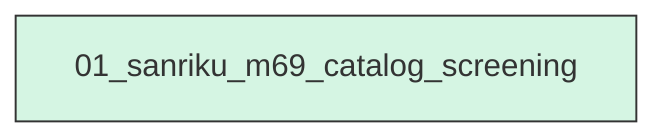
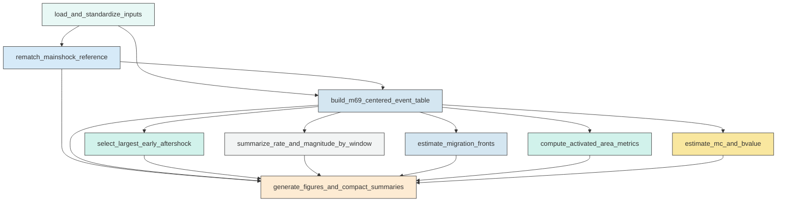

# Workflow Overview

## Top-Level Task Dependencies

**Description:**
- `01_sanriku_m69_catalog_screening`: Build the M6.9-centered catalog, compute screening metrics, generate diagnostic figures, and validate machine-readable outputs for the Sanriku-Oki sequence.

## Subtask Dependencies

#### 01_sanriku_m69_catalog_screening
**Usage**: Build the M6.9-centered catalog, compute screening metrics, generate diagnostic figures, and validate machine-readable outputs for the Sanriku-Oki sequence.

**Description:**
- `load_and_standardize_inputs`: Load the relocated catalog and mainshock table and standardize event fields and times.
- `rematch_mainshock_reference`: Re-match M1 to the relocated catalog with a documented near-time and near-space search and save the selection decision.
- `build_m69_centered_event_table`: Construct the master event table relative to the adopted M6.9 reference with distance, local coordinates, and phase labels.
- `select_largest_early_aftershock`: Identify the largest distinct event in the first 0.5 days after M6.9 within the local sequence while excluding the mainshock itself.
- `summarize_rate_and_magnitude_by_window`: Compute event-rate and magnitude-occurrence summaries for the foreshock and early-aftershock windows across radii.
- `estimate_migration_fronts`: Compute 90th-percentile distance fronts in time bins and fit simple linear apparent speeds before and after the mainshock.
- `compute_activated_area_metrics`: Estimate window-specific activated-area geometry with distance trimming, PCA rotation, and convex-hull metrics.
- `estimate_mc_and_bvalue`: Estimate completeness magnitude and b-value for the final foreshock stage and optionally for the early aftershock window as exploratory screening.
- `generate_figures_and_compact_summaries`: Produce the requested diagnostic figures, export compact summary files, and verify required outputs are present and non-empty.