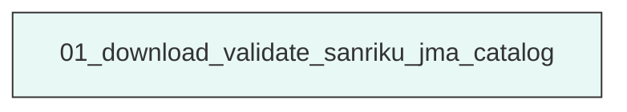
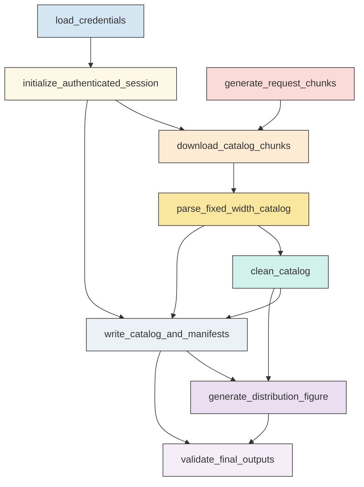

# Research Codings

## Task Overview


**Description:**
- `01_download_validate_sanriku_jma_catalog`: Download, parse, clean, validate, and visualize the authenticated Hi-net JMA unified hypocenter catalog for the Sanriku study region.


## Task Details


#### 01_download_validate_sanriku_jma_catalog
**Usage**: Download, parse, clean, validate, and visualize the authenticated Hi-net JMA unified hypocenter catalog for the Sanriku study region.

**Description:**
- `load_credentials`: Load Hi-net credentials from the default environment file with optional command-line overrides.
- `initialize_authenticated_session`: Create a reusable requests session and authenticate against the Hi-net login endpoint.
- `generate_request_chunks`: Build continuous half-open request chunks that cover the fixed manuscript interval without exceeding the service limit.
- `download_catalog_chunks`: Request each catalog chunk through the authenticated session and record request, response, and raw-saving diagnostics.
- `parse_fixed_width_catalog`: Extract event rows from the returned JMA fixed-width catalog tables and capture parse status for each chunk.
- `clean_catalog`: Standardize parsed records, remove invalid rows, apply fixed time and Sanriku bounds, sort events, and remove duplicates.
- `write_catalog_and_manifests`: Write the cleaned ASPECT-ready catalog and non-sensitive machine-readable processing evidence.
- `generate_distribution_figure`: Generate a catalog distribution figure only from the validated cleaned catalog table.
- `validate_final_outputs`: Validate chunk coverage, parsed date evidence, cleaned CSV integrity, duplicate removal, and figure provenance before declaring success.

#### Coding Script

```python

#!/usr/bin/env python3
"""Download, clean, validate, and plot a Sanriku JMA/Hi-net catalog.

The workflow is intentionally fixed to the manuscript-aligned half-open
interval 2025-06-01 <= origin time < 2026-05-02 and the Sanriku bounds
38.50-42.50 N, 141.00-144.50 E.  The Hi-net web form accepts a start date
and a list span (maximum seven days), so each submitted request is a half-open
chunk [chunk_start, chunk_end_exclusive) represented by list_span days.

No credentials are printed or written to output files.  Programmatic callers may
pass username/password/raw_dir to main(); default execution reads credentials
from the project .env file, with environment variables as non-CLI overrides.
"""
from __future__ import annotations

import json
import os
import re
import sys
import time
import traceback
from dataclasses import dataclass, asdict
from datetime import date, datetime, timedelta
from html import unescape
from pathlib import Path
from typing import Dict, List, Optional, Sequence, Tuple

import matplotlib
matplotlib.use("Agg")
import matplotlib.dates as mdates
import matplotlib.pyplot as plt
import pandas as pd
import requests
from requests.adapters import HTTPAdapter

SCRIPT_PATH = Path(__file__).resolve()
OUTPUT_DIR = Path("<CASE_ROOT>/run/00_catalog_download/exp_run/outputs/01_download_validate_sanriku_jma_catalog").resolve()
ENV_PATH = Path("<CASE_ROOT>/data/hinet_account/.env").resolve()

LOGIN_URL = "https://hinetwww11.bosai.go.jp/auth/?LANG=en"
CATALOG_URL = "https://hinetwww11.bosai.go.jp/auth/JMA/jmalist.php"

START_DATE = date(2025, 6, 1)
END_DATE_EXCLUSIVE = date(2026, 5, 2)
MAX_CHUNK_DAYS = 7
LAT_MIN, LAT_MAX = 38.50, 42.50
LON_MIN, LON_MAX = 141.00, 144.50
CONNECT_TIMEOUT_SECONDS = 30
READ_TIMEOUT_SECONDS = 240
REQUEST_TIMEOUT = (CONNECT_TIMEOUT_SECONDS, READ_TIMEOUT_SECONDS)
MAX_ATTEMPTS = 8
BACKOFF_BASE_SECONDS = 3.0
CHUNK_REQUEST_PAUSE_SECONDS = 3.0
USER_AGENT = "TRACE-Sanriku-JMA-catalog-workflow/1.0 (+requests)"
ASPECT_COLUMNS = ["datetime", "lat", "lon", "dep", "mag"]

OUTPUT_STEM = f"Snet_catalog_{START_DATE:%Y%m%d}_{END_DATE_EXCLUSIVE:%Y%m%d}"
CSV_PATH = OUTPUT_DIR / f"{OUTPUT_STEM}.csv"
FIGURE_PATH = OUTPUT_DIR / f"{OUTPUT_STEM}_distribution.png"
MANIFEST_PATH = OUTPUT_DIR / f"{OUTPUT_STEM}_chunk_manifest.csv"
VALIDATION_PATH = OUTPUT_DIR / f"{OUTPUT_STEM}_validation.json"


@dataclass
class ChunkRecord:
    chunk_index: int
    chunk_start_inclusive: str
    chunk_end_exclusive: str
    submitted_list_year: str
    submitted_list_month: str
    submitted_list_day: str
    submitted_list_span_days: int
    submitted_end_inclusive: str
    status: str
    parse_status: str
    attempts: int
    http_status: int
    response_bytes: int
    parsed_rows: int
    actual_returned_datetime_min: str
    actual_returned_datetime_max: str
    retained_sanriku_rows: int
    retained_sanriku_datetime_min: str
    retained_sanriku_datetime_max: str
    raw_file_path: str
    debug_file_path: str
    message: str


def log(message: str) -> None:
    print(f"[{datetime.utcnow().isoformat(timespec='seconds')}Z] {message}", flush=True)


def ensure_output_dirs() -> Dict[str, Path]:
    debug_raw = OUTPUT_DIR / "debug" / "raw"
    debug = OUTPUT_DIR / "debug"
    for path in (OUTPUT_DIR, debug, debug_raw):
        path.mkdir(parents=True, exist_ok=True)
    return {"debug": debug, "debug_raw": debug_raw}


def clear_stale_outputs() -> None:
    patterns = [
        f"{OUTPUT_STEM}.csv",
        f"{OUTPUT_STEM}_distribution.png",
        f"{OUTPUT_STEM}_chunk_manifest.csv",
        f"{OUTPUT_STEM}_validation.json",
        "debug/raw/*.html",
        "debug/raw/*.txt",
    ]
    for pattern in patterns:
        for path in OUTPUT_DIR.glob(pattern):
            if path.is_file():
                path.unlink()


def save_text(path: Path, text: str) -> Path:
    path.parent.mkdir(parents=True, exist_ok=True)
    path.write_text(text, encoding="utf-8", errors="ignore")
    return path


def load_dotenv_credentials(env_path: Path) -> Dict[str, str]:
    creds: Dict[str, str] = {}
    if not env_path.exists():
        return creds
    for raw_line in env_path.read_text(encoding="utf-8", errors="ignore").splitlines():
        line = raw_line.strip()
        if not line or line.startswith("#") or "=" not in line:
            continue
        key, value = line.split("=", 1)
        creds[key.strip()] = value.strip().strip('"').strip("'")
    return creds


def resolve_credentials(username: Optional[str] = None, password: Optional[str] = None) -> Tuple[str, str, str]:
    env_file_creds = load_dotenv_credentials(ENV_PATH)
    env_user = os.environ.get("HINET_USERNAME")
    env_pass = os.environ.get("HINET_PASSWORD")
    resolved_user = username or env_user or env_file_creds.get("HINET_USERNAME")
    resolved_pass = password or env_pass or env_file_creds.get("HINET_PASSWORD")
    if username or password:
        source = "programmatic_override"
    elif env_user or env_pass:
        source = "environment"
    else:
        source = ".env"
    if not resolved_user or not resolved_pass:
        raise RuntimeError(f"Missing Hi-net credentials. Checked programmatic overrides, environment variables, and {ENV_PATH}")
    return resolved_user, resolved_pass, source


def build_chunks(start: date, end_exclusive: date, max_days: int) -> List[Tuple[date, date]]:
    if end_exclusive <= start:
        raise ValueError(f"Invalid half-open interval: {start} to {end_exclusive}")
    chunks: List[Tuple[date, date]] = []
    current = start
    while current < end_exclusive:
        nxt = min(current + timedelta(days=max_days), end_exclusive)
        chunks.append((current, nxt))
        current = nxt
    return chunks


def build_session() -> requests.Session:
    session = requests.Session()
    # Keep retry control in request_with_backoff().  Layering urllib3 retries
    # under the explicit retry loop multiplied each apparent attempt into several
    # connection attempts, causing long stalls when the catalog endpoint was slow.
    adapter = HTTPAdapter(max_retries=0, pool_connections=4, pool_maxsize=4)
    session.mount("https://", adapter)
    session.mount("http://", adapter)
    # The Hi-net endpoint is more reliable when requests do not try to reuse a
    # stale HTTPS connection after a slow response or timeout.
    session.headers.update({"User-Agent": USER_AGENT, "Connection": "close"})
    return session


def request_with_backoff(session: requests.Session, method: str, url: str, *, data: Optional[Dict[str, str]] = None) -> Tuple[requests.Response, int]:
    last_exc: Optional[BaseException] = None
    for attempt in range(1, MAX_ATTEMPTS + 1):
        try:
            response = session.request(method, url, data=data, timeout=REQUEST_TIMEOUT, allow_redirects=True)
            if response.status_code < 500 and response.status_code not in (429,):
                return response, attempt
            last_exc = RuntimeError(f"HTTP {response.status_code}")
        except Exception as exc:  # requests exceptions plus unexpected transport failures
            last_exc = exc
        if attempt < MAX_ATTEMPTS:
            sleep_seconds = min(90.0, BACKOFF_BASE_SECONDS * (2 ** (attempt - 1)))
            log(
                f"{method} {url} attempt {attempt} failed ({last_exc}); "
                f"retrying in {sleep_seconds:.1f}s with timeout=(connect {CONNECT_TIMEOUT_SECONDS}s, read {READ_TIMEOUT_SECONDS}s)"
            )
            time.sleep(sleep_seconds)
    raise RuntimeError(f"{method} {url} failed after {MAX_ATTEMPTS} attempts: {last_exc}")


def response_text(response: requests.Response) -> str:
    if not response.encoding:
        response.encoding = response.apparent_encoding or "utf-8"
    return response.text


def response_looks_like_login_page(text: str) -> bool:
    lowered = text.lower()
    markers = ["login page for registered users", "user name", "password", "auth_un", "auth_pw"]
    return "welcome" not in lowered and sum(marker in lowered for marker in markers) >= 2


def extract_form_inputs(html_text: str) -> Dict[str, str]:
    inputs: Dict[str, str] = {}
    for match in re.finditer(r"<input\b[^>]*>", html_text, flags=re.I):
        tag = match.group(0)
        name_match = re.search(r"name=[\"']([^\"']+)[\"']", tag, flags=re.I)
        if not name_match:
            continue
        value_match = re.search(r"value=[\"']([^\"']*)[\"']", tag, flags=re.I)
        inputs[name_match.group(1)] = unescape(value_match.group(1)) if value_match else ""
    return inputs


def infer_auth_form_action(html_text: str) -> str:
    form_match = re.search(r"<form[^>]*name=[\"']auth[\"'][^>]*action=[\"']([^\"']+)[\"']", html_text, flags=re.I)
    if not form_match:
        form_match = re.search(r"<form[^>]*action=[\"']([^\"']+)[\"']", html_text, flags=re.I)
    return form_match.group(1) if form_match else "./?LANG=en"


def login(session: requests.Session, username: str, password: str, debug_raw_dir: Path) -> None:
    log("Fetching Hi-net login page")
    get_resp, _ = request_with_backoff(session, "GET", LOGIN_URL)
    login_page = response_text(get_resp)
    login_page_path = save_text(debug_raw_dir / "login_page.html", login_page)
    if get_resp.status_code >= 400:
        raise RuntimeError(f"Login page request returned HTTP {get_resp.status_code}; saved response to {login_page_path}")

    payload = extract_form_inputs(login_page)
    payload["auth_un"] = username
    payload["auth_pw"] = password
    payload.setdefault("LANG", "en")
    action = infer_auth_form_action(login_page)
    login_post_url = requests.compat.urljoin(LOGIN_URL, action)

    log("Posting Hi-net login form (credential values suppressed)")
    post_resp, _ = request_with_backoff(session, "POST", login_post_url, data=payload)
    login_response = response_text(post_resp)
    login_response_path = save_text(debug_raw_dir / "login_response.html", login_response)
    if post_resp.status_code >= 400:
        raise RuntimeError(f"Login POST returned HTTP {post_resp.status_code}; saved response to {login_response_path}")
    if response_looks_like_login_page(login_response):
        raise RuntimeError(f"Hi-net login appears to have failed; saved response to {login_response_path}")
    auth_markers = ("welcome", "logout", "/auth/jma/", "jma unified hypocenter")
    if not any(marker in login_response.lower() for marker in auth_markers):
        raise RuntimeError(f"Login response did not contain an authenticated marker; saved response to {login_response_path}")

    # Do not perform a separate catalog-page GET here.  In recent runs that GET
    # repeatedly timed out even after successful authentication, while the actual
    # required catalog access is the bounded POST request for each <=7-day chunk.
    # The first chunk POST below therefore serves as the catalog-session
    # verification and yields chunk-specific debug evidence if it fails.
    log("Hi-net authentication succeeded; catalog access will be verified by the first bounded chunk POST")


def build_catalog_payload(chunk_start: date, chunk_end_exclusive: date) -> Dict[str, str]:
    span_days = (chunk_end_exclusive - chunk_start).days
    if span_days <= 0 or span_days > MAX_CHUNK_DAYS:
        raise ValueError(f"Invalid JMA chunk span {span_days} days for {chunk_start} to {chunk_end_exclusive}")
    return {
        "LANG": "en",
        "list_span": str(span_days),
        "list_year": f"{chunk_start.year:04d}",
        "list_month": f"{chunk_start.month:02d}",
        "list_day": f"{chunk_start.day:02d}",
    }


def html_to_text(html_text: str) -> str:
    text = re.sub(r"(?is)<script.*?>.*?</script>", " ", html_text)
    text = re.sub(r"(?is)<style.*?>.*?</style>", " ", text)
    text = re.sub(r"(?is)<br\s*/?>", "\n", text)
    text = re.sub(r"(?is)</tr>", "\n", text)
    text = re.sub(r"(?is)</p>", "\n", text)
    text = re.sub(r"(?is)<[^>]+>", " ", text)
    text = unescape(text).replace("\r", "\n")
    return re.sub(r"\n{2,}", "\n", text)


def extract_pre_blocks(html_text: str) -> List[str]:
    blocks = re.findall(r"(?is)<pre[^>]*>(.*?)</pre>", html_text)
    return [unescape(block).replace("\r", "\n") for block in blocks if block.strip()]


def parse_mag_field(field: str) -> Optional[str]:
    match = re.search(r"[-+]?\d+(?:\.\d+)?", field)
    return match.group(0) if match else None


def parse_fixed_width_event_line(line: str) -> Optional[Dict[str, str]]:
    """Parse one JMA table event row using fixed column locations.

    Table header in the Hi-net response is:
    -----Origin Time--------OTerr---Lat---LatErr---Long--LonErr---Dep--DepErr-Mag...
    Required fields occupy stable positions in the monospaced table.  A regex
    fallback is retained only for rows with small spacing variations; no comma
    splitting is used.
    """
    if not re.match(r"^\s*20\d{2}-\d{2}-\d{2}\s+\d{2}:\d{2}:\d{2}", line):
        return None
    padded = line.rstrip("\n") + " " * 100
    fixed = {
        "datetime": padded[0:22].strip(),
        "lat": padded[30:38].strip(),
        "lon": padded[45:53].strip(),
        "dep": padded[61:68].strip(),
        "mag": parse_mag_field(padded[74:86]),
    }
    try:
        pd.to_datetime(fixed["datetime"], errors="raise")
        float(fixed["lat"])
        float(fixed["lon"])
        float(fixed["dep"])
        if fixed["mag"] is None:
            raise ValueError("missing magnitude")
        float(fixed["mag"])
        return fixed  # type: ignore[return-value]
    except Exception:
        pattern = re.compile(
            r"^\s*(20\d{2}-\d{2}-\d{2}\s+\d{2}:\d{2}:\d{2}(?:\.\d+)?)"
            r"\s+[-+]?\d+(?:\.\d+)?"
            r"\s+([-+]?\d+(?:\.\d+)?)"
            r"\s+[-+]?\d+(?:\.\d+)?"
            r"\s+([-+]?\d+(?:\.\d+)?)"
            r"\s+[-+]?\d+(?:\.\d+)?"
            r"\s+([-+]?\d+(?:\.\d+)?)"
            r"\s+[-+]?\d+(?:\.\d+)?"
            r"\s+([-+]?\d+(?:\.\d+)?)[A-Za-z]?\b"
        )
        match = pattern.match(line)
        if not match:
            return None
        return {
            "datetime": match.group(1),
            "lat": match.group(2),
            "lon": match.group(3),
            "dep": match.group(4),
            "mag": match.group(5),
        }


def page_is_recognizable_catalog(text: str) -> bool:
    lowered = text.lower()
    plain = html_to_text(text).lower()
    # Treat a response as a valid zero-row catalog only when it contains an
    # explicit no-data marker.  Generic JMA/form pages are not sufficient: if
    # the fixed-width table structure changes or the request is rejected, the
    # original response must be saved and surfaced as a parse failure.
    return "no data" in plain or "not found" in plain or "no hypocenter" in plain


def parse_catalog_response(text: str, debug_failure_path: Path) -> Tuple[pd.DataFrame, str, str]:
    candidate_blocks = extract_pre_blocks(text)
    candidate_blocks.append(html_to_text(text))
    records: List[Dict[str, str]] = []
    saw_header = False
    for block in candidate_blocks:
        if "Origin Time" in block or "Origin Time" in html_to_text(block):
            saw_header = True
        for line in block.splitlines():
            rec = parse_fixed_width_event_line(line)
            if rec is not None:
                records.append(rec)
    if records:
        df = pd.DataFrame.from_records(records, columns=ASPECT_COLUMNS).drop_duplicates().reset_index(drop=True)
        return df, "parsed", "ok"
    if saw_header or page_is_recognizable_catalog(text):
        empty = pd.DataFrame(columns=ASPECT_COLUMNS)
        return empty, "valid_zero_rows", "recognized catalog response with no event rows"
    saved = save_text(debug_failure_path, text)
    raise RuntimeError(f"Unable to parse HTML/text catalog response; saved original response to {saved}")


def request_chunk(
    session: requests.Session,
    chunk_index: int,
    chunk_start: date,
    chunk_end_exclusive: date,
    raw_dir: Optional[Path],
    debug_raw_dir: Path,
) -> Tuple[pd.DataFrame, ChunkRecord]:
    payload = build_catalog_payload(chunk_start, chunk_end_exclusive)
    submitted_end = chunk_end_exclusive - timedelta(days=1)
    raw_path = ""
    debug_path = ""
    log(f"Requesting chunk {chunk_index:03d}: [{chunk_start}, {chunk_end_exclusive}) span={payload['list_span']} days")
    resp, attempts = request_with_backoff(session, "POST", CATALOG_URL, data=payload)
    text = response_text(resp)
    response_bytes = len(text.encode("utf-8", errors="ignore"))
    if raw_dir is not None:
        raw_dir.mkdir(parents=True, exist_ok=True)
        raw_file = raw_dir / f"chunk_{chunk_index:03d}_{chunk_start:%Y%m%d}_{chunk_end_exclusive:%Y%m%d}.html"
        raw_path = str(save_text(raw_file, text))
    if resp.status_code >= 400:
        fail_file = debug_raw_dir / f"http_error_chunk_{chunk_index:03d}_{chunk_start:%Y%m%d}_{chunk_end_exclusive:%Y%m%d}.html"
        debug_path = str(save_text(fail_file, text))
        raise RuntimeError(f"JMA chunk {chunk_index:03d} returned HTTP {resp.status_code}; saved response to {debug_path}")
    if not text.strip():
        fail_file = debug_raw_dir / f"empty_chunk_{chunk_index:03d}_{chunk_start:%Y%m%d}_{chunk_end_exclusive:%Y%m%d}.txt"
        debug_path = str(save_text(fail_file, text))
        raise RuntimeError(f"JMA chunk {chunk_index:03d} returned an empty response; saved response to {debug_path}")
    if response_looks_like_login_page(text):
        fail_file = debug_raw_dir / f"auth_lost_chunk_{chunk_index:03d}_{chunk_start:%Y%m%d}_{chunk_end_exclusive:%Y%m%d}.html"
        debug_path = str(save_text(fail_file, text))
        raise RuntimeError(f"Authenticated session was lost for chunk {chunk_index:03d}; saved response to {debug_path}")

    fail_parse_file = debug_raw_dir / f"parse_failure_chunk_{chunk_index:03d}_{chunk_start:%Y%m%d}_{chunk_end_exclusive:%Y%m%d}.html"
    df, parse_status, parse_message = parse_catalog_response(text, fail_parse_file)

    dt = pd.to_datetime(df["datetime"], errors="coerce", format="mixed") if not df.empty else pd.Series(dtype="datetime64[ns]")
    actual_min = "" if dt.dropna().empty else str(dt.min())
    actual_max = "" if dt.dropna().empty else str(dt.max())
    start_ts = pd.Timestamp(datetime.combine(chunk_start, datetime.min.time()))
    end_ts = pd.Timestamp(datetime.combine(chunk_end_exclusive, datetime.min.time()))
    if not dt.dropna().empty and ((dt.dropna() < start_ts).any() or (dt.dropna() >= end_ts).any()):
        fail_file = debug_raw_dir / f"date_mismatch_chunk_{chunk_index:03d}_{chunk_start:%Y%m%d}_{chunk_end_exclusive:%Y%m%d}.html"
        debug_path = str(save_text(fail_file, text))
        raise RuntimeError(
            f"JMA chunk {chunk_index:03d} returned dates outside requested half-open interval "
            f"[{chunk_start}, {chunk_end_exclusive}); actual range {actual_min} to {actual_max}; saved response to {debug_path}"
        )

    chunk_record = ChunkRecord(
        chunk_index=chunk_index,
        chunk_start_inclusive=chunk_start.isoformat(),
        chunk_end_exclusive=chunk_end_exclusive.isoformat(),
        submitted_list_year=payload["list_year"],
        submitted_list_month=payload["list_month"],
        submitted_list_day=payload["list_day"],
        submitted_list_span_days=int(payload["list_span"]),
        submitted_end_inclusive=submitted_end.isoformat(),
        status="success",
        parse_status=parse_status,
        attempts=attempts,
        http_status=int(resp.status_code),
        response_bytes=response_bytes,
        parsed_rows=int(len(df)),
        actual_returned_datetime_min=actual_min,
        actual_returned_datetime_max=actual_max,
        retained_sanriku_rows=0,
        retained_sanriku_datetime_min="",
        retained_sanriku_datetime_max="",
        raw_file_path=raw_path,
        debug_file_path=debug_path,
        message=parse_message,
    )
    return df, chunk_record


def basic_numeric_time_clean(df: pd.DataFrame) -> pd.DataFrame:
    work = df.copy()
    for col in ASPECT_COLUMNS:
        if col not in work.columns:
            raise RuntimeError(f"Parsed table is missing required column: {col}")
    work = work[ASPECT_COLUMNS].copy()
    # JMA origin times mix whole-second and fractional-second strings.  Pandas 2
    # infers one strict format for a Series unless format="mixed" is specified,
    # which caused valid whole-second rows to become NaT during validation.
    work["datetime"] = pd.to_datetime(work["datetime"], errors="coerce", format="mixed")
    for col in ("lat", "lon", "dep", "mag"):
        work[col] = pd.to_numeric(work[col], errors="coerce")
    return work


def clean_catalog(parsed_all: pd.DataFrame) -> Tuple[pd.DataFrame, Dict[str, int]]:
    initial_rows = int(len(parsed_all))
    work = basic_numeric_time_clean(parsed_all)
    valid = work.dropna(subset=ASPECT_COLUMNS).copy()
    after_dropna = int(len(valid))
    time_start = pd.Timestamp(datetime.combine(START_DATE, datetime.min.time()))
    time_end = pd.Timestamp(datetime.combine(END_DATE_EXCLUSIVE, datetime.min.time()))
    valid = valid[(valid["datetime"] >= time_start) & (valid["datetime"] < time_end)].copy()
    after_time = int(len(valid))
    valid = valid[
        (valid["lat"] >= LAT_MIN) & (valid["lat"] <= LAT_MAX)
        & (valid["lon"] >= LON_MIN) & (valid["lon"] <= LON_MAX)
    ].copy()
    after_space = int(len(valid))
    valid = valid[(valid["dep"] >= 0.0) & (valid["dep"] <= 800.0) & (valid["mag"] >= -5.0) & (valid["mag"] <= 10.0)].copy()
    after_physical = int(len(valid))
    valid = valid.sort_values("datetime").drop_duplicates(subset=ASPECT_COLUMNS).reset_index(drop=True)
    final_rows = int(len(valid))
    output = valid[ASPECT_COLUMNS].copy()
    output["datetime"] = output["datetime"].dt.strftime("%Y-%m-%d %H:%M:%S.%f").str.rstrip("0").str.rstrip(".")
    stats = {
        "initial_parsed_rows": initial_rows,
        "rows_after_datetime_numeric_dropna": after_dropna,
        "rows_removed_invalid_datetime_or_numeric": initial_rows - after_dropna,
        "rows_after_time_filter": after_time,
        "rows_removed_outside_requested_time": after_dropna - after_time,
        "rows_after_sanriku_spatial_filter": after_space,
        "rows_removed_outside_sanriku_bounds": after_time - after_space,
        "rows_after_physical_sanity_filter": after_physical,
        "rows_removed_failed_physical_sanity": after_space - after_physical,
        "duplicates_removed": after_physical - final_rows,
        "final_rows": final_rows,
    }
    return output, stats


def update_manifest_retained_ranges(manifest: List[ChunkRecord], parsed_all: pd.DataFrame) -> None:
    if parsed_all.empty or "chunk_index" not in parsed_all.columns:
        return
    work = basic_numeric_time_clean(parsed_all)
    work["chunk_index"] = parsed_all["chunk_index"].values
    time_start = pd.Timestamp(datetime.combine(START_DATE, datetime.min.time()))
    time_end = pd.Timestamp(datetime.combine(END_DATE_EXCLUSIVE, datetime.min.time()))
    retained = work.dropna(subset=ASPECT_COLUMNS).copy()
    retained = retained[
        (retained["datetime"] >= time_start) & (retained["datetime"] < time_end)
        & (retained["lat"] >= LAT_MIN) & (retained["lat"] <= LAT_MAX)
        & (retained["lon"] >= LON_MIN) & (retained["lon"] <= LON_MAX)
    ].copy()
    for rec in manifest:
        sub = retained[retained["chunk_index"] == rec.chunk_index]
        rec.retained_sanriku_rows = int(len(sub))
        if not sub.empty:
            rec.retained_sanriku_datetime_min = str(sub["datetime"].min())
            rec.retained_sanriku_datetime_max = str(sub["datetime"].max())


def write_manifest(records: Sequence[ChunkRecord]) -> None:
    pd.DataFrame([asdict(r) for r in records]).to_csv(MANIFEST_PATH, index=False)


def validate_chunks(chunks: Sequence[Tuple[date, date]], manifest_df: pd.DataFrame) -> None:
    if len(chunks) != 48:
        raise RuntimeError(f"Expected exactly 48 chunks for the fixed interval; got {len(chunks)}")
    if chunks[0][0] != START_DATE or chunks[-1][1] != END_DATE_EXCLUSIVE:
        raise RuntimeError(f"Chunk coverage mismatch: first={chunks[0]}, last={chunks[-1]}")
    for i, (start, end) in enumerate(chunks):
        if (end - start).days > MAX_CHUNK_DAYS:
            raise RuntimeError(f"Chunk {i+1} exceeds {MAX_CHUNK_DAYS} days: {start} to {end}")
        if i > 0 and chunks[i - 1][1] != start:
            raise RuntimeError(f"Chunks are not continuous at index {i+1}: previous end {chunks[i-1][1]}, current start {start}")
    if len(manifest_df) != len(chunks):
        raise RuntimeError(f"Manifest row count {len(manifest_df)} does not match chunk count {len(chunks)}")
    if not (manifest_df["status"] == "success").all():
        failed = manifest_df.loc[manifest_df["status"] != "success", ["chunk_index", "message"]].to_dict("records")
        raise RuntimeError(f"One or more chunks failed: {failed}")


def validate_cleaned_csv(csv_path: Path) -> Tuple[pd.DataFrame, Dict[str, object]]:
    if not csv_path.exists():
        raise RuntimeError(f"Cleaned catalog CSV was not written: {csv_path}")
    df = pd.read_csv(csv_path)
    if list(df.columns) != ASPECT_COLUMNS:
        raise RuntimeError(f"CSV schema mismatch: expected {ASPECT_COLUMNS}, got {list(df.columns)}")
    parsed_dt = pd.to_datetime(df["datetime"], errors="coerce", format="mixed")
    numeric = df[["lat", "lon", "dep", "mag"]].apply(pd.to_numeric, errors="coerce")
    if parsed_dt.isna().any() or numeric.isna().any().any():
        raise RuntimeError("Cleaned CSV still contains non-parsable datetime or numeric values")
    check = pd.concat([parsed_dt.rename("datetime"), numeric], axis=1)
    if check.isna().any().any():
        raise RuntimeError("Cleaned CSV contains missing values")
    time_start = pd.Timestamp(datetime.combine(START_DATE, datetime.min.time()))
    time_end = pd.Timestamp(datetime.combine(END_DATE_EXCLUSIVE, datetime.min.time()))
    if not ((check["datetime"] >= time_start) & (check["datetime"] < time_end)).all():
        raise RuntimeError("Cleaned CSV contains rows outside the requested half-open time interval")
    if not (check["lat"].between(LAT_MIN, LAT_MAX, inclusive="both") & check["lon"].between(LON_MIN, LON_MAX, inclusive="both")).all():
        raise RuntimeError("Cleaned CSV contains rows outside Sanriku inclusive spatial bounds")
    if not check["datetime"].is_monotonic_increasing:
        raise RuntimeError("Cleaned CSV is not sorted by datetime")
    if df.duplicated(subset=ASPECT_COLUMNS).any():
        raise RuntimeError("Cleaned CSV contains duplicate ASPECT rows")
    stats: Dict[str, object] = {
        "csv_rows": int(len(df)),
        "datetime_min": "" if df.empty else str(check["datetime"].min()),
        "datetime_max": "" if df.empty else str(check["datetime"].max()),
        "lat_min": None if df.empty else float(check["lat"].min()),
        "lat_max": None if df.empty else float(check["lat"].max()),
        "lon_min": None if df.empty else float(check["lon"].min()),
        "lon_max": None if df.empty else float(check["lon"].max()),
        "dep_min": None if df.empty else float(check["dep"].min()),
        "dep_max": None if df.empty else float(check["dep"].max()),
        "mag_min": None if df.empty else float(check["mag"].min()),
        "mag_max": None if df.empty else float(check["mag"].max()),
    }
    return df, stats


def save_distribution_figure(cleaned_df: pd.DataFrame, figure_path: Path) -> None:
    if list(cleaned_df.columns) != ASPECT_COLUMNS:
        raise RuntimeError("Distribution figure input does not have the exact ASPECT schema")
    plot_df = cleaned_df.copy()
    plot_df["datetime"] = pd.to_datetime(plot_df["datetime"], errors="raise", format="mixed")
    for col in ("lat", "lon", "dep", "mag"):
        plot_df[col] = pd.to_numeric(plot_df[col], errors="raise")

    fig, axes = plt.subplots(1, 2, figsize=(12, 5.2), dpi=160)
    ax_map, ax_time = axes
    if plot_df.empty:
        ax_map.text(0.5, 0.5, "No retained Sanriku events\nafter valid parsing and filtering", ha="center", va="center", transform=ax_map.transAxes)
        ax_map.set_xlim(LON_MIN - 0.2, LON_MAX + 0.2)
        ax_map.set_ylim(LAT_MIN - 0.2, LAT_MAX + 0.2)
        ax_time.text(0.5, 0.5, "N = 0", ha="center", va="center", transform=ax_time.transAxes)
    else:
        mag = plot_df["mag"]
        if float(mag.max()) == float(mag.min()):
            sizes = pd.Series(25.0, index=plot_df.index)
        else:
            sizes = 12.0 + 50.0 * (mag - mag.min()) / (mag.max() - mag.min())
        sc = ax_map.scatter(
            plot_df["lon"], plot_df["lat"], c=plot_df["dep"], s=sizes,
            cmap="viridis_r", alpha=0.78, edgecolors="black", linewidths=0.15,
        )
        cbar = fig.colorbar(sc, ax=ax_map, pad=0.015)
        cbar.set_label("Depth (km)")
        daily_counts = plot_df.set_index("datetime").resample("7D").size()
        ax_time.bar(daily_counts.index, daily_counts.values, width=5.5, color="tab:blue", alpha=0.75)
        ax_time.xaxis.set_major_locator(mdates.MonthLocator(interval=2))
        ax_time.xaxis.set_major_formatter(mdates.DateFormatter("%Y-%m"))
        ax_time.tick_params(axis="x", rotation=30)
        ax_time.set_ylabel("Events per 7 days")
        ax_time.set_title(f"Temporal distribution, N={len(plot_df)}")
        annotation = (
            f"Mag: {plot_df['mag'].min():.1f} to {plot_df['mag'].max():.1f}\n"
            f"Depth: {plot_df['dep'].min():.1f} to {plot_df['dep'].max():.1f} km"
        )
        ax_map.text(0.02, 0.02, annotation, transform=ax_map.transAxes, va="bottom", ha="left", fontsize=8,
                    bbox={"facecolor": "white", "alpha": 0.75, "edgecolor": "none"})

    rect_lon = [LON_MIN, LON_MAX, LON_MAX, LON_MIN, LON_MIN]
    rect_lat = [LAT_MIN, LAT_MIN, LAT_MAX, LAT_MAX, LAT_MIN]
    ax_map.plot(rect_lon, rect_lat, color="red", lw=1.3, label="Sanriku bounds")
    ax_map.set_xlim(LON_MIN - 0.2, LON_MAX + 0.2)
    ax_map.set_ylim(LAT_MIN - 0.2, LAT_MAX + 0.2)
    ax_map.set_xlabel("Longitude (°E)")
    ax_map.set_ylabel("Latitude (°N)")
    ax_map.set_title("Sanriku JMA unified hypocenter catalog")
    ax_map.grid(True, alpha=0.3)
    ax_map.legend(loc="upper right", fontsize=8)
    ax_time.set_xlabel("Origin date")
    ax_time.grid(True, alpha=0.3)
    fig.suptitle(f"Hi-net/JMA catalog: {START_DATE} <= t < {END_DATE_EXCLUSIVE}", fontsize=11)
    fig.tight_layout()
    figure_path.parent.mkdir(parents=True, exist_ok=True)
    fig.savefig(figure_path, bbox_inches="tight")
    plt.close(fig)


def main(username: Optional[str] = None, password: Optional[str] = None, raw_dir: Optional[str] = None) -> None:
    dirs = ensure_output_dirs()
    clear_stale_outputs()
    user, passwd, credential_source = resolve_credentials(username=username, password=password)
    chunks = build_chunks(START_DATE, END_DATE_EXCLUSIVE, MAX_CHUNK_DAYS)
    log(
        f"Starting Sanriku JMA workflow: interval=[{START_DATE}, {END_DATE_EXCLUSIVE}), "
        f"chunks={len(chunks)}, bounds=lat[{LAT_MIN}, {LAT_MAX}], lon[{LON_MIN}, {LON_MAX}], output={OUTPUT_DIR}"
    )
    if len(chunks) != 48:
        raise RuntimeError(f"Internal chunking error: expected 48 chunks, got {len(chunks)}")
    raw_save_dir = Path(raw_dir).resolve() if raw_dir else None
    if raw_save_dir is not None:
        raw_save_dir.mkdir(parents=True, exist_ok=True)
        log(f"Raw chunk responses will be saved to {raw_save_dir}")

    session = build_session()
    login(session, user, passwd, dirs["debug_raw"])

    manifest: List[ChunkRecord] = []
    parsed_frames: List[pd.DataFrame] = []
    try:
        for idx, (chunk_start, chunk_end) in enumerate(chunks, start=1):
            try:
                chunk_df, record = request_chunk(session, idx, chunk_start, chunk_end, raw_save_dir, dirs["debug_raw"])
                chunk_df = chunk_df.copy()
                chunk_df["chunk_index"] = idx
                parsed_frames.append(chunk_df)
                manifest.append(record)
                write_manifest(manifest)
                log(f"Chunk {idx:03d} complete: parsed_rows={record.parsed_rows}, actual_range={record.actual_returned_datetime_min} to {record.actual_returned_datetime_max}")
                if idx < len(chunks) and CHUNK_REQUEST_PAUSE_SECONDS > 0:
                    time.sleep(CHUNK_REQUEST_PAUSE_SECONDS)
            except Exception as exc:
                payload = build_catalog_payload(chunk_start, chunk_end)
                failed = ChunkRecord(
                    chunk_index=idx,
                    chunk_start_inclusive=chunk_start.isoformat(),
                    chunk_end_exclusive=chunk_end.isoformat(),
                    submitted_list_year=payload["list_year"],
                    submitted_list_month=payload["list_month"],
                    submitted_list_day=payload["list_day"],
                    submitted_list_span_days=int(payload["list_span"]),
                    submitted_end_inclusive=(chunk_end - timedelta(days=1)).isoformat(),
                    status="failed",
                    parse_status="failed",
                    attempts=MAX_ATTEMPTS,
                    http_status=0,
                    response_bytes=0,
                    parsed_rows=0,
                    actual_returned_datetime_min="",
                    actual_returned_datetime_max="",
                    retained_sanriku_rows=0,
                    retained_sanriku_datetime_min="",
                    retained_sanriku_datetime_max="",
                    raw_file_path="",
                    debug_file_path="",
                    message=str(exc),
                )
                manifest.append(failed)
                write_manifest(manifest)
                raise
    finally:
        if manifest:
            write_manifest(manifest)

    parsed_all = pd.concat(parsed_frames, ignore_index=True) if parsed_frames else pd.DataFrame(columns=ASPECT_COLUMNS + ["chunk_index"])
    update_manifest_retained_ranges(manifest, parsed_all)
    write_manifest(manifest)
    manifest_df = pd.read_csv(MANIFEST_PATH)
    validate_chunks(chunks, manifest_df)

    cleaned, cleaning_stats = clean_catalog(parsed_all)
    cleaned.to_csv(CSV_PATH, index=False)
    cleaned_for_plot, csv_stats = validate_cleaned_csv(CSV_PATH)
    save_distribution_figure(cleaned_for_plot, FIGURE_PATH)
    if not FIGURE_PATH.exists() or FIGURE_PATH.stat().st_size <= 0:
        raise RuntimeError(f"Distribution figure was not generated correctly: {FIGURE_PATH}")

    validation = {
        "status": "pass",
        "script_path": str(SCRIPT_PATH),
        "output_dir": str(OUTPUT_DIR),
        "credential_source": credential_source,
        "login_url": LOGIN_URL,
        "catalog_url": CATALOG_URL,
        "start_date_inclusive": START_DATE.isoformat(),
        "end_date_exclusive": END_DATE_EXCLUSIVE.isoformat(),
        "requested_record_coverage_note": "Requests cover 2025-06-01 through 2026-05-01 using half-open chunks.",
        "lat_bounds_inclusive": [LAT_MIN, LAT_MAX],
        "lon_bounds_inclusive": [LON_MIN, LON_MAX],
        "max_chunk_days": MAX_CHUNK_DAYS,
        "total_chunks_requested": len(chunks),
        "chunk_boundaries": [{"start_inclusive": s.isoformat(), "end_exclusive": e.isoformat(), "span_days": (e - s).days} for s, e in chunks],
        "chunk_manifest_path": str(MANIFEST_PATH),
        "all_chunk_status_counts": manifest_df["status"].value_counts(dropna=False).to_dict(),
        "parse_status_counts": manifest_df["parse_status"].value_counts(dropna=False).to_dict(),
        "total_parsed_rows": int(len(parsed_all)),
        "cleaning_stats": cleaning_stats,
        "csv_path": str(CSV_PATH),
        "csv_validation": csv_stats,
        "figure_path": str(FIGURE_PATH),
        "figure_exists": True,
        "figure_source_csv": str(CSV_PATH),
        "figure_plotted_event_count": int(len(cleaned_for_plot)),
        "empty_catalog_note": "" if len(cleaned_for_plot) else "Final catalog has zero rows after valid parsing/cleaning; see cleaning_stats and per-chunk manifest.",
    }
    save_text(VALIDATION_PATH, json.dumps(validation, indent=2, ensure_ascii=False))
    log(f"Workflow passed. CSV: {CSV_PATH}")
    log(f"Figure: {FIGURE_PATH}")
    log(f"Manifest: {MANIFEST_PATH}")
    log(f"Validation summary: {VALIDATION_PATH}")


if __name__ == "__main__":
    try:
        main()
    except Exception:
        print(traceback.format_exc(), flush=True)
        sys.exit(1)


```