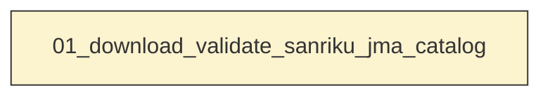
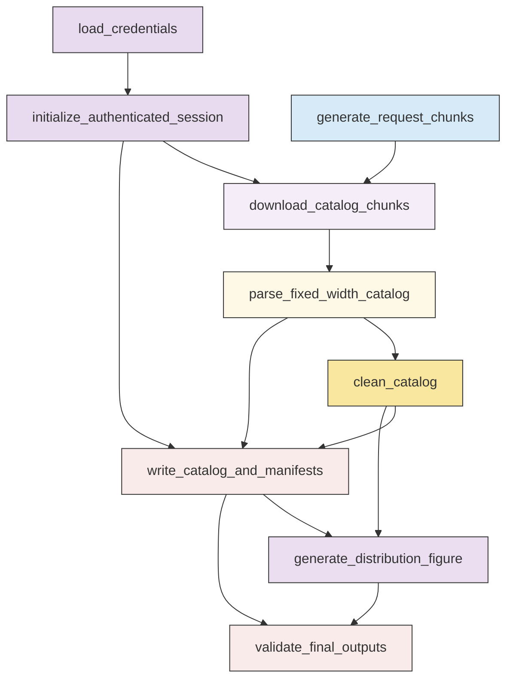

# Workflow Overview

## Top-Level Task Dependencies

**Description:**
- `01_download_validate_sanriku_jma_catalog`: Download, parse, clean, validate, and visualize the authenticated Hi-net JMA unified hypocenter catalog for the Sanriku study region.

## Subtask Dependencies

#### 01_download_validate_sanriku_jma_catalog
**Usage**: Download, parse, clean, validate, and visualize the authenticated Hi-net JMA unified hypocenter catalog for the Sanriku study region.

**Description:**
- `load_credentials`: Load Hi-net credentials from the default environment file with optional command-line overrides.
- `initialize_authenticated_session`: Create a reusable requests session and authenticate against the Hi-net login endpoint.
- `generate_request_chunks`: Build continuous half-open request chunks that cover the fixed manuscript interval without exceeding the service limit.
- `download_catalog_chunks`: Request each catalog chunk through the authenticated session and record request, response, and raw-saving diagnostics.
- `parse_fixed_width_catalog`: Extract event rows from the returned JMA fixed-width catalog tables and capture parse status for each chunk.
- `clean_catalog`: Standardize parsed records, remove invalid rows, apply fixed time and Sanriku bounds, sort events, and remove duplicates.
- `write_catalog_and_manifests`: Write the cleaned ASPECT-ready catalog and non-sensitive machine-readable processing evidence.
- `generate_distribution_figure`: Generate a catalog distribution figure only from the validated cleaned catalog table.
- `validate_final_outputs`: Validate chunk coverage, parsed date evidence, cleaned CSV integrity, duplicate removal, and figure provenance before declaring success.