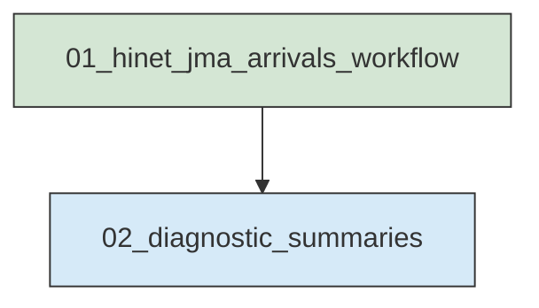
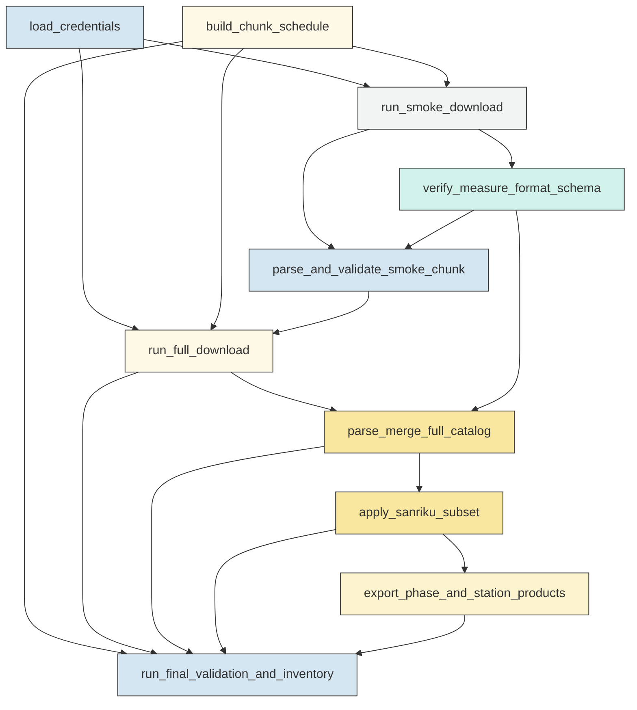
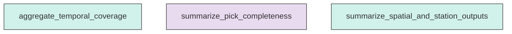

# Workflow Overview

## Top-Level Task Dependencies

**Description:**
- `01_hinet_jma_arrivals_workflow`: Download Hi-net JMA arrival-time measure files, parse fixed-width records, subset the Sanriku region, export compatibility products, and validate all required outputs.
- `02_diagnostic_summaries`: Generate compact non-authoritative diagnostic summaries and optional QC figures from the validated catalog products.

## Subtask Dependencies

#### 01_hinet_jma_arrivals_workflow
**Usage**: Download Hi-net JMA arrival-time measure files, parse fixed-width records, subset the Sanriku region, export compatibility products, and validate all required outputs.

**Description:**
- `load_credentials`: Load one or more Hi-net accounts from environment variables before the configured dotenv source with password redaction.
- `build_chunk_schedule`: Build deterministic half-open five-day chunks for the full requested JST interval and identify the smoke-test chunk.
- `run_smoke_download`: Download or reuse the first five-day raw measure file through the HinetPy arrival-time interface with retry and backoff.
- `verify_measure_format_schema`: Verify documented byte slices for JMA fixed-width J, station-pick, and E records before producing scientific catalogs.
- `parse_and_validate_smoke_chunk`: Parse the smoke raw file in byte mode and gate full execution on download, fixed-width, event-pick, and P/S count checks.
- `run_full_download`: After smoke-test success, download or reuse all scheduled raw measure files and write a complete sanitized manifest.
- `parse_merge_full_catalog`: Parse all accepted raw measure files into deterministic full event and pick tables with per-file parser QC.
- `apply_sanriku_subset`: Apply the inclusive Sanriku event-location filter locally after parsing and retain linked picks by event identifier.
- `export_phase_and_station_products`: Export Sanriku phase.dat and station.sta products using existing project conventions without fabricating station metadata.
- `run_final_validation_and_inventory`: Validate download schedule, parser QC, table integrity, regional subset consistency, compatibility exports, and product completeness.

#### 02_diagnostic_summaries
**Usage**: Generate compact non-authoritative diagnostic summaries and optional QC figures from the validated catalog products.

**Description:**
- `aggregate_temporal_coverage`: Summarize download, event, and pick coverage by chunk and UTC calendar day.
- `summarize_pick_completeness`: Compute P/S availability, P-only, S-only, both-present, and both-missing summaries for full and regional pick tables.
- `summarize_spatial_and_station_outputs`: Summarize Sanriku filtering behavior and station metadata matching without changing authoritative outputs.