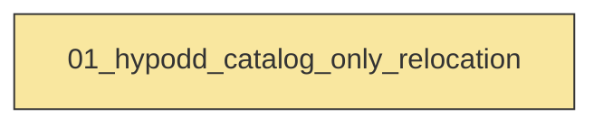
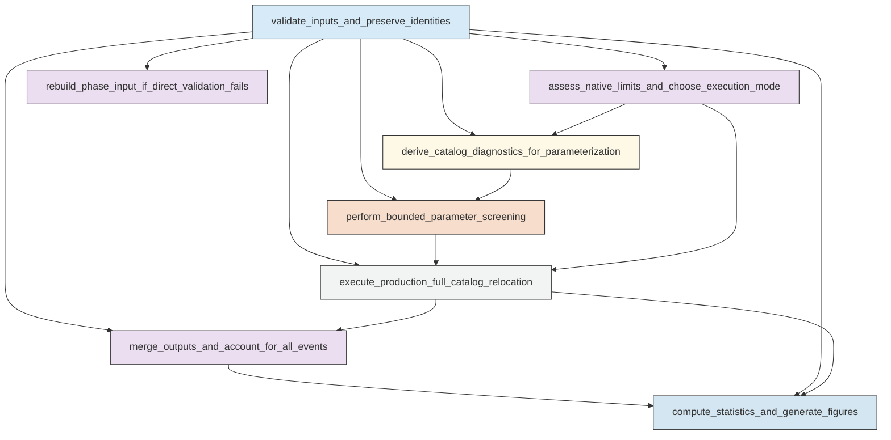

# Workflow Overview

## Top-Level Task Dependencies

**Description:**
- `01_hypodd_catalog_only_relocation`: Execute a self-contained hypodd_runner catalog-only relocation workflow for the full Aomori JMA catalog with validation, bounded parameter screening, production windowed relocation, merged accounting, and real-output figures.

## Subtask Dependencies

#### 01_hypodd_catalog_only_relocation
**Usage**: Execute a self-contained hypodd_runner catalog-only relocation workflow for the full Aomori JMA catalog with validation, bounded parameter screening, production windowed relocation, merged accounting, and real-output figures.

**Description:**
- `validate_inputs_and_preserve_identities`: Validate regional inputs, preserve event and station identities, and decide whether direct phase usage or a documented fallback rebuild is required.
- `assess_native_limits_and_choose_execution_mode`: Compare catalog scale against native HypoDD limits and select the package-supported production execution mode and initial time-window strategy.
- `derive_catalog_diagnostics_for_parameterization`: Compute catalog diagnostics needed to choose ph2dt link controls and explicit HypoDD iteration rows from actual Aomori data coverage.
- `perform_bounded_parameter_screening`: Run a small number of real diagnostic relocations on representative windows to choose production ph2dt settings and explicit iter_rows.
- `execute_production_full_catalog_relocation`: Run the production full-catalog catalog-only relocation with grouped hypodd_runner objects and package-supported automatic time windows.
- `merge_outputs_and_account_for_all_events`: Merge real native relocation outputs back to preserved event identities and classify every input event as relocated, unrelocated, failed, or explicitly excluded.
- `compute_statistics_and_generate_figures`: Compute relocation quality statistics and generate required nature-style figures from real relocation outputs only.
- `rebuild_phase_input_if_direct_validation_fails`: Rebuild a package-ready phase input from tabular files only when the provided phase.dat is proven invalid for the validated public API path.