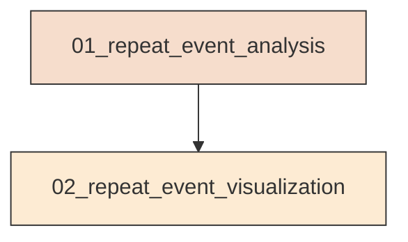
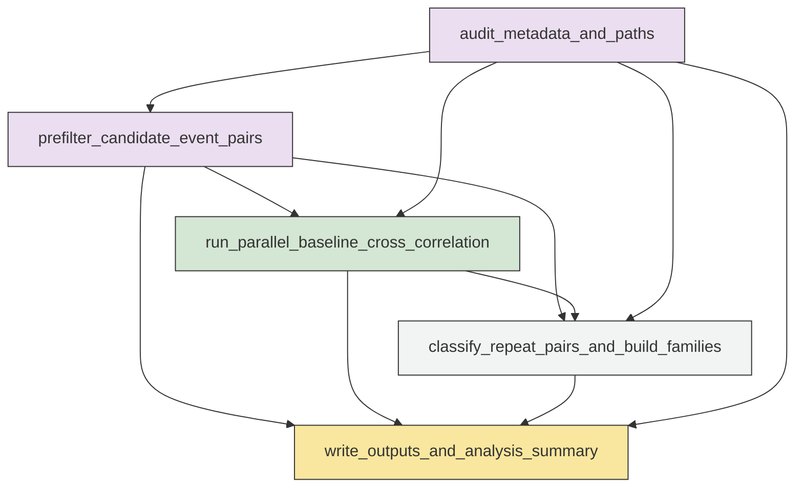
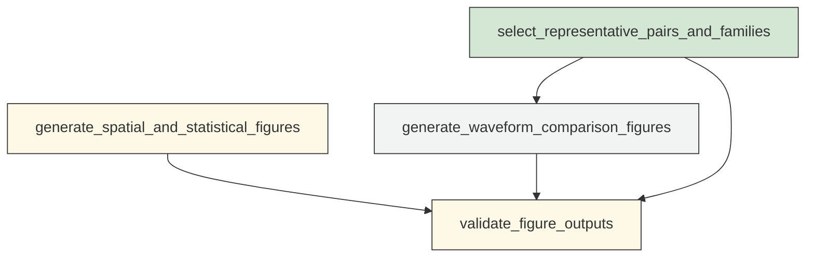

# Workflow Overview

## Top-Level Task Dependencies

**Description:**
- `01_repeat_event_analysis`: Audit metadata, prefilter candidate event pairs, run baseline phase-aligned waveform cross-correlation in parallel, aggregate pair similarity, build repeat-event families, and write machine-readable outputs.
- `02_repeat_event_visualization`: Generate reviewable figures from the standardized repeat-event outputs and representative SAC waveforms using the baseline processing chain.

## Subtask Dependencies

#### 01_repeat_event_analysis
**Usage**: Audit metadata, prefilter candidate event pairs, run baseline phase-aligned waveform cross-correlation in parallel, aggregate pair similarity, build repeat-event families, and write machine-readable outputs.

**Description:**
- `audit_metadata_and_paths`: Check required metadata fields, time coverage, SAC path existence, pick availability, and minimal data issues within the fixed analysis window.
- `prefilter_candidate_event_pairs`: Select physically plausible and computationally tractable candidate event pairs using shared observations, epicentral distance, magnitude difference, and ranking rules.
- `run_parallel_baseline_cross_correlation`: Match common station-components exactly, align by S then P picks, preprocess SAC waveforms consistently, and compute positive-peak-based cross-correlation metrics in multiprocessing batches.
- `classify_repeat_pairs_and_build_families`: Assign loose and high-confidence repeat-pair labels from pair similarity results and construct repeat-event families as connected components.
- `write_outputs_and_analysis_summary`: Validate merged outputs, enforce key field consistency, and write final CSV and JSON deliverables with audit, runtime, threshold, and failure statistics.

#### 02_repeat_event_visualization
**Usage**: Generate reviewable figures from the standardized repeat-event outputs and representative SAC waveforms using the baseline processing chain.

**Description:**
- `select_representative_pairs_and_families`: Choose top-scoring event pairs and major families for waveform and timeline visualization using reproducible ranking rules.
- `generate_spatial_and_statistical_figures`: Create spatial maps, family timelines, and statistical diagnostic plots for repeat-event screening and family structure.
- `generate_waveform_comparison_figures`: Re-read representative SAC waveforms and plot phase-aligned waveform overlays ordered by average station distance with CC and lag annotations.
- `validate_figure_outputs`: Check that all required figures are produced and record figure completion and selection rules for reproducibility.